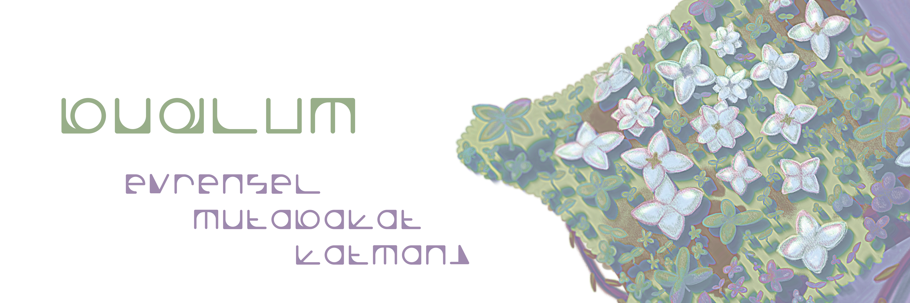
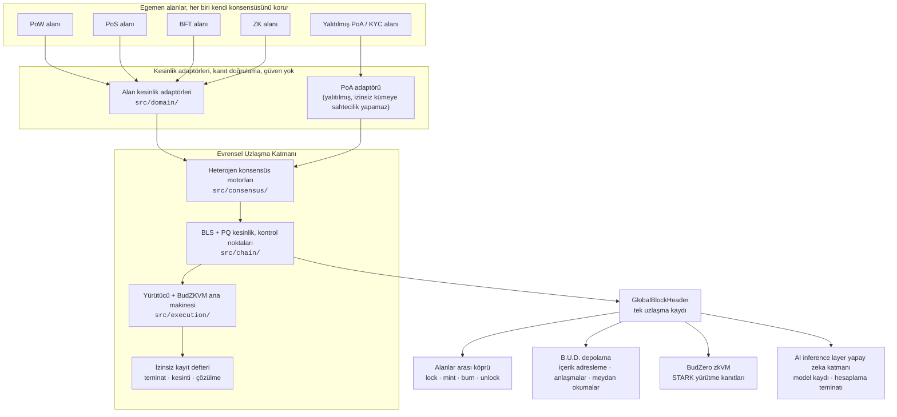

Budlum veri egemenliğine ve toplumsal yeşermeye odaklanmış internetin bir sonraki katmanıdır.

Budlum, izin gerektirmeyen bir Evrensel Uzlaşma Katmanıdır. Diğer zincirlerle yarışmaz, onları *uzlaştırır*.
PoW, PoS, PoA, BFT ve ZK alanlarının her biri kendi konsensüsünü korur; Budlum bu alanların
kesinlik kanıtlarını doğrular ve alanlar arası değer transferini tek bir `GlobalBlockHeader`
üzerinde kriptografik bir olgu olarak kaydeder. Veri, anahtar ve hesaplama egemenliği
katılımcılarda kalır.

Evrensel Uzlaşma Katmanı, birbirinden farklı ağların altındaki ortak zemindir: bir olguyu
hangi konsensüsün ürettiğini sormaz, yalnızca o olgunun kesinlik kanıtının geçerli olup
olmadığını sorar. Böylece değer, bir aracıya güvenmeden alanlar arasında hareket eder.

[](https://github.com/budlum-xyz/budlum/actions/workflows/ci.yml?query=branch%3Amain+event%3Apush)
[](https://github.com/budlum-xyz/budlum/actions/workflows/ci.yml?query=branch%3Amain+event%3Apush)
[](rust-toolchain.toml)
[](LICENSE.md)

[Mimari](docs/ARCHITECTURE.md) · [Belirtim](docs/SPECIFICATION.md) · [Güvenlik](docs/SECURITY.md) · [Katkı](docs/CONTRIBUTING.md) · [Web sitesi](https://github.com/budlum-xyz/budlum.com) · [English](README.md)

---

> [!WARNING]
> **Budlum bir ana ağ başlatmadı ve denetimden geçmedi.** Bu depo araştırma
> düzeyinde, kontrollü devnet yazılımıdır. Gerçek değer taşıyan trafik için kullanmayın.
> Neyin uygulandığını, neyin bilerek yarım bırakıldığını ve neyin iddia edilmediğini
> [Proje durumu](#proje-durumu) bölümünde tam olarak görebilirsiniz.

---

## İçindekiler

- [Budlum neden var](#budlum-neden-var)
- [Uzlaşma nasıl çalışır](#uzlaşma-nasıl-çalışır)
- [Operatör senaryoları](#operatör-senaryoları-ölçülmüş)
- [Depo yerleşimi](#depo-yerleşimi)
- [Başlarken](#başlarken)
- [Düğüm çalıştırma](#düğüm-çalıştırma)
- [JSON-RPC](#json-rpc)
- [Mühendislik standartları](#mühendislik-standartları)
- [Güvenlik](#güvenlik)
- [Proje durumu](#proje-durumu)
- [Belgeler](#belgeler)
- [Katkı](#katkı)
- [Lisans](#lisans)

---

## Budlum neden var

| Sorun | Budlum'un yanıtı |
| --- | --- |
| **Parçalanma.** Binlerce yalıtılmış zincir; her birinin kendi kesinliği var, hiçbiri diğerininkini doğrulayamıyor. | *Herhangi* bir alanın kesinlik kanıtını doğrulayan ve sonucu tek bir küresel başlığa kaydeden bir uzlaşma katmanı. |
| **Köprü riski.** Emanetçi ve çoklu imza köprüleri milyarlarca dolar kaybettirdi; arızalar neredeyse her zaman eksik doğrulamadan kaynaklandı, kırık kriptografiden değil. | Her mint işleminin sınırlı bir kanıtı yeniden hesapladığı ve alacak yazmadan önce yük özetini `(asset_id, amount)` değerlerinden yeniden türettiği bir `lock -> mint -> burn -> unlock` yaşam döngüsü. |
| **Kuantum ufku.** Ed25519 ve ECDSA'nın, bugün başlatılan bir zincirin ömrü içinde kırılabilir olması bekleniyor. | Melez kesinlik: BLS12-381 toplu imzaların yanında kuantum sonrası bir şema (varsayılan ML-DSA-65 - FIPS 204 NIST nihai; eski Dilithium5 yalnızca göç için mevcut). |
| **Kullanıcı verisinin operatör emanetinde olması.** Depolaması, RPC'si ve çıkarımı tek bir şirkette sonlanan "merkeziyetsiz" ağlar. | Yönetici anahtarı yok, duraklatma kancası yok, beyaz liste yok. Depolama, RPC ve yapay zeka uç noktaları herhangi bir düğümde çalışır; katılım izinle değil, teminatla kapılanır. |
| **Doğrulanamayan zincir dışı hesaplama.** Arkasında hiçbir şey olmadan olgu diye sunulan yapay zeka çıktısı. | Yürütmenin STARK kanıtlarını üreten, ağaç içi bir zkVM (BudZero). Çıkarım kanıtı *doğrulaması* henüz etkin değildir; işlem yolu doğrulanmamış bir sonuca güvenmek yerine [kapalı biçimde başarısız olur](docs/AI_VERIFICATION_STATUS.md). |

**Veri egemenliği değişmezi.** Ağdaki hiçbir kritik işlev, Budlum ekibinin işlettiği bir
servise bağlı değildir. Bu bir değer beyanı değil, test paketinin ve CI kapılarının
zorladığı bir özelliktir; yönetici yolu ekleyen bir pull request bu kapılardan geçemez.

---

## Uzlaşma nasıl çalışır



Bir alan kesinlik kanıtı sunar. Eşleşen adaptör bu kanıtı o alanın kendi kurallarına göre
doğrular; bir PoA alanının kanıtının izinsiz kümede geçerli olması yapısal olarak
engellenmiştir ve KYC'li bir alanı açık bir alanın yanında barındırmayı güvenli kılan
sınır tam olarak budur. Doğrulandıktan sonra taahhüt `GlobalBlockHeader` içine girer ve
alt sistemlerin her biri (köprü, depolama, zkVM, yapay zeka) uzlaşmayı bir alana doğrudan
güvenerek değil, o tek kayıttan okur.

### Diyagramlar nerede

[**ARCHITECTURE.md**](docs/ARCHITECTURE.md) bu ağacın başvuru atlasıdır: yürütücü boru
hattını, köprü doğrulamasını, EVM makbuz ve MPT yolunu, anlık görüntü güven sınırını, STARK
kanıt yaşam döngüsünü, yönetişim ve tokenomi durum makinelerini kapsayan 80 Mermaid
diyagramı içerir. [budzero/ARCHITECTURE.md](budzero/ARCHITECTURE.md) ise BudZKVM ISA'sını,
sanal makinesini, kanıtlayıcısını ve doğrulayıcısını ayrıca ele alır, çünkü BudZero kendi
çalışma alanıdır.

İkisi de önce kod haritası, sonra tasarım belgesidir. Bir diyagram ile kod çelişirse
olgu koddur, diyagram ise hatadır.

---

## Operatör senaryoları (ölçülmüş)

Üç üretim yolu CI'da uç uca çalışır. Aşağıdaki her sayı bir CI günlüğünden
okunmuştur; hiçbiri yerel ölçüm değildir.

1. **Kanonik kanıt rölesi.** `bud-cli relay` önce iki kanonik kontrol programını
   (private-transfer, syscall-context) sabitlenmiş işlenen değerlerden satır
   satır yeniden türetir ve hesaplanan Keccak-256'yı pin tablosuyla
   karşılaştırır: kaymış bir derleyici, kanıta dokunmadan önce koşumu reddeder.
   İmzalı `relay_report.json` sonra diskten okunarak doğrulanır: JSON'un
   biçimli hâli ayrıştırılmış kopyadan yeniden üretilip bayt bayt
   karşılaştırılır, kanıt parmak izi yüklenen zarftan yeniden türetilir ve
   `--payload-out` imzanın kapsadığı baytların tamını yazar; izleyici düzeni
   yeniden yazmadan onları yeniden hash'leyebilir. `--verified-at <unix>` saati
   sabitler ve yeniden koşum imzayı bayt-bayt üretir.
2. **AI inference layer derecelendirme döngüsü.** `ai-ops tune data.jsonl` veri seti
   etiketini (hedef model, örnek sayısı) doğrular, müfredatın derecelendirme
   seti özetini plana iliştirip bağı kontrol eder; `ai-ops eval data.jsonl
   responses.jsonl [MIN_SCORE]` altın kuralları boş yanıtta geçen bir
   müfredatı reddeder, üretilen yanıtları altın kurallarla derecelendirir ve
   rapor eşiği geçmezse sıfır olmayan çıkışla döner. Cihaz tarafında
   `ai-serve`, yerleşim planı operatörün `disk_budget_bytes` payından
   fazlasını diskten akıtan köprüyü, akış politikası bir şeye karar
   vermeden önce reddeder.
3. **Depolama verimi.** `cargo bench --bench ratio_rayon`, QR yük paketleyicisini
   96 x 65536 B'lik bir gövde üzerinde ölçer (6291456 B giriş, 7 tekrar, en
   hızlısı bildirilir): seri 39.7 MB/s (158352 us), rayon havuzu 97.5 MB/s
   (64539 us), hızlanma 2.45x. İki yolun paketli çıktıları bayt bayt
   karşılaştırılır; uyuşmazlık sıfır olmayan çıkışla biter. CI'da
   `usl@967acce4c` head'inde ölçüldü (`Timing-Safe Regression` işi,
   `Ratio rayon vs serial throughput` adımı, 2026-08-30T06:18:49Z).

## Depo yerleşimi

Bu depo yığının tamamıdır. Aşağıdaki katmanlar ayrı bağımlılıklar değil, **ağaç içidir**;
dolayısıyla sistemin tamamı tek bir ağaç olarak derlenir, test edilir ve dağıtılır.

### Evrensel Uzlaşma Katmanı çekirdeği: [`src/`](src)

| Yol | Rol |
| --- | --- |
| [`src/consensus/`](src/consensus) | PoW · PoS · PoA · BFT motorları, blok boyutu ve reorg derinliği sınırları |
| [`src/chain/`](src/chain) | Blok zinciri, BLS/QC kesinliği, kontrol noktaları, anlık görüntüler |
| [`src/domain/`](src/domain) | Alan kayıt defteri ve alan başına kesinlik adaptörleri |
| [`src/cross_domain/`](src/cross_domain) | Köprü yaşam döngüsü, alanlar arası mesajlar, tekrar koruması |
| [`src/execution/`](src/execution) | İşlem yürütücüsü ve BudZKVM ana makinesi |
| [`src/registry/`](src/registry) | İzinsiz teminat kayıt defteri (doğrulayıcı · denetleyici · aktarıcı · depolama) ve kesinti |
| [`src/core/`](src/core) | Hesaplar, bloklar, işlemler, zincir yapılandırması, genesis |
| [`src/mempool/`](src/mempool) | Kabul denetimi ve imza öncesi ucuz reddetme |
| [`src/network/`](src/network) | libp2p yığını, tel protokolü, eş puanlama ve yasaklar |
| [`src/crypto/`](src/crypto) | Ed25519, BLS12-381, Dilithium / ML-DSA, PKCS#11 |
| [`src/rpc/`](src/rpc) | JSON-RPC: ayrık genel/operatör dinleyicileri, kimlik doğrulama, IP başına kota, CORS |
| [`src/tokenomics/`](src/tokenomics) | `$BUD` arzı, yakım takvimi, hak ediş, doğrulayıcı ödülleri |

### Birleştirilebilir katmanlar

| Katman | Bu depoda | Ne olduğu |
| --- | --- | --- |
| **BudZero** | [`budzero/`](budzero), [README](budzero/README.md) | ZK yerlisi sanal makine: belirlenimli ISA, gaz ölçümlü VM, derleyici ve bir Plonky3 STARK kanıtlayıcı/doğrulayıcı |
| **B.U.D.** | [`bud/`](bud) · [`src/storage/`](src/storage) | Broad Universal Database: `bud/` 1.0/2.0/3.0 uygulamasıdır (tarif / QR / makbuz / uzlaşma modülleri, [bud README](bud/README.md)); `src/storage/` uzlaşma katmanının depolama motorudur (içerik adresleme, anlaşmalar, meydan okuma/yanıt kanıtları) |
| **AI inference layer** | [`src/ai_inference/`](src/ai_inference) | Kapalı devre yapay zeka katmanı: model kayıt defteri, operatör hesaplama teminatı, çaba kademeleri, Pollen ile kapılanan veri erişimi, algı beyanları (V3), SocialFi çıktı köprüsü. Zincir dışı çalışma alanı: [`crates/ai-inference/`](crates/ai-inference) |
| **Pollen** | [`src/pollen/`](src/pollen) | Rıza ile kapılanan veri pazarı, izinler, şifreleme ve yapay zeka katmanının geçmek zorunda olduğu kapı |
| **BNS** | [`src/bns/`](src/bns) | `.bud` adlandırması: kayıt, alt alanlar, içerik ve depolama kayıtları |
| **Wallet Core** | [`crates/wallet-core/`](crates/wallet-core), [README](crates/wallet-core/README.md) | BIP39 + SLIP-0010 Ed25519 türetimi ve işlem imzalama. Bir cüzdandır, aktarıcı değildir |

### Destek ağaçları

| Yol | İçerik |
| --- | --- |
| [`crates/`](crates) | Bağımsız çalışma alanları: wallet-core, budscan, ai_inference, note-packing |
| [`bud/`](bud) | B.U.D. 1.0/2.0/3.0 uygulaması (kendi çalışma alanı) |
| [`docs/`](docs) | Başvuru belgeleri: ARCHITECTURE, SPECIFICATION, SECURITY, CONTRIBUTING, PROVENANCE_NOTES |
| [`config/`](config) | Devnet / testnet / mainnet profilleri ve genesis şablonları |
| [`xtask/gates/`](xtask/gates) | CI kapıları; her biri kendi kendini sınar ([Mühendislik standartları](#mühendislik-standartları)) |
| [`kani/`](kani) · [`fuzz/`](fuzz) | Model denetleme koşum takımları ve fuzz hedefleri ([fuzz README](fuzz/README.md)) |
| [`benches/`](benches) | İmza doğrulama, Merkle ve tek düğüm verim ölçümleri |
| [`ops/`](ops) | systemd birimi, Prometheus yapılandırması, yedekleme/geri yükleme tatbikatı |
| [`proto/`](proto) | Protobuf tel şemaları |
| [`supply-chain/`](supply-chain) | `cargo-vet` denetim kayıtları |

### Kökte kalan dosyalar

| Dosya | Neden kökte kalıyor |
| --- | --- |
| `Cargo.toml` · `Cargo.lock` · `build.rs` | Cargo paket kökü: çekirdek crate, ölçümleri ve yol bağımlılıkları (`budzero/*`, `crates/*`) buradan çözülür |
| `rust-toolchain.toml` | rustup çalışma dizininden yukarı yürür ve dosyayı burada bulmak zorundadır |
| `buf.yaml` | Protobuf çalışma alanı kökü, `proto/` ile eşleşir (Repo Lint kapısı `buf`u kökten çalıştırır) |
| `flake.nix` · `flake.lock` | Nix flake keşfi yalnızca kökte olur |
| `README.md` | GitHub depo ana sayfasını kökteki README'den oluşturur |
| `LICENSE.md` | GitHub lisans tespiti, `cargo-deny` ve `.quality/check_license.py` dosyayı kökten okur |
| `.gitignore` · `.gitleaks.toml` | Git ve gitleaks yapılandırmaları kökten çözer |

Konteyner ve lisans bildirim dosyaları ağaç içine taşındı: `ops/Dockerfile`,
`ops/docker-compose*.yml` (derleme bağlamı kökte kalır), `docs/NOTICE`.

### İlgili depolar

| Depo | Amaç |
| --- | --- |
| [budlum-xyz/budlum.com](https://github.com/budlum-xyz/budlum.com) | Proje web sitesi |
| [budlum-xyz/budlum.xyz](https://github.com/budlum-xyz/budlum.xyz) | Marka ve tasarım sistemi |

---

## Başlarken

### Ön koşullar

- **Rust 1.97.1**: [`rust-toolchain.toml`](rust-toolchain.toml) içinde sabitlenmiştir; `rustup` bunu kendiliğinden seçer
- **protoc** (Protocol Buffers derleyicisi): `apt install protobuf-compiler` veya `brew install protobuf`
- İsteğe bağlı: [Nix](https://nixos.org), `nix develop` tüm araç zincirini [`flake.nix`](flake.nix) dosyasından kurar

### Derleme ve test

```bash
git clone https://github.com/budlum-xyz/budlum.git
cd budlum

cargo build --release              # cekirdek dugum
cargo test --lib                   # cekirdek test paketi

# BudZero / BudZKVM kendi çalışma alanıdır
cargo test --manifest-path budzero/Cargo.toml --workspace
```

Bir pull request açmadan önce CI'ın çalıştırdığı denetimlerin aynısını çalıştırın:

```bash
cargo run --manifest-path xtask/tools/Cargo.toml -- pre-push   # fmt + clippy, sabitlenmis arac zinciri
```

### Derleme özellikleri

| Özellik | Varsayılan | Etki |
| --- | --- | --- |
| `pq-ml-dsa` | Açık | FIPS 204 ML-DSA (NIST nihai) - ML-DSA-65 doğrulayıcı imzaları (`ml-dsa`). Şema genesis içine yazılır; derlemesi zincirle çelişen bir düğüm başlamayı reddeder |
| `pq-dilithium` | - | Eski Dilithium5 (tur 3, NIST nihai öncesi) imzaları (`pqcrypto-dilithium`). Yalnızca göç için tutulur, varsayılan değildir |
| `p2p-mdns` | - | Yalnızca devnet için yerel eş keşfi. mDNS uyarıları erişilemez kalsın diye sürüm derlemelerinden bilerek çıkarılmıştır |

`cargo build --all-features` komutunun **başarısız olması beklenir**: PQ arka uçları
birbirini dışlar ve bunu bir `compile_error!` zorlar. CI bu başarısızlığı doğrular,
böylece koruma sessizce çürüyemez.

---

## Düğüm çalıştırma

### Devnet, tek düğüm

```bash
cargo run --release -- --network devnet
```

### Devnet, dört düğüm + Prometheus

```bash
docker compose -f ops/docker-compose.yml up   # bkz. ops/docker-compose.yml
bash ops/scripts/devnet-multinode-smoke.sh
```

### Profilden çalıştırma

```bash
cargo run --release -- --config config/devnet.toml
```

Profiller [`config/`](config) altında yaşar: [`devnet.toml`](config/devnet.toml),
[`testnet.toml`](config/testnet.toml), [`archive.toml`](config/archive.toml) ve
[`mainnet.toml`](config/mainnet.toml) tören şablonu. Ana ağ genesis'i
**başlatılamaz bir şablondur**: önyükleme eşleri, DNS tohumları ve tahsisler yer
tutucudur ve kapalı biçimde başarısız olan bir koruma bunları reddeder. Böylece kimse
bir tören dosyasına karşı yanlışlıkla "ana ağ" başlatamaz.

### Düğüm rolleri

`--role` bir düğümün hangi profille çalışacağını seçer: `validator`, `sentry`, `seed`,
`rpc` veya `archive`. Her birinin maruz kalma yüzeyi ve gerekli garanti kümesi farklıdır;
bkz. [docs/VALIDATOR_ROLES.md](docs/VALIDATOR_ROLES.md).

> [!IMPORTANT]
> **Ana ağ doğrulayıcıları PKCS#11 üzerinden imzalamak zorundadır.** Diske dayalı
> `ValidatorKeys`, yani bir dosyada duran BLS ve kuantum sonrası malzeme, ana ağ
> profilinde reddedilir. Bu bir tavsiye değildir; düğüm başlamayı reddeder.

### İşletme

Ölçümler Prometheus biçiminde sunulur (varsayılan `:9090`; toplama yapılandırması
[`ops/prometheus.yml`](ops/prometheus.yml) içinde). Bir systemd birimi
[`ops/budlum-core.service`](ops/budlum-core.service) altında verilmiştir ve
`cargo run --manifest-path xtask/tools/Cargo.toml -- backup-drill` anlık görüntü
yedekleme/geri yükleme yolunu uçtan uca çalıştırır (`SOURCE_DB` ve `BACKUP_DIR`
değişkenlerini ayarlayın): ihtiyacınız olmadan önce çalıştırın.

---

## JSON-RPC

Düğüm, `bud_` ad alanlı bir JSON-RPC API'sini **iki ayrı dinleyici** üzerinden sunar:
genel olan (zincir okumaları, işlem gönderimi) ve geri döngüye bağlı operatör olanı
(düğüm denetimi, anahtar işlemleri, eş yönetimi). Bunları ayırmak, açığa çıkmış bir
genel portun, işleyicinin nasıl yazıldığından bağımsız olarak bir operatör metoduna
ulaşamaması demektir.

```bash
curl -s -X POST http://127.0.0.1:8545 \
  -H 'Content-Type: application/json' \
  -d '{"jsonrpc":"2.0","id":1,"method":"bud_getStatus","params":[]}'
```

API; zincir ve hesap durumunu, blokları, işlemleri ve makbuzları, doğrulayıcı kümesini ve
kesinti geçmişini, alan taahhütlerini ve uzlaşma bilgisini, köprü yaşam döngüsünü, BNS
çözümlemesini, Pollen pazarını, yapay zeka çıkarım yaşam döngüsünü ve düğüm sağlığını
kapsar. Dinleyici başına kimlik doğrulama gereksinimleriyle birlikte tam metot listesi
[SPECIFICATION.md bölüm 3.3](docs/SPECIFICATION.md) içindedir.

Aynı ağaçta asgari bir CLI istemcisi de bulunur:

```bash
cargo run --bin bud -- query balance <adres>
cargo run --bin bud -- query block latest
cargo run --bin bud -- tx send --to <adres> --amount <n> --priv-key <hex-tohum>
```

---

## Mühendislik standartları

Budlum'un CI'ı bir formalite değildir; projenin güven yerine kullandığı mekanizmadır.
Her pull request; çekirdek derleme, BudZero, belirlenimlilik, güvenlik denetimi, tedarik
zinciri, fuzzing, Miri, semver ve daha fazlası için ayrılmış iş akışlarında tüm kapı
kümesini çalıştırır.

**Kapıların olağanın ötesinde zorladıkları:**

- **`fmt` ve `-D warnings` ile `clippy`**, sabitlenmiş 1.97.1 araç zincirine karşı; ayrıca
  ayrı bir pedantic/nursery **cırcırı**: uyarı sayısının depoda kayıtlı bir taban çizgisi
  vardır ve yalnızca azalabilir. Bir koşuyu geçirmek için taban çizgisini yükseltmek
  düzeltme değil, kusur sayılır.
- **Belirlenimlilik.** Durum kökleri ve blok özetleri yeniden üretilebilir olmak
  zorundadır. Ayrı bir kapı, hiçbir özet fonksiyonunun sırasız bir koleksiyonu
  gezmediğini kanıtlar; durum kökü yolundaki bir `HashMap`, iki düğümün anlaşmazlığa
  düşmesini bekleyen bir zincir durmasıdır ve kapı bunu inceleme anında yakalar.
- **Rozetler yalan söyleyemez.** Bu sayfadaki her rozet, işaret ettiği dosyaya karşı
  denetlenir: test sayısı koşunun ölçtüğüne, Rust sürümü `rust-toolchain.toml` dosyasına,
  lisans `Cargo.toml` içindeki SPDX kimliğine ve CI rozeti adlandırmak zorunda olduğu dal
  ile olaya karşı. Çünkü süzgeçsiz bir rozet, varsayılan dalda koşu yokken herhangi bir
  daldaki en yeni koşuyu bildirir. Uyuşmazlık, ona yol açan pull request'i düşürür.
- **Testler gerçekten test olmalıdır.** Bir kapının zorunlu ilan ettiği her ad, gerçekten
  `#[test]` taşıyıp taşımadığına karşı denetlenir; aksi halde sessizce var olmayı bırakmış
  zorunlu bir test sonsuza dek geçerdi.
- **Biçimsel yöntemler.** [Kani](kani) aritmetik değişmezleri model denetler; `cargo fuzz`
  hedefleri tel serisizleştirmesini kapsar; Miri paketi tanımsız davranış tespiti altında
  çalıştırır.
- **Tedarik zinciri.** `cargo-deny`, `cargo-audit`, `cargo-vet`, `osv-scanner`, Grype, SBOM
  üretimi, iş akışlarının kendisi üzerinde `zizmor` ve `actionlint`. Eylemler SHA ile
  sabitlenmiştir; tek git bağımlılığı tam revizyonla sabitlenmiş, gerekçesi ağaç içine
  kaydedilmiş ve **yamanın kendisi vendor edilmiş kaynakta doğrulanmıştır**, çünkü bir git
  bağımlılığındaki sürüm numarası bir addır, kanıt değil.

**Geri kalanı anlamlı kılan iki kural:**

1. **Hiçbir kapı boş olamaz.** Her kapı bir `--self-test` uygular: gerçek bir ihlal
   enjekte eder ve kapı bunu yakalamazsa başarısız olur. Başarısız olabildiğini
   kanıtlayamayan bir kapı, kapı değildir; CI kanaryayı denetimin yanında çalıştırır.
2. **Hiçbir kapı öksüz olamaz.** Hiçbir iş akışının çağırmadığı bir kapı derlemeyi adıyla
   düşürür. Ya bağlanır ya silinir; sayı şişirerek ağaçta oturmasına izin verilmez.

Bastırmalar iş akışının parçası değildir. `#[allow(...)]`, `#[ignore]`, `|| true` ve taban
çizgisi şişirme, yeşil bir derlemenin anlamını yitirmesinin yollarıdır ve burada hiçbiri
düzeltme olarak kabul edilmez.

---

## Güvenlik

Güvenlik açıklarını **özel olarak** bildirin: bkz. [SECURITY.md](docs/SECURITY.md).
Konsensüs güvenliğini, yürütme belirlenimliliğini, ağı, depolama bütünlüğünü, kriptografiyi
veya doğrulayıcı anahtar işlemesini etkileyen hiçbir şey için lütfen herkese açık bir konu
açmayın.

Sertleştirme süreklidir ve düşmancadır. Bugün kodda zorlanan şeylerden bir örnek:

- **Köprü.** Bir mint işlemi `bridge_payload_hash(asset_id, amount)` değerini yeniden
  türetir ve eşleşen bir `Locked` durumu ile sınırlı, yeniden hesaplanmış bir kanıt ister.
  Sekiz haneli birkaç köprü kaybının arkasındaki sınıf olan kaynak tutarı karışıklığı,
  gelenekle değil yapısal olarak reddedilir.
- **Konsensüs sınırları.** Reorg derinliği, blok boyutu ve kesinleşmiş kontrol noktası
  çakışmasının her biri, katmanları birbirine bağlayan derleme zamanı bir doğrulamayla
  tek bir sabit tarafından zorlanır; böylece çatal seçimi ile durum makinesi farklı
  sınırlar uygulayamaz.
- **Canlılık ve kesinti.** Hapsedilmiş bir doğrulayıcı, imzalaması yasak olan bloklar için
  kesinti süresi biriktirmeyi durdurur ve her canlılık yolunun aynı doğrulayıcı kümesini
  gördüğü doğrulanır.
- **Anahtarlar.** BLS anahtar çifti yüklemesi G2 kodlamasını ve `pk = g·sk` eşitliğini
  doğrular. Ana ağ doğrulayıcı imzalaması yalnızca PKCS#11 iledir. İmza doğrulama
  fonksiyonları gerçek çağrı yerleri için denetlenir, çünkü doğru ama çağrılmayan bir
  `verify_*` hiçbir şey zorlamaz.
- **RPC.** Genel kimlik doğrulama, sabit zamanlı bir API anahtarı karşılaştırması, IP
  başına kotalar ve açık bir CORS izin listesiyle kapalı biçimde başarısız olur.
- **Varsayılan olarak kapalı başarısızlık.** Bir garantinin henüz kanıtlanamadığı yerde,
  yani çıkarım kanıtı doğrulaması ve üretim derinliğinde BudZKVM `VerifyMerkle`: yol
  iyimser biçimde açık bırakılmaz, **devre dışı bırakılır**. Bunların listesi örtük
  bırakılmak yerine [docs/](docs) altındadır.

**Hiçbir harici denetim yapılmamıştır.** Yukarıdakilerin hiçbiri bunun yerine geçmez ve bu
depoda hiçbir yerde "denetlenmiş" iddiası yapılmaz.

---

## Proje durumu

**Uygulanmış ve test edilmiş:** Evrensel Uzlaşma Katmanı üzerinde heterojen konsensüs
(PoW/PoS/PoA/BFT) · BLS + kuantum sonrası melez kesinlik · alan kayıt defteri ve kesinlik
adaptörleri · sahtecilik kapılarıyla alanlar arası köprü yaşam döngüsü · kesinti ve
çözülme ile izinsiz teminat kayıt defteri · STARK kanıtlamalı ağaç içi BudZKVM · anlaşma ve
meydan okuma ekonomisiyle B.U.D. depolama · BNS `.bud` adları · Pollen veri pazarı ·
SocialFi ilkelleri · AI inference layer yapay zeka çıkarım katmanı · EVM zincir adaptörü
(RLP + MPT + makbuz doğrulama) · `$BUD` tokenomisi · doğrulayıcı yönetişimi · parça oturumu
bağlamalı anlık görüntü V2.

**Bilerek etkinleştirilmemiş ve bu durum değişirse kırılan testlerle sabitlenmiş:** zincir
üstü yapay zeka çıkarım kanıtı *doğrulaması* ([durum](docs/AI_VERIFICATION_STATUS.md)) ·
üretim derinliğinde BudZKVM `VerifyMerkle` · BNS yenileme ve transferi (hiçbir işlem türü
bunlara ulaşmıyor) · çözücü ekonomisi modülü.

**İddia edilmeyen:** protokolün TLA+ ile biçimsel doğrulaması · eksiksiz bir ZK gizlilik
katmanı · tam zincir üstü yapay zeka yürütmesi · Ed25519 PKCS#11 ötesinde satıcı yerlisi
BLS/PQ HSM desteği · harici bir güvenlik denetimi · başlatılmış bir ana ağ.

Ayrım önemlidir: ikinci grup, var olan ve bilerek kapatılmış, kapının başında bekleyen
başarısız bir testi olan koddur. Üçüncü grup ise yapılmamış iştir ve bu sayfa aksini ima
etmeyecektir.

---

## Belgeler

| Belge | Kapsamı |
| --- | --- |
| [ARCHITECTURE.md](docs/ARCHITECTURE.md) | Başvuru atlası: sistem, güven sınırı, köprü, EVM doğrulama, anlık görüntü, STARK, yönetişim ve tokenomiyi kapsayan 80 diyagram |
| [SPECIFICATION.md](docs/SPECIFICATION.md) | Protokol belirtimi: konsensüs, doğrulayıcı ekonomisi, ağ protokolü, BLS kesinliği, JSON-RPC yüzeyi, anlık görüntü biçimi |
| [SECURITY.md](docs/SECURITY.md) | Açıklama politikası, desteklenen sürümler, bir raporda nelerin bulunması gerektiği |
| [CONTRIBUTING.md](docs/CONTRIBUTING.md) | Geliştirme kurulumu, PR beklentileri, konsensüs ve yürütme değişiklikleri için kurallar |
| [CODE_OF_CONDUCT.md](docs/CODE_OF_CONDUCT.md) | Topluluk beklentileri |
| [PROVENANCE_NOTES.md](docs/PROVENANCE_NOTES.md) | Her önemsiz olmayan uygulamanın neye dayandığının modül başına kaydı |
| [docs/VALIDATOR_ROLES.md](docs/VALIDATOR_ROLES.md) | Düğüm rolleri ve işletme gereksinimleri |
| [docs/AI_VERIFICATION_STATUS.md](docs/AI_VERIFICATION_STATUS.md) | Yapay zeka katmanının tam olarak neyi doğrulayıp neyi doğrulamadığı |
| [docs/BUD_STORAGE_ROADMAP.md](docs/BUD_STORAGE_ROADMAP.md) | Depolama katmanı yol haritası |
| [budzero/ARCHITECTURE.md](budzero/ARCHITECTURE.md) | BudZKVM ISA, VM, kanıtlayıcı ve doğrulayıcı tasarımı |

---

## Katkı

Katkılar hoş karşılanır. Önce [CONTRIBUTING.md](docs/CONTRIBUTING.md) dosyasını okuyun;
konsensüs ve yürütme değişiklikleri için araçlardan daha yüksek bir çıta koyar ve nedenini
açıklar.

Kısa hâli:

1. İtmeden önce `cargo run --manifest-path xtask/tools/Cargo.toml -- pre-push` çalıştırın.
   Biçimlendirme elle tahmin edilmez. `-- install-hook` bunu `git push` akışına bağlar.
2. Yeni davranış, düzeltmeden önce başarısız olduğu gözlenmiş bir testle gelir.
3. Değişikliğiniz bir CI kapısını kırmızıya çevirirse bulgu kapıdır. Nedeni düzeltin,
   sinyali susturmayın.

---

## Lisans

**PolyForm Shield License 1.0.0** ile lisanslanmıştır: bkz. [LICENSE.md](LICENSE.md).

PolyForm Shield, Budlum ile ya da lisans verenin Budlum'u kullanarak sunduğu herhangi bir
ürünle **rekabet eden bir ürün sunmak dışında** her kullanıma izin verir. Kaynak okunabilir,
değiştirilebilir ve yeniden dağıtılabilir kalır; yalnızca rakip ürünler dışlanmıştır.

> Zorunlu Bildirim: Copyright budlum-xyz (https://github.com/budlum-xyz)
