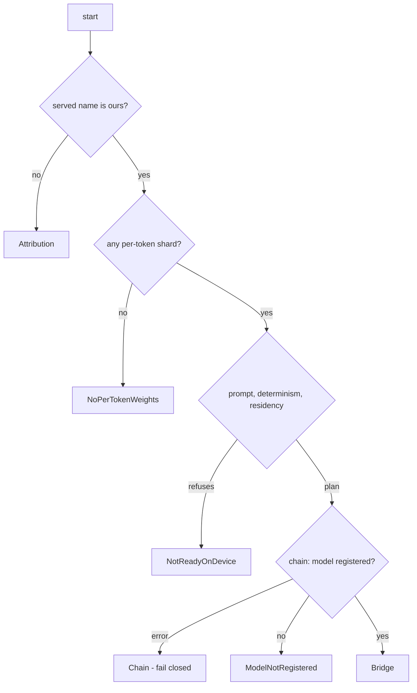

# Lubot architecture summary

This file summarises the layers. It used to point at a full version,
`docs/MIMARI_ONERISI_2026-08-13.md`, but that file does not exist anywhere in
the tree; the pointer is recorded here as a missing reference rather than
repeated as though it resolved.

## Layers

```
[ On chain - budlum/main/src/lubot/ ]        (exists; this repo does not touch it)
   model registry - operator compute bond - Pollen - B.U.D. - SocialFi
                        ^ hash and reference matching
[ This repo - the off-chain skeleton ]
   lubot-core   : ModelId (a 32-byte hash, mirroring the AiModelId form),
                  dataset types, LoRaManifest
   lubot-data   : closed-loop source checking over 3 channels, the record
                  format, fail-closed hash verification
   lubot-serve  : the vLLM and SGLang bridge; the weight name is preserved and
                  the served name is ours
   lubot-tune   : TunePlan (LoRA in BF16 or FP16, with no FP4), the output hash
                  lock
   lubot-ops    : the CLI skeleton
```

## Principles

1. **Closed loop:** there is no path that reads outside data; every set enters
   through a B.U.D. `StorageDeal`, a `TrainingCorpus` tag and hash
   verification.
2. **Fail closed:** an unverified hash is a refusal, and `lubot-data::verify`
   deliberately returns `Err`. Real SHA-256 arrives in production.
3. **Attribution:** third party names are preserved; only our own layer carries
   the name "Lubot".
4. **Language:** the whole tree, documents included, is English. This principle
   used to read "documents in Turkish, code identifiers in English"; the
   repository-wide rule replaced it, and the `tree-is-english` gate enforces it.
5. **No shell scripts:** no shell code is hosted in the repository; the training
   phase runs in outside containers and is only documented.

## Decision status, 2026-08-13

| Decision | Status |
|---|---|
| K1 skeleton and repository | produced; awaiting review |
| K2 base model | abstract; the light tier is the default, with approval before the first run |
| K3 type binding | deferred; the skeleton suits either option |
| K5 method | LoRA SFT with a BF16 adapter |
| K6 data source | **HYBRID**: open sets enter the network with a B.U.D. record |
| K7 tier naming | **light**, Flash based, and **normal**, Pro based; there are no multiplier labels |

## Deepening, 2026-08-13

- `lubot-data`: real SHA-256 verification (`verify_sha256`, `content_id_of`),
  JSONL records built on serde_json, and a draft structural chat template.
- `lubot-serve`: the tier naming (`lubot-light-*` and `lubot-normal-*`), the
  multiplier label check, and a fail-closed chain RPC draft
  (`chain::NotConnected`).
- `lubot-core`: the `ModelTier` type, light or normal; `ModelSpec` carries the
  tier.

## The system prompt, 2026-08-25

The prompt handed to a model before the first user message lives in
`lubot-core/src/system_prompt.rs` as a `const`, not in a configuration file.
A prompt is the part of the product a user is asked to trust without being able
to read the weights; loading it from a mutable file at runtime would let two
operators claim the same model while running different instructions, and
nothing in the tree would notice.

Because it is source, its claims are checkable, and they are checked in two
places:

- `lubot-core` tests assert the prompt is internally consistent - the ceilings
  it states match the table it declares, the reading-only boundary keeps all
  three of its reasons, and it does not overstate what is cryptographically
  proven.
- The `lubot-prompt-is-true` gate checks the half those tests cannot see: that
  the numbers the prompt tells a user are the numbers `src/lubot/perception.rs`
  actually admits by. It fails in both directions, because which of the two is
  wrong is a judgement a gate should not make.

The prompt states why Lubot reads and does not generate, at length and with the
measurements behind it. That is deliberate. An unexplained boundary reads as a
missing feature and gets removed by the next contributor who thinks they are
adding symmetry.

### Promises traced to an implementation

A prompt makes two kinds of statement, and only one of them is a number. The
ceiling checks above cover the numeric kind. The other kind is behavioural -
"if your hardware cannot serve the declared tier, say so", "masking happens
before storage, not after" - and a sentence like that is true only while some
function somewhere makes it true.

`lubot-prompt-is-true` therefore carries a table of (sentence, file, symbol)
triples and checks both halves are present. The two failures are not symmetric.
A sentence that disappears while its implementation stays is a documentation
problem: the runtime still behaves correctly and has stopped saying so. A symbol
that disappears while its sentence stays is the dangerous direction, because
nothing announces it - the prompt still reads correctly to a reviewer, and the
product it describes has quietly stopped keeping the promise.

This crate learned the shape of that failure before the gate existed.
`tier_is_servable` was written, documented in its module header as the rule
governing effort, and called from nowhere for a full release. Prose beside an
unwired implementation is worse than no prose, because the prose is what an
auditor reads.

The symbol check matches a definition, not a substring. The first version used
a plain `contains`, and a mutation walked straight past it: renaming
`unservable_reason` to `unservable_reason_RENAMED` leaves the old name as a
prefix, so the gate stayed green while the promise had lost its implementation.
Matching requires `fn ` on the left - so a mention in a doc comment or at a call
site does not count as an implementation - and a non-identifier character on the
right.

### Names of products read during research

Some of the designs here were reached by reading other projects. No code was
copied and no dependency was added, and the names of those projects do not
appear in the tree either. This is not etiquette. A variant called after another
product tells a reader the tree depends on it: they check its licence against
ours and reason about upgrades to something we never link. Naming the same
variant for what it selects - an engine that pages experts off disk - describes
our own system instead of someone else's, and loses nothing.

The `no-upstream-brands` gate keeps it that way, and exempts `LICENSE.md`,
`NOTICE.md` and `THIRD-PARTY.md`. A gate that forbade attribution would push the
project toward a licence violation in order to stay green; if a dependency is
ever genuinely added, its name belongs in exactly those files.

## On-device residency, 2026-08-25

`lubot-serve/src/residency.rs` plans where each part of a model lives on the
machine an operator actually owns. The motivating fact is that engines
requiring the whole model resident in accelerator memory restrict the operator
set to data-centre hardware, which contradicts the effort tiers: a tier no
consumer device can serve is a tier no consumer device can earn from.

A mixture-of-experts model activates a small fraction of its parameters per
token. The dense part - attention, shared experts, embeddings, the output head
- is needed for every token and earns residency. Routed experts are needed one
subset at a time and can be staged from slower storage on demand. So memory
stops being a requirement and becomes a placement.

One invariant governs the whole module: **placement decides speed and never
semantics.** A device short on memory produces the same tokens, more slowly. It
does not drop to a smaller quantisation, a shorter context or a different
routing rule. On this chain that is not a preference: answers are grouped by an
exact 32-byte commitment, and an operator whose engine quietly reduced
precision under memory pressure would stop agreeing while appearing healthy -
the symptom would be a request that never finalises, which reads as a liveness
fault rather than the configuration error it is. `SemanticProfile` is therefore
carried through the planner untouched, and the invariant is a test rather than
a comment.

Two consequences follow from the same rule. A device that cannot hold the dense
part is refused rather than degraded, because streaming a weight every token
needs is not a slow plan but a plan that re-reads the same bytes every step.
And weights are placements of B.U.D. content, addressed by `ContentId`; there
is no path that stages a shard the chain has not seen, because an operator who
could stage a shard from anywhere could stage a different one, and the model
commitment would then describe something other than what ran.

Deliberately absent: prefetch policy, learned hot-sets, eviction heuristics.
Those have to be measured on real hardware before they are believed, and an
unmeasured policy written into the tree reads as a decision when it is a guess.

## Bringing a bridge up, 2026-08-25

The serving crate had four modules, each answering one question correctly, and
nothing that put them in an order. A set of checks that is never run in sequence
is a set of checks an operator runs in whichever order suits them - and the
order is not a matter of taste, because each answer changes what the next
question means.

`bridge.rs` is that order, and `Bridge` cannot be constructed any other way. A
value of the type is evidence that every check ran before the first request:



Cheapest first, and not only for speed. Naming costs nothing and no later check
would notice it. The dense-part question comes before planning because a model
built only from routed experts has no attention and no output head, while the
planner would place all of it happily - "nothing is needed on every token" is
trivially satisfiable, so the malformed model would arrive as a valid plan. The
chain is last because it is the only step that leaves the machine, and an
operator whose device cannot hold the model has no reason to be told about their
registration.

The composite step is where residency stopped being a module nobody called. The
configuration check can see the engine and the sampling settings; it cannot see
the machine. A bridge configured correctly and then run on a device that cannot
hold the weights answers requests either way, so the fault surfaces as timeouts -
which is exactly the shape of failure the determinism check exists to prevent.
So the plan is part of the decision, and it adds two conditions: a plan must
exist at all, and it must not stream from disk.

Streaming is not a defect. It is why the disk tier exists, and it is how a small
device runs a large model. But read time is a property of the storage, not of the
model: two operators with different disks return the same bytes and disagree
about when. The consensus path groups on `output_commitment`, so the bytes still
match - what does not match is the deadline. A streaming bridge serves locally
and is refused for consensus, which is a narrower statement than "streaming is
slow" and the only one that is true.

The prompt is resolved once, at startup, and held. Re-reading it per request
would let a bridge pass the check at boot and serve something else afterwards.
What is checked is that every generation phrase in it is a refusal rather than an
offer, and that each declared limit still appears as its exact integer - the
limits are prose in the prompt and numbers in the source, and prose and numbers
drift apart quietly. A prompt claiming a megabyte while the runtime enforces
something else is a lie told to the user in our name.

Refusals are counted. A supervisor restarting a failing bridge turns a permanent
misconfiguration into a quiet loop: every attempt refuses correctly, nothing is
served, and the only evidence sits in logs nobody reads. The counter takes the
refusal itself rather than being a bare increment, so it cannot be raised by a
caller that was not actually refused.
