# Budlum Mimari Atlası

> **Durum:** Kod haritası ve hedef mimariyi birlikte gösterir. Diyagramlardaki
> `feature-gated`, `planlı` ve `mainnet blocker` etiketleri tamamlanmış üretim
> özelliği iddiası değildir.

## Icindekiler

> 66 bolum, tek dosya. Bolme karari degismedi; bu liste yalnizca gezinme icin.

- [1. Genel sistem mimarisi](#1-genel-sistem-mimarisi)
- [2. Consensus-domain izolasyonu](#2-consensus-domain-izolasyonu)
- [3. Transaction admission and V4 signing](#3-transaction-admission-and-v4-signing)
- [4. Cross-domain bridge lifecycle](#4-cross-domain-bridge-lifecycle)
- [5. EVM receipt verification path](#5-evm-receipt-verification-path)
- [6. Snapshot trust and schema migration](#6-snapshot-trust-and-schema-migration)
- [7. Critical durability boundary](#7-critical-durability-boundary)
- [8. BudZero execution and proof boundary](#8-budzero-execution-and-proof-boundary)
- [9. AI inference lifecycle](#9-ai-inference-lifecycle)
- [10. B.U.D. storage lifecycle](#10-bud-storage-lifecycle)
- [11. Mainnet launch gates](#11-mainnet-launch-gates)
- [12. CI and security gates](#12-ci-and-security-gates)
- [13. Executor: tam state transition pipeline](#13-executor-tam-state-transition-pipeline)
- [14. Privacy layer: Poseidon circuit + note registry state machine](#14-privacy-layer-poseidon-circuit--note-registry-state-machine)
- [15. Bridge: full cross-domain message verification pipeline](#15-bridge-full-cross-domain-message-verification-pipeline)
- [16. AI inference + execution proof: full lifecycle with STARK](#16-ai-inference--execution-proof-full-lifecycle-with-stark)
- [17. Consensus finality: all 5 domain adapters](#17-consensus-finality-all-5-domain-adapters)
- [18. Registry: complete stake + slash + unbond state machine](#18-registry-complete-stake--slash--unbond-state-machine)
- [19. Wallet: complete signing + privacy + TEE pipeline](#19-wallet-complete-signing--privacy--tee-pipeline)
- [20. BudZero STARK: bytecode to verified proof pipeline](#20-budzero-stark-bytecode-to-verified-proof-pipeline)
- [21. Governance: proposal to execution pipeline](#21-governance-proposal-to-execution-pipeline)
- [22. Tokenomics: burn + vesting + reward state machine](#22-tokenomics-burn--vesting--reward-state-machine)
- [23. P2P protocol stack: libp2p to application](#23-p2p-protocol-stack-libp2p-to-application)
- [24. Pollen data marketplace: full grant + encryption + AI gate](#24-pollen-data-marketplace-full-grant--encryption--ai-gate)
- [25. Cross-domain message verification: EVM MPT deep dive](#25-cross-domain-message-verification-evm-mpt-deep-dive)
- [26. Privacy layer: note lifecycle (D2)](#26-privacy-layer-note-lifecycle-d2)
- [27. Wallet-core architecture](#27-wallet-core-architecture)
- [28. Governance lifecycle](#28-governance-lifecycle)
- [29. Tokenomics flow](#29-tokenomics-flow)
- [30. P2P network topology](#30-p2p-network-topology)
- [31. Permissionless registry architecture](#31-permissionless-registry-architecture)
- [32. PoA domain lifecycle](#32-poa-domain-lifecycle)
- [33. Validator lifecycle: multi-role architecture](#33-validator-lifecycle-multi-role-architecture)
- [34. Pollen data rights lifecycle](#34-pollen-data-rights-lifecycle)
- [35. Relayer policy layer](#35-relayer-policy-layer)
- [36. Fee market (EIP-1559)](#36-fee-market-eip-1559)
- [37. AI execution proof pipeline](#37-ai-execution-proof-pipeline)
- [38. DeEd content manifest architecture](#38-deed-content-manifest-architecture)
- [39. BNS (Budlum Name Service) lifecycle](#39-bns-budlum-name-service-lifecycle)
- [40. SocialFi NFT lifecycle](#40-socialfi-nft-lifecycle)
- [41. budlumxyz app registry](#41-budlumxyz-app-registry)
- [42. Mempool internals](#42-mempool-internals)
- [43. Developer OS / SDK architecture](#43-developer-os--sdk-architecture)
- [44. Gateway: Atlas + Passport evidence](#44-gateway-atlas--passport-evidence)
- [45. Settlement commitment tree](#45-settlement-commitment-tree)
- [46. Prover market: proof verification](#46-prover-market-proof-verification)
- [47. Sovereign domain kit](#47-sovereign-domain-kit)
- [48. Constitution engine](#48-constitution-engine)
- [49. Mobile self-hosting profile](#49-mobile-self-hosting-profile)
- [50. Encryption DAO policy lifecycle](#50-encryption-dao-policy-lifecycle)
- [51. Security audit: attack graph](#51-security-audit-attack-graph)
- [52. Panik sinirlari: dogrulayici ve dugum canliligi](#52-panik-sinirlari-dogrulayici-ve-dugum-canliligi)
- [53. Hesap soyutlama: kayit defteri ve V6 coklu imza yetkilendirmesi](#53-hesap-soyutlama-kayit-defteri-ve-v6-coklu-imza-yetkilendirmesi)
- [54. Egemen alanlar: sablonun adlandirdigi seyle ayni olmasi](#54-egemen-alanlar-sablonun-adlandirdigi-seyle-ayni-olmasi)
- [55. Kanit gecerliligi bir yetkilendirme karari degildir](#55-kanit-gecerliligi-bir-yetkilendirme-karari-degildir)
- [56. Yalnizca bizim koydugumuz kod calisir: zk program izin listesi](#56-yalnizca-bizim-koydugumuz-kod-calisir-zk-program-izin-listesi)
- [57. Regeneration: izinsiz kodu reddeden, kanonik kodu geri ureten kapi](#57-regeneration-izinsiz-kodu-reddeden-kanonik-kodu-geri-ureten-kapi)
- [58. Tarayici sinirinda izin: CORS bir reddetme degil, bir teslim kararidir](#58-tarayici-sinirinda-izin-cors-bir-reddetme-degil-bir-teslim-kararidir)
- [59. Dayanikliligi kopya degil tarif saglar: kaynak rejimi ve replikasyon hedefi](#59-dayanikliligi-kopya-degil-tarif-saglar-kaynak-rejimi-ve-replikasyon-hedefi)
- [60. Turev temsil: kare kendini tanimlar, hicbir ara urun saklanmaz](#60-turev-temsil-kare-kendini-tanimlar-hicbir-ara-urun-saklanmaz)
- [61. Kimlik kimi, tasima limiti neyi sinirlar: dinlemeden once iki soru](#61-kimlik-kimi-tasima-limiti-neyi-sinirlar-dinlemeden-once-iki-soru)
- [62. Iki kok: consensus'un okudugu ve kanit verebilen](#62-iki-kok-consensusun-okudugu-ve-kanit-verebilen)
- [63. Komsulukla verilen garanti garanti degildir](#63-komsulukla-verilen-garanti-garanti-degildir)
- [64. Izinli alanda kabul yoklugu izin degildir](#64-izinli-alanda-kabul-yoklugu-izin-degildir)
- [65. Bir yolda duran denetim kural degildir](#65-bir-yolda-duran-denetim-kural-degildir)
- [66. Turetilmis icerik: bagimli bir tarif indirim almaz](#66-turetilmis-icerik-bagimli-bir-tarif-indirim-almaz)

## 1. Genel sistem mimarisi

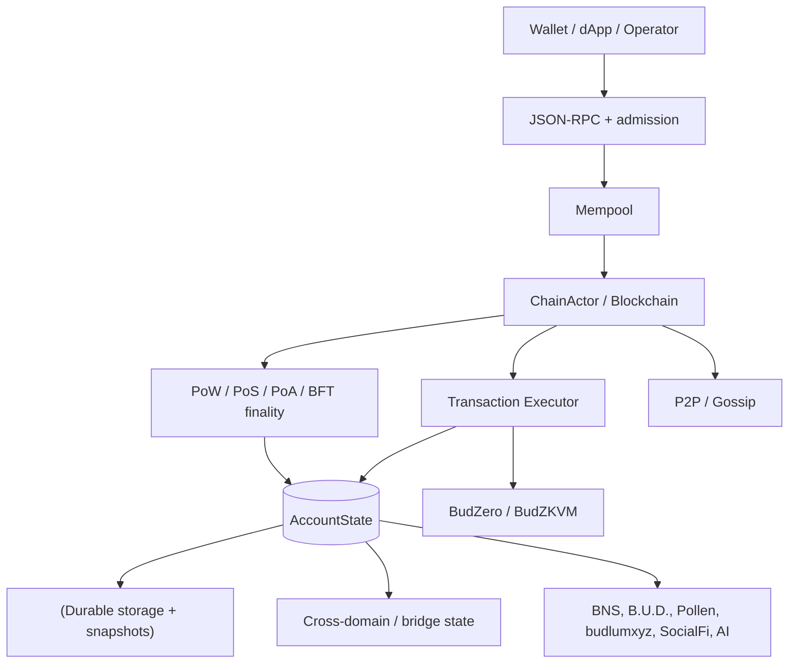

## 2. Consensus-domain izolasyonu

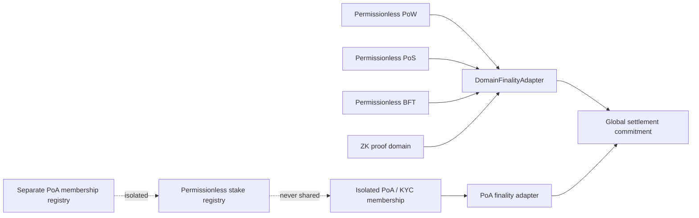

## 3. Transaction admission and V4 signing

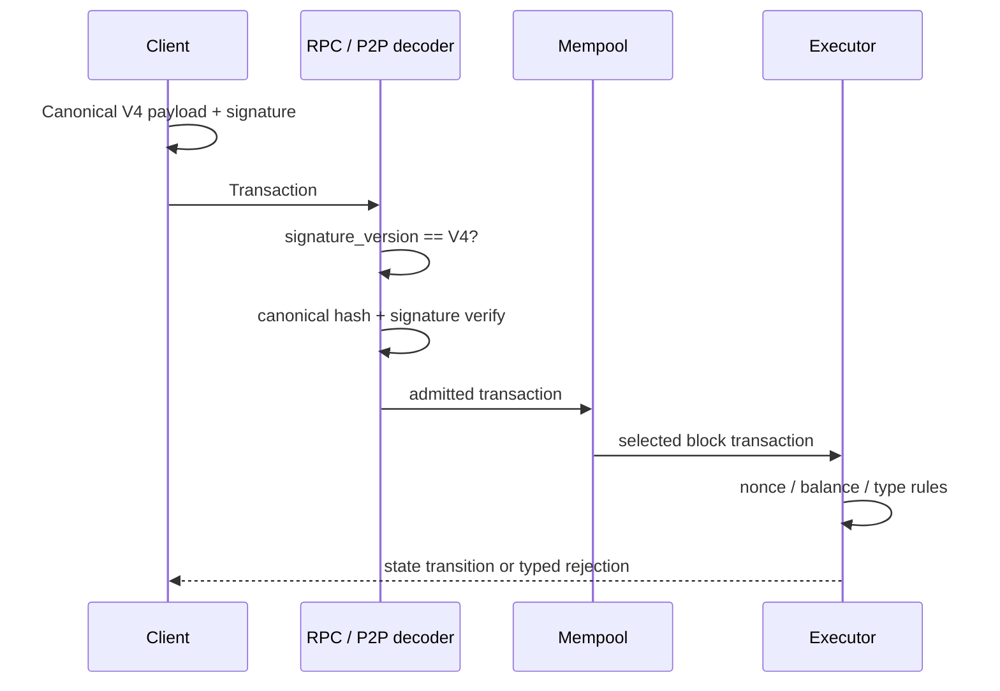

## 4. Cross-domain bridge lifecycle

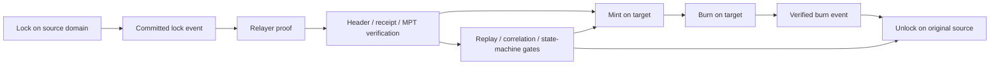

## 5. EVM receipt verification path

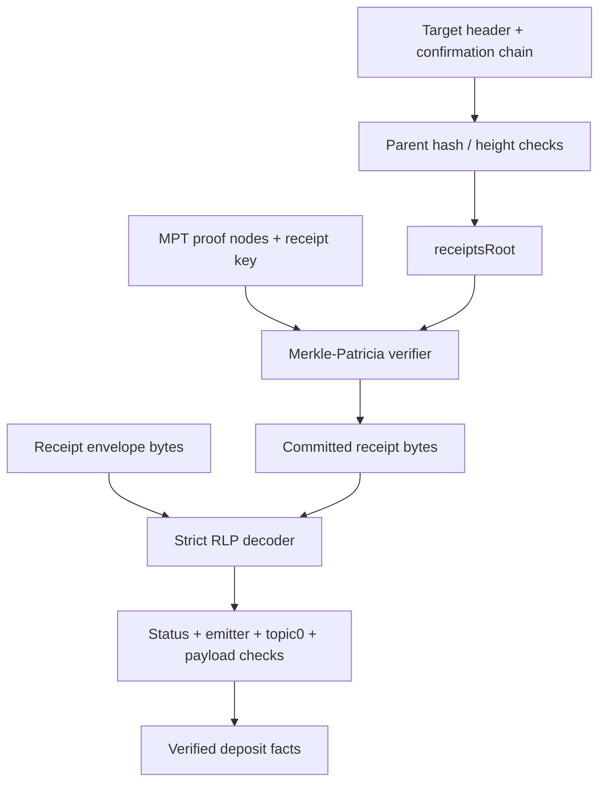

## 6. Snapshot trust and schema migration

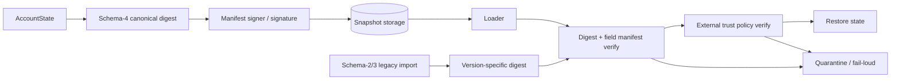

## 7. Critical durability boundary

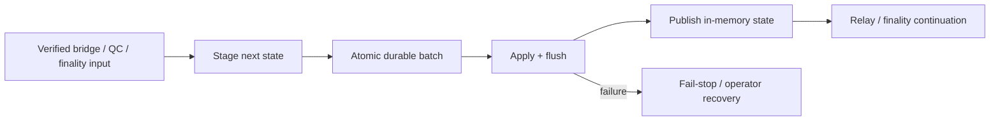

## 8. BudZero execution and proof boundary

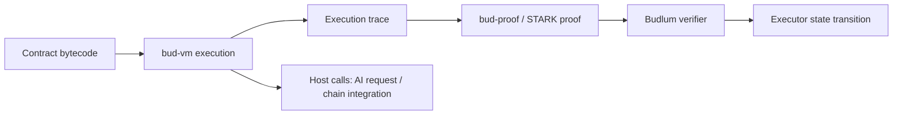

## 9. AI inference lifecycle

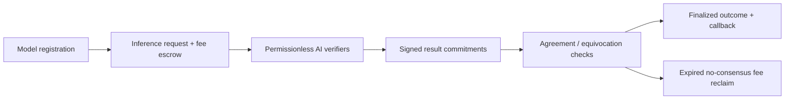

## 10. B.U.D. storage lifecycle

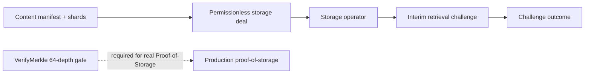

## 11. Mainnet launch gates

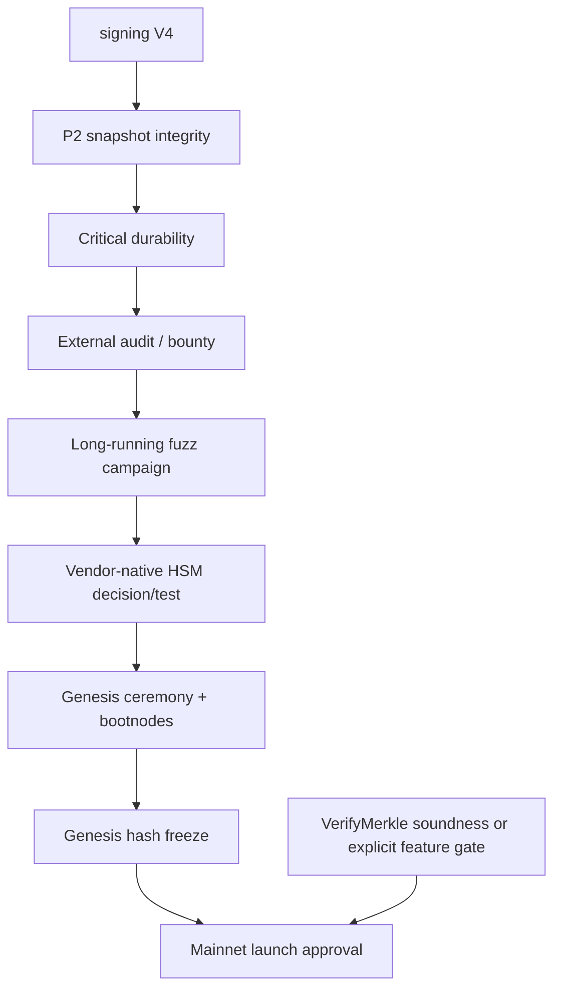

## 12. CI and security gates

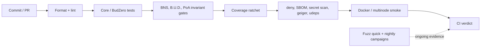


---

# Kapsamlı Sistem Diyagramları (Detaylı Veri Akışı)

## 13. Executor: tam state transition pipeline

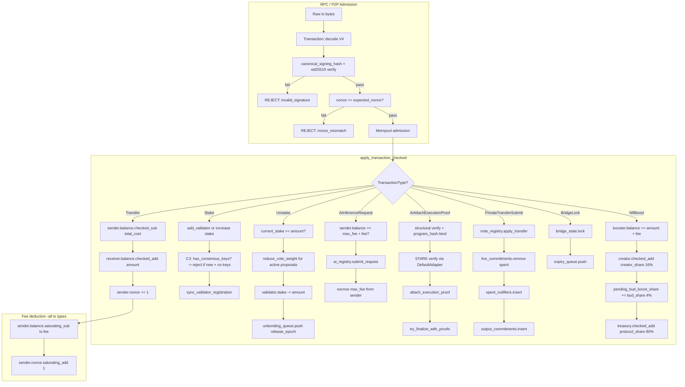

## 14. Privacy layer: Poseidon circuit + note registry state machine

```mermaid
flowchart TD
  subgraph sg4[Wallet-side key derivation]

    Seed[wallet_seed 32 bytes] --> DS[derive_spend_secret SHA3-256 seed // commitment -> u64]
    Seed --> DB[derive_blinding SHA3-256 seed // counter -> u64]
    Seed --> DV[derive_view_key SHA3-256 seed // 0xVIEW -> 32 bytes]
    Addr[address] --> Tag[address_to_recipient_tag SHA3-256 -> u64]
  end

  subgraph sg5[PrivacyCommit opcode -0x20]

    Amount[rs1 = amount u64] --> PC[Poseidon4_hash3 amount blinding recipient_tag]
    Blinding[rs2 = blinding u64 full] --> PC
    RecipTag[imm = recipient_tag i32] --> PC
    PC --> CommitOut[rd = commitment u64]
    CommitOut --> Insert[note_registry.insert_note commitment]
    Insert --> LiveSet[live_commitments BTreeSet]
  end

  subgraph sg6[NullifierCheck opcode -0x21]

    Secret[rs2 = spend_secret] --> NC[Poseidon4_hash secret DOMAIN_NULLIFIER]
    NC --> NullOut[derived_nullifier u64]
    Claimed[rs1 = claimed_nullifier] --> EqCheck{derived == claimed?}
    NullOut --> EqCheck
    EqCheck -->|yes| Rd1[rd = 1 valid]
    EqCheck -->|no| Rd0[rd = 0 invalid]
    Rd1 --> SpentSet[spent_nullifiers BTreeSet insert]
    SpentSet --> DoubleSpend{already in set?}
    DoubleSpend -->|yes| Reject[REJECT: double-spend]
  end

  subgraph sg7[SumConservation opcode -0x22]

    SumIn[rs1 = Sum input amounts] --> SC{sum_in == sum_out AND both < P}
    SumOut[rs2 = Sum output amounts] --> SC
    SC -->|yes| Rd1c[rd = 1 balanced]
    SC -->|no| Rd0c[rd = 0 unbalanced]
  end

  subgraph sg8[AIR constraints -plonky3_air]

    Selector[is_privacy_commit selector -> opcode 0x20]
    PoseidonState[s0=rs1 s1=rs2 blinding s2=imm recipient s3..7=0]
    NullSelector[is_nullifier_check -> opcode 0x21]
    NullState[s0=rs2 secret s1=DOMAIN_NULLIFIER s2..7=0]
    SumSelector[is_sum_conservation -> opcode 0x22]
    SumState[s0=rs1 sum_in s1=rs2 sum_out]
    S2Guard["Goldilocks P bound: both < 0xFFFFFFFF00000001"]
  end
```

## 15. Bridge: full cross-domain message verification pipeline

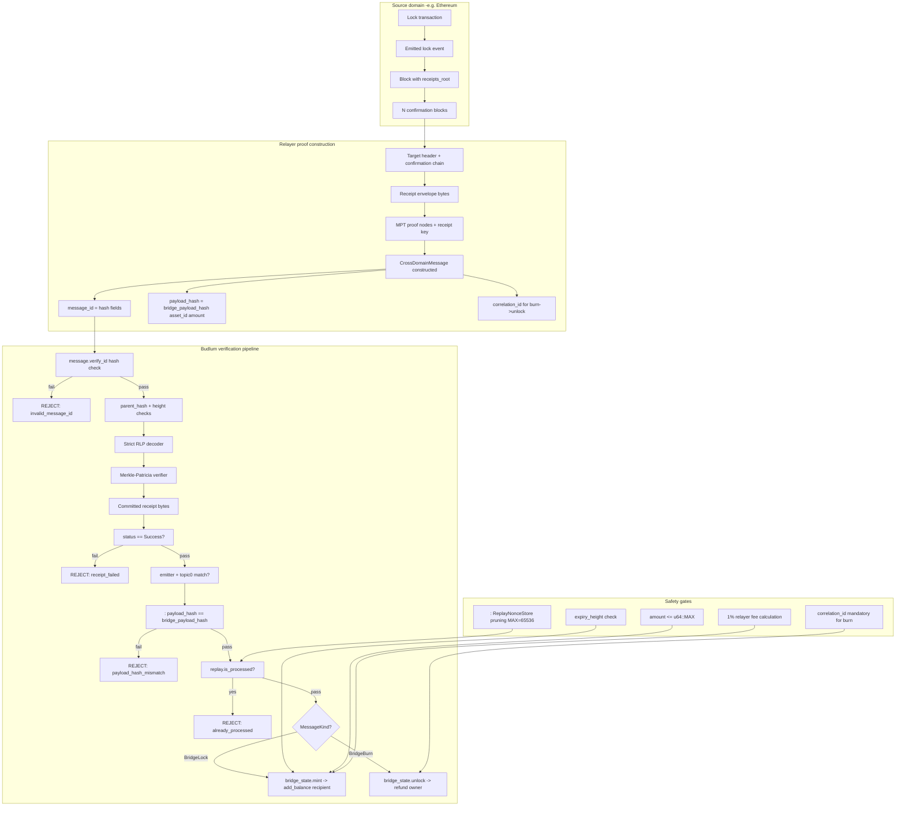

## 16. AI inference + execution proof: full lifecycle with STARK

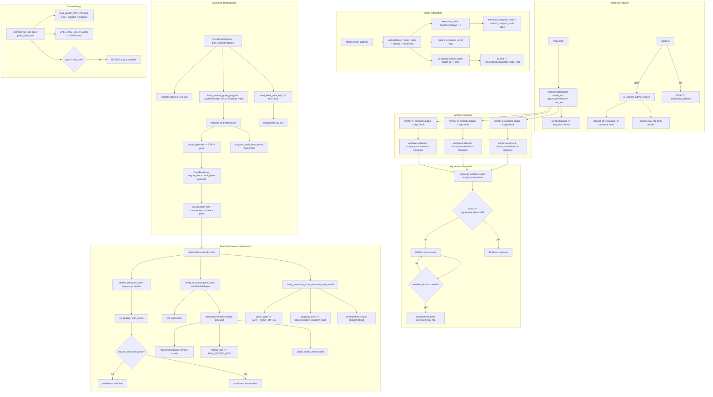

## 17. Consensus finality: all 5 domain adapters

```mermaid
flowchart TD
  subgraph sg20[PoW domain adapter]

    PowCommit["DomainCommitment: domain_block_hash + cumulative_work"]
    PowProof["FinalityProof::PoW: nonce + extra_nonce"]
    PowVerify["verify: declared_head_hash == commitment.domain_block_hash"]
    PowVerify --> WorkCheck[cumulative_work internal consistency]
    WorkCheck --> MinWork[min_work threshold check]
  end

  subgraph sg21[PoS domain adapter]

    PosCommit["DomainCommitment: validators_root + epoch"]
    PosProof["FinalityProof::PoS: BLS certificate"]
    PosVerify[verify: cert.verify BLS aggregate signature]
    PosVerify --> SignerCheck["signers subset of validator_set"]
    SignerCheck --> Threshold["2/3+ stake threshold"]
    PosVRF[VRF: calculate_seed -> validator selection]
    PosVRF --> SeedRisk[C2: poison fallback -> predictable seed]
  end

  subgraph sg22[BFT domain adapter]

    BftCommit["DomainCommitment: round + state_hash"]
    BftProof["FinalityProof::BFT: BLS certificate"]
    BftVerify[verify: BLS cert with signer_count]
    BftVerify --> QuorumCheck[quorum threshold met]
  end

  subgraph sg23[ZK domain adapter]

    ZkCommit["DomainCommitment: proof_hash + program_hash"]
    ZkProof["FinalityProof::ZK: STARK ProofEnvelope"]
    ZkVerify[verify: ProofClaimRegistry first-valid-wins]
    ZkVerify --> StarkCheck["DefaultAdapter::verify envelope"]
    StarkCheck --> PublicInputs[public_inputs_hash match]
  end

  subgraph sg24[PoA domain adapter -isolated]

    PoaCommit["DomainCommitment: authorities_root + round"]
    PoaProof["FinalityProof::PoA: authorities + signatures vec"]
    PoaVerify[verify: ed25519 signature set]
    PoaVerify --> PoaMsg[poa_commit_signing_message commitment-bound]
    PoaMsg --> QuorumPoa[quorum count met no stake]
    PoaIsolation[PoA NO stake in PermissionlessRegistry]
    PoaIsolation --> SeparateReg[PoaMembershipRegistry KYC-only]
  end

  subgraph sg25[Global settlement]

    PowVerify --> Global["GlobalBlockHeader 12+ roots"]
    PosVerify --> Global
    BftVerify --> Global
    ZkVerify --> Global
    PoaVerify --> Global
    Global --> DomainSep[BDLM_GLOBAL_BLOCK_V2 domain separation]
    Global --> Seal[seal_global_header operator-only RPC]
  end
```

## 18. Registry: complete stake + slash + unbond state machine

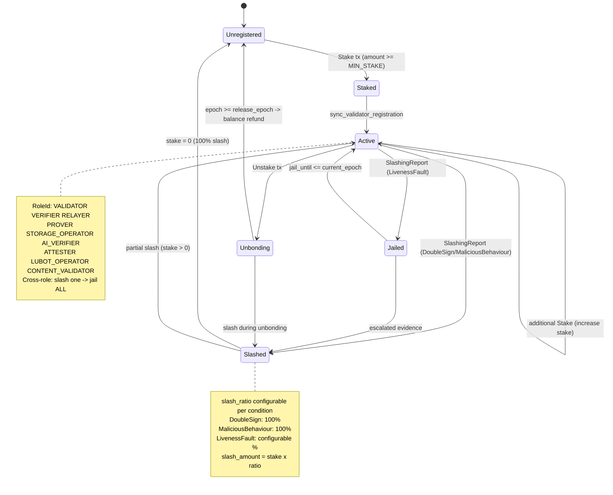

## 19. Wallet: complete signing + privacy + TEE pipeline

```mermaid
flowchart TD
  subgraph sg26[Key derivation]

    Entropy[CSPRNG 16/32 bytes getrandom] --> Mnemonic[BIP39 2048-word English wordlist]
    Mnemonic --> Checksum[checksum verify: SHA256 first N bits]
    Mnemonic --> Seed[PBKDF2-HMAC-SHA512 2048 iterations -> 32 bytes]
    Seed --> SLIP10[SLIP-10 Ed25519 hardened HD m/44'/coin'/account']
    SLIP10 --> SigningKey[ed25519_dalek SigningKey]
    SigningKey --> VerifyingKey[VerifyingKey 32 bytes]
    VerifyingKey --> Address[SHA3-256 -> BudlumAddress]
  end

  subgraph sg27[V4 transaction signing]

    Payload[Transaction payload] --> Canonical[canonical_signing_hash V4]
    Canonical --> Fields["chain_id + nonce + to + amount + fee + data + type"]
    Fields --> Preimage[SHA3-256 domain-separated preimage]
    Preimage --> Ed25519Sign[SigningKey.sign preimage]
    Ed25519Sign --> Signature[ed25519 Signature 64 bytes]
    Signature --> Tx["Transaction: payload + signature + V4 marker"]
  end

  subgraph sg28[Privacy key derivation]

    Seed --> SpendSecret[derive_spend_secret seed // commitment -> u64]
    Seed --> Blinding[derive_blinding seed // counter -> u64]
    Seed --> ViewKey[derive_view_key seed // 0xVIEW -> 32 bytes]
    SpendSecret --> Nullifier[Poseidon2 secret DOMAIN_NULLIFIER]
    Blinding --> Commit[Poseidon3 amount blinding recipient_tag]
  end

  subgraph sg29[TEE execution-time confidentiality]

    TeeConfig[TeeBackendKind: None/ClientSgx/ServerNitro]
    TeeConfig -->|None| NoTee[Plaintext signing path]
    TeeConfig -->|Sgx/Nitro| TeeRuntime[TeeRuntime.seal_private_intent]
    TeeRuntime -->|available| Sealed[Sealed intent -> enclave]
    TeeRuntime -->|unavailable| FailClosed[FAIL-CLOSED: refuse plaintext]
  end

  subgraph sg30[Memory safety]

    Drop["Wallet::drop"] --> ZeroizeMnemonic[mnemonic.zeroize]
    Drop --> ZeroizeSeed[seed.zeroize]
    Drop --> ZeroizeKey[signing_key zeroize internal]
  end

  subgraph sg31[Social recovery]

    Guardians["GuardianApproval: threshold + timelock"] --> Proposal[RecoveryProposal]
    Proposal --> Digest[BDLM_WALLET_RECOVERY_PROPOSAL_V1 domain-separated]
    Proposal --> Timelock["executable_after = created_block + timelock"]
    Proposal --> Rotate[rotate_guardian for compromised]
  end
```

## 20. BudZero STARK: bytecode to verified proof pipeline

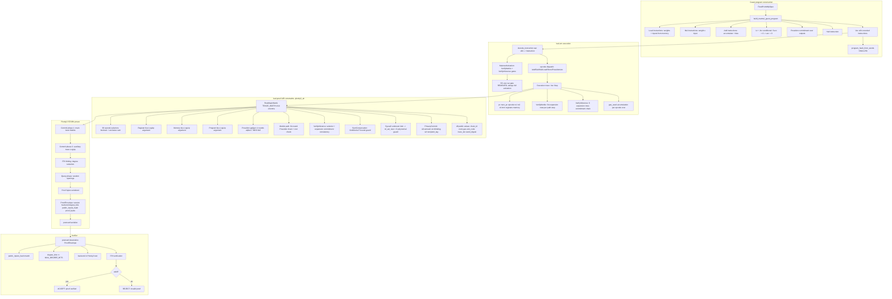

## 21. Governance: proposal to execution pipeline

```mermaid
flowchart TD
  subgraph sg37[Proposal creation]

    Proposer[Proposer address] --> Type{ProposalType?}
    Type -->|ChangeBlockReward| P1[value: new reward amount]
    Type -->|ChangeFeeParams| P2[value: new fee parameters]
    Type -->|SetConstitutionParameter| P3["key + value bounded"]
    Type -->|SetEncryptionPolicy| P4["policy: version + suite + limits"]
    P1 --> Gov[governance.proposals.push]
    P2 --> Gov
    P3 --> Gov
    P4 --> Gov
    Gov --> Epoch["start_epoch + end_epoch"]
    Gov --> Activation[activation_epoch timelock]
  end

  subgraph sg38[Voting period]

    Epoch --> Active[Active status]
    Active --> Vote[Voter: stake-weighted]
    Vote --> For["votes_for += voter.stake"]
    Vote --> Against["votes_against += voter.stake"]
    Vote --> Snapshot[voter_weights snapshot]
    Snapshot --> Unstake[Unstake during voting -> reduce_vote_weight]
    Active --> Cancel[cancel_proposal owner-only]
  end

  subgraph sg39["Epoch advance: finalize"]

    EndEpoch["current_epoch >= end_epoch"] --> Finalize[proposal.finalize]
    Finalize --> TotalStake[total_stake = get_total_stake]
    TotalStake --> Quorum[quorum_pct = 33%]
    Quorum --> Check{votes >= quorum AND for > against?}
    Check -->|yes| Passed[Status: Passed]
    Check -->|no| Rejected[Status: Rejected]
  end

  subgraph sg40["Activation: execute"]

    Passed --> ActCheck["current_epoch >= activation_epoch?"]
    ActCheck -->|yes| Execute[execute_proposal]
    ActCheck -->|no| Wait[Wait for activation]
    Execute -->|ChangeBlockReward| SetReward[block_reward = new_value]
    Execute -->|ChangeFeeParams| SetFee[fee_params = new_value]
    Execute -->|SetConstitutionParameter| SetConst[parameter update with whitelist check]
    Execute -->|SetEncryptionPolicy| SetEnc[encryption_policies.insert DAO-managed]
    Execute --> Whitelist[GOVERNANCE_PARAMETER_WHITELIST validation]
    Whitelist -->|not whitelisted| RejectParam[REJECT: non_whitelisted_parameter]
  end
```

## 22. Tokenomics: burn + vesting + reward state machine

```mermaid
flowchart TD
  subgraph sg41[Genesis allocation -100M BUD, 6 decimals]

    Total[100_000_000 x BUD_UNIT] --> Community[10M -> community accounts]
    Total --> Liquidity[10M -> liquidity accounts]
    Total --> Ecosystem[20M -> ecosystem accounts]
    Total --> Team["20M -> team_vesting cliff+linear"]
    Total --> BurnReserve[40M -> burn_reserve_address]
  end

  subgraph sg42[process_timed_burn -epoch-triggered]

    Epoch[advance_epoch] --> Trigger[process_timed_burn called]
    Trigger --> Rate[annual_burn_rate x BUD_UNIT / epochs_per_year]
    Rate --> BurnFrom[burn_from burn_reserve_address amount]
    BurnFrom --> Supply[circulating_supply decreases]
    BurnFrom --> Exhausted{reserve == 0?}
    Exhausted -->|yes| Stop[Stop burning]
    Exhausted -->|no| Continue[Continue next epoch]
  end

  subgraph sg43[Metabolic tx-fee burn]

    Tx[Transaction applied] --> Fee[tx.fee collected]
    Fee --> Ratio[tx_fee_burn_ratio x fee]
    Ratio --> BurnFee[burn_from sender amount]
    Fee --> Remainder[remainder -> proposer/treasury]
  end

  subgraph sg44[Team vesting -cliff + linear]

    TeamAlloc[20M team allocation] --> Cliff[cliff_epochs: no unlock]
    Cliff --> Linear[linear unlock per epoch after cliff]
    Linear --> Spendable["spendable_balance = balance - locked_at epoch"]
    Spendable --> Transfer{transfer amount <= spendable?}
    Transfer -->|yes| Allow[Transfer allowed]
    Transfer -->|no| RejectVest[REJECT: vesting_locked]
  end

  subgraph sg45[Supply cap enforcement]

    BlockReward[block_reward mint] --> CapCheck["total_bud_committed <= 100M?"]
    CapCheck -->|yes| Mint[Allow mint]
    CapCheck -->|no| CapReject[REJECT: supply_cap_exceeded]
    TotalBud["total_bud_committed = circulating + staked + unbonding"]
    TotalBud --> CapCheck
  end

  subgraph sg46[Fee market -EIP-1559]

    BaseFee[block N-1 base_fee] --> Adjust[±12.5% based on gas usage]
    Adjust --> NewBase[block N base_fee]
    Tx2[Transaction] --> Effective["effective_fee = min max_fee base_fee+priority"]
    Effective --> Burn2[base_fee portion burned]
    Effective --> Tip[priority_fee -> proposer]
  end
```

## 23. P2P protocol stack: libp2p to application

```mermaid
flowchart TD
  subgraph sg47[Transport layer]

    TCP[TCP /ip4/0.0.0.0/tcp/4001]
    QUIC[QUIC /ip4/0.0.0.0/udp/4001/quic-v1]
    Identity[Ed25519 PeerId identity key]
    TCP --> Libp2p[libp2p Swarm]
    QUIC --> Libp2p
    Identity --> Libp2p
  end

  subgraph sg48[Peer discovery]

    Kademlia[Kademlia DHT]
    Bootstrap[Bootstrap nodes from config]
    DNS[Dns seed resolution]
    Kademlia --> Peers[PeerManager known peers]
    Bootstrap --> Kademlia
    DNS --> Bootstrap
  end

  subgraph sg49[Gossipsub messaging]

    Topics[Topic: blocks txs finality snapshots]
    MsgIn[Incoming message] --> Dedup[MessageId dedup SipHash]
    Dedup --> Validate[Message validation]
    Validate --> SizeCheck[MAX_MESSAGE_SIZE 10MB]
    SizeCheck -->|oversized| Score1[report_oversized_message penalty]
    SizeCheck -->|ok| Dispatch[Dispatch to handler]
    Dispatch --> BlockHandler[block received -> validate_and_add_block]
    Dispatch --> TxHandler[tx received -> mempool admission]
    Dispatch --> FinalityHandler[finality cert -> apply_qc_fault_verdict]
  end

  subgraph sg50[Reputation scoring]

    Score[PeerScore: -100 to 100]
    Score --> Good["Valid block/tx relay: +reward"]
    Score --> Bad1[Invalid block: report_invalid_block penalty]
    Score --> Bad2[Invalid tx: report_invalid_tx penalty]
    Score --> Bad3[Oversized msg: report_oversized_message penalty]
    Score --> RateLimit[Rate limit exhaustion: dedicated penalty]
    Score --> Ban{score <= -100?}
    Ban -->|yes| BanPeer["Ban peer + disconnect"]
    Ban -->|no| Continue[Continue connection]
    Eclipse[max_peers_per_subnet /24 = 4] --> Score
    Eclipse --> Idempotent[note_connected/disconnected idempotent]
  end

  subgraph sg51[Snapshot synchronization]

    SnapReq[Snapshot request] --> Chunks[MAX_SNAPSHOT_CHUNKS = 4096]
    Chunks --> Concurrent[MAX_CONCURRENT_SNAPSHOTS = 10]
    Chunks --> Verify["Schema-4 digest + field manifest verify"]
    Verify --> Restore[Restore AccountState]
    Verify --> Quarantine[Quarantine on failure]
  end
```

## 24. Pollen data marketplace: full grant + encryption + AI gate

```mermaid
flowchart TD
  subgraph sg52[DataAsset registration]

    Owner[Data owner address] --> Asset["DataAsset: asset_id + metadata"]
    Asset --> Registry[MarketplaceRegistry.data_assets.insert]
    Asset --> Root1[data_assets_root -> Pollen root -> state_root]
  end

  subgraph sg53[AccessGrant lifecycle]

    Asset --> Grant["AccessGrant: grant_id + grantee + scope + expiry + max_reads"]
    Grant --> GrantReg[MarketplaceRegistry.access_grants.insert]
    Grant --> Root2[access_grants_root -> Pollen root]
    Grant --> Revoke[Revoke: owner-only -> remove from registry]
    Grant --> Expire["Expiry: block > expiry_block -> invalid"]
    Grant --> Exhaust[max_reads reached -> exhausted]
  end

  subgraph sg54[SaleAuthorization + purchase]

    Asset --> Sale["SaleAuthorization: seller + buyer + price + duration"]
    Sale --> SaleReg[MarketplaceRegistry.sale_authorizations.insert]
    Sale --> Purchase["PollenPurchaseReceipt: seller auth + buyer + grant + payment"]
    Purchase --> IssueGrant[issue_grant_from_sale_authorization]
    IssueGrant --> NewGrant[New AccessGrant for buyer]
    Purchase --> ReceiptReg[purchase_receipts.insert -> root]
  end

  subgraph sg55[EncryptionPolicy -DAO-managed]

    DAO[Governance proposal] --> SetPolicy[SetEncryptionPolicy action]
    SetPolicy --> Policy["EncryptionPolicy: version + hpke_suite + min_key + max_duration"]
    Policy --> PolicyReg[MarketplaceRegistry.encryption_policies.insert]
    Policy --> NoDecrypt[NO decrypt/key/read override fields]
    Policy --> AssetPolicy[AssetEncryptionPolicy per-asset]
    AssetPolicy --> Validate["validate_static: algorithm + key_length + rotation"]
    Validate --> RejectNone["EncryptionAlgorithm::None REJECTED"]
  end

  subgraph sg56[AI inference data gate]

    Req[AiInferenceRequest] --> InputRef["input_ref: Pollen data reference?"]
    InputRef -->|no poll| Legacy["Legacy opaque path, no grant needed"]
    InputRef -->|yes poll| GrantCheck{valid AccessGrant exists?}
    GrantCheck -->|no grant| Deny1[REJECT: ai_data_access_denied]
    GrantCheck -->|expired| Deny2[REJECT: grant_expired]
    GrantCheck -->|revoked| Deny3[REJECT: grant_revoked]
    GrantCheck -->|exhausted| Deny4[REJECT: grant_exhausted]
    GrantCheck -->|wrong grantee| Deny5[REJECT: grantee_mismatch]
    GrantCheck -->|valid| Allow[ALLOW: data read permitted]
    Allow --> Consume[Increment read count]
    Consume --> FailCheck[Failed request does NOT consume grant]
  end

  subgraph sg57[D-Web Passport evidence]

    BNSName[BNS name] --> Profile[DwebPassportProfile]
    Profile --> Evidence[EvidenceCard: BNS verified/expired]
    Profile --> PollenSummary[Pollen lineage counts]
    Profile --> Bundle[PassportProofBundle deterministic root]
    Bundle --> Warning["Warning hash only, NO plaintext"]
    Profile --> RPC[bud_passportGetProfile read-only]
    Bundle --> RPC2[bud_passportGetProofBundle read-only]
  end
```

## 25. Cross-domain message verification: EVM MPT deep dive

```mermaid
flowchart TD
  subgraph sg58[Target chain header validation]

    BlockNum[block_number] --> Height["source_height >= deployment_height"]
    ParentHash[parent_hash] --> Chain[chain continuity check]
    Confirm[N confirmations] --> Depth["depth >= min_confirmations"]
    ReceiptsRoot[receipts_root] --> MPT[MPT root for proof verification]
    StateRoot[state_root] --> AccRoot[account state verification]
  end

  subgraph sg59[Strict RLP decoding]

    Bytes[Receipt envelope bytes] --> Prefix[RLP prefix byte]
    Prefix -->|0xf7..0xff| List[RLP list header]
    Prefix -->|0x80..0xb7| String[RLP string]
    List --> Status[Status field: 0x0 = fail 0x1 = success]
    List --> Logs[Logs array]
    Logs --> Topic0[topic0: event signature]
    Logs --> Emitter["Emitter address: known contract?"]
    Logs --> Data[Data: payload bytes]
  end

  subgraph sg60[Merkle-Patricia trie verification]

    Key[RLP encode receipt index] --> Nibble[Convert to nibbles]
    Nibble --> Root[Start at receipts_root]
    Root --> Node{Node type?}
    Node -->|Branch| Branch["16 children + value"]
    Node -->|Extension| Extension["shared nibbles + next"]
    Node -->|Leaf| Leaf["remaining nibbles + value"]
    Branch --> Match[Match next nibble -> child]
    Extension --> Shared[Verify shared prefix matches]
    Leaf --> Remain[Verify remaining nibbles match]
    Match --> Next[Recurse into child node]
    Shared --> Next
    Remain --> Value[Extract leaf value = receipt bytes]
  end

  subgraph sg61[Payload verification]

    Value --> DecodeReceipt[Decode receipt bytes]
    DecodeReceipt --> StatusCheck{status == 0x1 success?}
    StatusCheck -->|no| Reject1[REJECT: transaction_failed]
    StatusCheck -->|yes| EmitterCheck{emitter in allowlist?}
    EmitterCheck -->|no| Reject2[REJECT: unknown_emitter]
    EmitterCheck -->|yes| TopicCheck{topic0 matches expected event?}
    TopicCheck -->|no| Reject3[REJECT: wrong_event_type]
    TopicCheck -->|yes| PayloadHash[": payload_hash == bridge_payload_hash asset_id amount"]
    PayloadHash -->|fail| Reject4[REJECT: payload_hash_mismatch]
    PayloadHash -->|pass| Accept[ACCEPT: verified deposit/lock facts]
  end
```
## 26. Privacy layer: note lifecycle (D2)

```mermaid
flowchart LR
  Seed[Wallet seed] --> Derive["derive_spend_secret + derive_blinding"]
  Derive --> Note[PrivateNoteInput / PrivateNoteOutput]
  Note --> Commit[PrivacyCommit opcode -> Poseidon3]
  Commit --> Reg[L1NoteRegistry live_commitments]
  Note --> Null[NullifierCheck opcode -> Poseidon2]
  Null --> Spent[spent_nullifiers set]
  Reg --> Transfer[PrivateTransferSubmit tx]
  Transfer --> Verify[SumConservation opcode]
  Transfer --> Apply["apply_transfer: remove commitment + insert nullifier"]
  ViewKey[View key disclosure] -. selective .-> Audit[Auditor / authority]
  TEE[TEE opt-in] -. encrypt .-> Note
```

## 27. Wallet-core architecture

```mermaid
flowchart TD
  Entropy[CSPRNG entropy] --> BIP39[BIP39 mnemonic 12/24 words]
  BIP39 --> Seed[PBKDF2 -> 32-byte seed]
  Seed --> SLIP10[SLIP-10 Ed25519 HD derivation]
  SLIP10 --> KeyPair["SigningKey + VerifyingKey"]
  KeyPair --> Address[SHA3-256 -> BudlumAddress]
  KeyPair --> Sign[V4 canonical signing]
  Seed --> Privacy[derive_spend_secret / derive_blinding]
  Seed --> ViewKey[derive_view_key]
  TEE[TeeRuntime opt-in] -. seal .-> Sign
  Zeroize[Zeroize on drop] -. cleanup .-> Seed
  Zeroize -. cleanup .-> BIP39
  Recovery[Social recovery guardians] -. restore .-> Seed
```

## 28. Governance lifecycle

```mermaid
flowchart LR
  Propose[Proposal submitted] --> Active[Active voting period]
  Active --> Vote[Stake-weighted votes for/against]
  Active --> Timelock[activation_epoch timelock]
  Vote --> Finalize[Epoch advance -> finalize]
  Finalize -->|quorum met + majority| Passed[Passed]
  Finalize -->|quorum not met| Rejected[Rejected]
  Passed --> Execute[Execute governance action]
  Timelock --> Execute
  Execute --> Params[Update chain parameters]
  Execute --> BlockReward[Change block reward]
  Execute --> Constitution[Update constitution guardrails]
  Cancel[Proposal cancellation] -. owner only .-> Active
```

## 29. Tokenomics flow

```mermaid
flowchart TD
  Genesis[100M BUD genesis] --> Community[Community 10M]
  Genesis --> Liquidity[Liquidity 10M]
  Genesis --> Ecosystem[Ecosystem 20M]
  Genesis --> Team["Team 20M vesting cliff+linear"]
  Genesis --> BurnReserve[Burn reserve 40M]
  BurnReserve --> TimedBurn[process_timed_burn epoch-triggered]
  TxnFee[Tx fee] --> FeeBurn[tx_fee_burn_ratio metabolic burn]
  TxnFee --> Proposer[Proposer tip]
  TxnFee --> Treasury[Treasury share]
  BlockReward[block_reward mint] --> Proposer2[Block producer]
  TimedBurn --> Sink["Burn sink, supply decreases"]
  FeeBurn --> Sink
```

## 30. P2P network topology

```mermaid
flowchart TB
  Node[Budlum node] --> Gossip[Gossipsub topics]
  Gossip --> Blocks[Block announcements]
  Gossip --> Txs[Transaction relay]
  Gossip --> Finality[Finality certificates]
  Node --> Peers[PeerManager]
  Peers --> MaxPeers[MAX_PEERS = 50]
  Peers --> Subnet[max_peers_per_subnet /24 = 4]
  Peers --> Score[Reputation scoring]
  Score --> Ban["Ban threshold <= -100"]
  Node --> Snap[Snapshot sync]
  Snap --> Chunks[MAX_SNAPSHOT_CHUNKS = 4096]
  Snap --> Concurrent[MAX_CONCURRENT_SNAPSHOTS = 10]
  Node --> Identity[Ed25519 identity key]
  Identity --> Auth[Peer authentication]
```

## 31. Permissionless registry architecture

```mermaid
flowchart LR
  Stake[Stake tx] --> Reg[PermissionlessRegistry]
  Reg --> Roles["RoleId: VALIDATOR, VERIFIER, RELAYER, PROVER, STORAGE_OPERATOR, AI_VERIF..."]
  Reg --> Slash[SlashingReport -> slash]
  Slash --> DoubleSign[DoubleSign -> 100%]
  Slash --> Liveness[LivenessFault -> configurable]
  Slash --> Malicious[MaliciousBehaviour -> 100%]
  Reg --> Unbond[Unbond tx -> unbonding_queue]
  Unbond --> Epoch[Epoch advance -> release]
  CrossRole[Cross-role slashing] -. slash one .-> AllRoles[All roles jailed]
```

## 32. PoA domain lifecycle

```mermaid
flowchart LR
  KYC[KYC / identity verification] --> Membership[PoaMembershipRegistry]
  Membership --> Admin[Admin approval]
  Admin --> Active[Active PoA member]
  Active --> Sign[Ed25519 finality signatures]
  Active --> Compliance[PoaComplianceRegistry]
  Compliance --> Screen[Address screening]
  Compliance --> Freeze[Asset freeze]
  Compliance --> TravelRule[Travel rule metadata hash]
  Compliance --> Audit[Append-only audit log]
  Isolation[PoA isolated from permissionless domains] -. no shared registry .-> Permissionless["Permissionless PoW / PoS / BFT domains"]
```

## 33. Validator lifecycle: multi-role architecture

```mermaid
flowchart TD
  Genesis[Genesis config] --> Val[Validator created with keys]
  Stake[Stake tx] --> Active[Active validator]

  subgraph sg1["Role 1: Consensus Validation"]
    Active --> Propose[Block proposal via VRF]
    Active --> Finality[BLS finality signing]
    Active --> Witness[Epoch witness + vote]
    Propose --> ConsensusReward[Block reward + fee tip]
    Finality --> FinalityReward[Finality signing reward]
  end

  subgraph sg2["Role 2: Lubot CPU/System Provider"]
    Active --> LubotBond[LUBOT_OPERATOR role bond]
    LubotBond --> LubotCompute[CPU/GPU compute for AI inference]
    LubotCompute --> LubotServe[Serve Lubot inference requests]
    LubotServe --> LubotReward[Inference service reward]
    LubotServe --> LubotSlash[Compute fault -> slash]
  end

  subgraph sg3["Role 3: B.U.D. Storage Verification"]
    Active --> StorageBond[STORAGE_OPERATOR role bond]
    StorageBond --> StorageStore[Store content shards]
    StorageStore --> StorageChallenge[Respond to retrieval challenges]
    StorageChallenge --> StorageProof[VerifyMerkle 64-depth proof]
    StorageProof --> StorageReward[Storage operator reward]
    StorageChallenge --> StorageSlash[Challenge failure -> slash]
  end

  subgraph sg4[Cross-Role Slashing]
    Slash[Slashing evidence] --> Jailed[Jailed until epoch N]
    LubotSlash --> Jailed
    StorageSlash --> Jailed
    Jailed --> Release[Jail release]
    Release --> Active
    Liveness["Missed epochs > threshold"] --> LivenessSlash[Liveness report -> slash all roles]
    CrossRole[Slash one role -> jail ALL roles]
  end

  Unstake[Unstake tx] --> Unbonding[Unbonding queue]
  Unbonding --> Epoch[Epoch advance -> release stake]
```

## 34. Pollen data rights lifecycle

```mermaid
flowchart LR
  Asset[DataAsset registered] --> Grant[AccessGrant issued]
  Grant --> Grantee["Grantee address + scope + expiry"]
  Asset --> Sale[SaleAuthorization]
  Sale --> Buyer[Buyer purchases access]
  Buyer --> Purchase[PollenPurchaseReceipt]
  Grant --> AI[AI inference request]
  AI --> Gate[Pollen data gate: valid grant required]
  Gate -->|grant valid| Allow[Allow data read]
  Gate -->|no grant| Deny["Deny, strict default-deny"]
  Encrypt[EncryptionPolicy DAO-managed] -. parameters .-> Asset
  Revoke[Revoke grant/asset] -. owner only .-> Grant
```

## 35. Relayer policy layer

```mermaid
flowchart LR
  User[User intent] --> Intent[UserIntent signed]
  Intent --> Pool[Intent pool]
  Pool --> Solver[Solver bids]
  Solver --> Best[Best bid selection]
  Best --> Settle[IntentSettlement]
  Settle --> Execute[Execute settlement]
  Policy[PolicyEnvelope] --> FeeCap[Fee cap enforcement]
  Policy --> Deadline[Deadline validation]
  Policy --> Domain[Domain allowlist]
  Policy --> Replay[Replay nonce check]
  Slashing[Relayer slashing] --> Griefing[Griefing -> 100%]
  Slashing --> FrontRunning[Front-running -> 100%]
  Slashing --> WrongRelay[Wrong-relay -> 100%]
```

## 36. Fee market (EIP-1559)

```mermaid
flowchart LR
  Block[Block N-1 base_fee] --> Calc[next_base_fee calculation]
  Calc --> Adjustment[±12.5% adjustment based on gas usage]
  Adjustment --> BaseFee[Block N base_fee]
  Tx[Transaction] --> Bid["FeeBid: max_fee + max_priority_fee"]
  Bid --> Effective["effective_fee = min(max_fee, base_fee + priority)"]
  Effective --> Check["effective_fee >= base_fee?"]
  Check -->|yes| Accept[Accepted]
  Check -->|no| Reject["Rejected, underpriced"]
  Accept --> Burn[base_fee burned]
  Accept --> Tip[priority_fee -> proposer]
```

## 37. AI execution proof pipeline

```mermaid
flowchart TD
  Model[FixedPointMlpSpec] --> Host[Host eval_fixed_point_mlp i32 MAC]
  Host --> Output[Output limbs]
  Model --> Guest[build_matmul_guest_program BudZKVM instructions]
  Guest --> ProgramHash[program_hash_from_words]
  Model --> Weights[weights_digest SHA3-256]
  Weights --> Bytecode["Guest bytecode: Load + Mul + Add + ReLU + Poseidon + Halt"]
  Bytecode --> Prove[prove_bytecode -> STARK proof]
  Prove --> Envelope[ProofEnvelope postcard]
  Envelope --> Attach[AiAttachExecutionProof tx]
  Attach --> Verify["Structural verify + program_hash bind"]
  Verify --> STARK[STARK verify via DefaultAdapter]
  STARK --> Finalize[try_finalize_with_proofs]
```

## 38. DeEd content manifest architecture

```mermaid
flowchart LR
  Content[Raw content bytes] --> Hash[ContentId = SHA3-256 domain-tagged]
  Content --> Shards[Off-chain sharding]
  Shards --> ShardRef["ShardRef: shard_id + size"]
  Hash --> Manifest["ContentManifest: shards + metadata + owner"]
  Manifest --> ManifestId["Manifest::id() = deterministic hash"]
  ManifestId --> Chain[On-chain registration]
  Chain --> Deal[Storage deal per shard]
  Deal --> Operator[Storage operator bonds]
  Deal --> Challenge[Retrieval challenge]
  Challenge --> Proof[VerifyMerkle 64-depth proof]
  Roles["Permissionless roles: STORAGE_OPERATOR, ATTESTER"] -. no whitelist .-> Deal
```

## 39. BNS (Budlum Name Service) lifecycle

```mermaid
flowchart LR
  Register[Register name 3-32 chars] --> Cost[Cost = base x multiplier x duration]
  Cost --> Owner[Owner address bound]
  Owner --> Resolve[resolve_content -> address]
  Owner --> SetContent[set_content -> CID/hash]
  Owner --> Transfer[Transfer to new owner]
  Owner --> Renew[Renew before expiry]
  Expiry[Expiry epoch reached] --> Grace[Grace period 3000 epochs]
  Grace -->|original owner| Renew2[Renew only by original owner]
  Grace -->|expired| Available[Name available for re-registration]
  Squat[Front-running squatting protection] -. grace period .-> Grace
```

## 40. SocialFi NFT lifecycle

```mermaid
flowchart LR
  Mint[Mint NFT owner-only] --> Metadata["CID + luminance=0"]
  Metadata --> Luminance[update_luminance delta i128]
  Luminance --> Positive[Positive: amplify reach]
  Luminance --> Negative[Negative: reduce reach]
  Mint --> Transfer[Transfer to new owner]
  Mint --> Burn[Burn -> CID returned]
  Registry[NftRegistry next_id auto-increment] --> Mint
  Guard[Luminance clamp i128 -> safe range] --> Luminance
```

## 41. budlumxyz app registry

```mermaid
flowchart LR
  Developer[Developer address] --> Register[register_app auto-increment ID]
  Register --> Record["AppRecord: website_url + manifest_id"]
  Record --> Update[update_app URL/manifest]
  Register --> SelfVerify[verify_app developer self-verify]
  SelfVerify --> Attested[developer_attested = true]
  Attested --> Verified[verified = true DAO override reserved]
  Root[Registry root hash] --> StateRoot[AccountState state_root]
  Audit[Attestation audit trail] --> SelfVerify
```

## 42. Mempool internals

```mermaid
flowchart TD
  Tx[Incoming transaction] --> Decode["V4 decode + signature verify"]
  Decode --> Admit["Admission: nonce + balance + type rules"]
  Admit --> Pool[Mempool pool max_size=20000]
  Pool --> PerSender[max_per_sender=100]
  Pool --> Evict[evict_lowest_fee when full]
  Pool --> RBF[Replace-By-Fee: higher fee replaces]
  Pool --> Dedup[Duplicate tx rejection]
  Pool --> Select[Block producer selects by fee priority]
  Select --> Block[Included in next block]
  Select --> Expire[Stale tx removed after N blocks]
```

## 43. Developer OS / SDK architecture

```mermaid
flowchart LR
  Manifest[DeveloperOsManifest deterministic] --> Project["Project ID + labels"]
  Project --> DevNet[Local devnet topology]
  Project --> BudL[BudL package fixtures]
  Project --> Proof[Proof fixtures]
  Project --> Pollen[Pollen fixtures]
  Project --> Relayer[Relayer policy fixtures]
  Manifest --> Flags[SDK feature flags]
  Flags --> Offline[Offline default: no external network]
  Flags --> Safety[Safety fixtures: verified proof required]
  Safety --> NoMock[Pollen fixture cannot bypass AI grant]
  Project --> Traversal[Path traversal rejection]
```

## 44. Gateway: Atlas + Passport evidence

```mermaid
flowchart LR
  Address[BudlumAddress] --> Atlas[AtlasWalletContext]
  Atlas --> Account[Account state evidence]
  Atlas --> Pollen[Pollen lineage summary]
  Atlas --> Domain["Domain trace + wallet graph"]
  Name[BNS name] --> Passport[DwebPassportProfile]
  Passport --> Evidence[EvidenceCard: verified/expired/pending]
  Passport --> Bundle[PassportProofBundle deterministic root]
  Bundle --> Warning["Warning hash only, no plaintext"]
  Atlas --> RPC[bud_atlasGetWalletContext read-only]
  Passport --> RPC2[bud_passportGetProofBundle read-only]
  NoPlaintext[Endpoint never returns raw data] -. enforced .-> RPC
  NoPlaintext -. enforced .-> RPC2
```

## 45. Settlement commitment tree

```mermaid
flowchart TD
  Block[Block commitment] --> Roots["12+ root fields"]
  Roots --> DomainReg[domain_registry_root]
  Roots --> Commitment[commitment_root]
  Roots --> Message[message_root]
  Roots --> Bridge[bridge_root]
  Roots --> Replay[replay_root]
  Roots --> Settlement[settlement_root]
  Roots --> Storage[storage_root]
  Roots --> AI[ai_root]
  Roots --> Pollen[pollen_root]
  DomainSep[BDLM_GLOBAL_BLOCK_V2 domain separation] --> Hash[GlobalBlockHeader hash]
  Proof[SettlementProofVerifier] --> Merkle["Merkle proof + domain/height/index check"]
  Merkle --> Forge[expected_block_hash forgery gate]
```

## 46. Prover market: proof verification

```mermaid
flowchart LR
  Task[ProofTask created] --> Assign[Assigned to prover]
  Assign --> Prove[Prover generates STARK proof]
  Prove --> Receipt["ProofReceipt: task_id + prover + hash + reward"]
  Receipt --> Verify["Verification: task_id + prover + epoch + hash + reward cap"]
  Verify -->|valid| Complete[complete_task -> reward committed]
  Verify -->|invalid| Reject["Reject, task stays active"]
  Policy[First valid receipt wins] --> Complete
  Policy --> Duplicate[Identical duplicate -> idempotent]
  Limits["Active tasks + pending receipts bounded"] --> Task
```

## 47. Sovereign domain kit

```mermaid
flowchart LR
  Template[SovereignDomainTemplate] --> Class[SovereignDomainClass enum]
  Class --> PoA[EnterprisePoa -> requires PoA consensus]
  Class --> Custom[Custom class label validated]
  Template --> Compliance[ComplianceEvidence hash/root only]
  Compliance --> NoPII[No private KYC/passport on-chain]
  Template --> Lifecycle[Lifecycle: draft -> active -> retired]
  Lifecycle --> NoReactivate[Retired cannot re-activate]
  Template --> Audit["AuditExportBundle template + compliance root"]
  Audit --> Bounded[Bounded height span]
```

## 48. Constitution engine

```mermaid
flowchart TD
  Guardrails[Hard guardrails immutable] --> NoWhitelist[No permissionless whitelist]
  Guardrails --> NoDecrypt[No AI read/decrypt override]
  Guardrails --> PoAIsolation[PoA domain isolation]
  Guardrails --> NoCustody[No private key custody]
  Guardrails --> EvidenceOnly[Evidence-only API]
  Params[Mutable bounded params] --> HaltMax[emergency_halt_max_epochs]
  Params --> PropMin[constitution_proposal_min_epochs]
  Governance[SetConstitutionParameter proposal] --> Params
  Governance -->|hard guardrail update| Reject[Fail-closed rejected]
  Root[Constitution root hash] --> StateRoot[AccountState state_root]
```

## 49. Mobile self-hosting profile

```mermaid
flowchart LR
  Profile[MobileNodeProfile] --> Power[PowerMode: battery/saver/performance]
  Power --> Battery[BatteryStatus validated]
  Profile --> Network["NetworkStatus: bandwidth + latency + NAT"]
  Profile --> Storage["StorageStatus: capacity + availability"]
  Network --> Relay[Relay address for NAT traversal]
  Storage --> Critical[Critical content requires paid replica]
  Profile --> Opportunistic["Opportunistic hosting, not always-on"]
  Profile --> Scheduled[Scheduled replication windows]
  BatteryCheck[Impossible battery state rejected] --> Battery
  BandwidthCheck[Zero bandwidth rejected] --> Network
```

## 50. Encryption DAO policy lifecycle

```mermaid
flowchart LR
  DAO[Governance proposal] --> SetPolicy[SetEncryptionPolicy action]
  SetPolicy --> Policy["EncryptionPolicy: version + suite + limits"]
  Policy --> Active[active = true]
  Policy --> Deprecated[deprecated_after_block set]
  Policy --> MinKey[min_public_key_bytes enforced]
  Policy --> MaxGrant[max_grant_duration_blocks enforced]
  Policy --> NoDecrypt[No decrypt/key/read override fields]
  Asset[AssetEncryptionPolicy per-asset] --> Validate["validate_static: algorithm + key length + rotation"]
  Validate --> Reject["EncryptionAlgorithm::None rejected"]
  Root[Pollen root hash] --> StateRoot[AccountState state_root]
```

## 51. Security audit: attack graph

```mermaid
flowchart TD
  CIPat[CI PAT leak] --> MainBranch[main branch compromise]
  MainBranch --> CodeManip[Code manipulation]
  PKCS11[PKCS11 data object] --> BLSExtract[BLS key extraction]
  BLSExtract --> FinalityForge[Finality forge]
  BLSExtract --> FixH1["Closed: CKA_EXTRACTABLE false, key never leaves the token"]
  BLSBias["BLS hash_to_g1 bias"] --> FinalityManip[Finality manipulation]
  FinalityManip --> FixC1["Closed: dual SHA3-256 LO/HI, bias below the field modulus"]
  RPCNoAuth[RPC no auth] --> BridgeMint[Unauth bridge mint]
  BridgeMint --> FixR2["Closed: require_operator on every mint path"]
  BridgeNoPayload[Bridge mint no payload check] --> FundInflation[Fund inflation]
  FundInflation --> FixB2["Closed: payload_hash verified against the deposit"]
  SaturatingArith[saturating arithmetic] --> SilentLoss[Silent BUD loss]
  SilentLoss --> FixE1["Closed: checked arithmetic, a refusal instead of a rounded balance"]
  BlindingTrunc[Blinding truncation] --> PrivacyBreak[Privacy break]
  PrivacyBreak --> FixS1["Closed: register-based blinding, full-width factor"]
  NullifierCollision[Nullifier collision] --> DoubleSpend[Double-spend]
  PoseidonDesync[Poseidon constants desync] --> AllProofsFail[All proofs rejected]
  SeedMemory[Seed in memory] --> TotalLoss[Total fund loss]
```

## 52. Panik sinirlari: dogrulayici ve dugum canliligi

Release profili `panic = "abort"` kullanir. Bunun sonucu tek cumleyle: uretim
kodundaki her `unwrap`/`expect`, tetiklenebilirse, bir canlilik acigidir. Bir
es tek bozuk mesaj gonderip dugumu durdurabiliyorsa saldirgan hicbir kripto
varsayimi kirmadan agi yavaslatir.

Bu yuzden `unwrap_used` ve `expect_used` calisma alani genelinde `deny`
(kok `Cargo.toml`, `[lints.clippy]`). Kapi acilmadan once olculdu: uretim
yolunda 150 ihlal vardi, hepsi kapatildi. Kapinin kendisi de sinandi -
uretim koduna gecici bir `unwrap` eklendiginde `clippy --lib -D warnings`
101 ile duser, kaldirildiginda 0 doner.

Muafiyetler dar ve gerekcelidir:

| Yer | Neden muaf |
|---|---|
| `#[cfg(test)]` moduller, `#[test]` fonksiyonlar | Testte panik dogru davranistir: bozulan degismezi bildirme yolu odur. |
| `build.rs` | Derleme zamani calisir, kosan dugum degil; protobuf uretimi basarisizsa derleme sesli durmalidir. |
| `benches/` | Olcum kosucusu; kurulum adimi duserse olcum durmalidir. |
| `Blockchain::last_block` | `&Block` dondurur, geri donulecek sahipli deger yok; zincir insada genesis ile tohumlanir. Tek tek isaretlenmistir. |

Ihlallerin nasil kapatildigi, uc desende toplanir:

1. **Saldirgan girdisi ayristirma.** Koruma varsa ama *uzaktaysa*, yerellestir.
   `verify_bls_sig` icinde `is_none()` denetimi ile `unwrap()` arasinda bir
   ifade mesafesi vardi; `CtOption::into_option()` ikisini tek adimda birlestirir,
   boylece bozuk anahtar yalnizca `Err` olabilir. Ayni sey STARK dogrulayicisi
   icin gecerlidir: sekil denetimi `valid_shape` icinde yapiliyordu, okuma ise
   yuzlerce satir otede; okuma noktasi artik kendi denetimini tasir.
2. **Durum koku hesaplari.** Bunlar her dugumde ayni sekilde kosar. Panik burada
   tek dugumu degil butun kumeyi ayni anda dusurur. Serilestirme hatasi (turetilmis
   `Serialize` icin gerceklesemez) artik sabit bir isaretci baytina duser:
   `BDLM_*_SERIALIZE_FAILED`. Bos bayt kullanilmaz - iki farkli durumun ayni
   hash'e dusmesi, hicbir yerde hata gorunmeden catallanma demektir.
3. **Sabit sinirli aritmetik.** `digest[..8].try_into().expect(...)` gibi
   ifadeler, dilim uzunlugu zaten sabit oldugu icin, sabit boyutlu dizi
   okumasina cevrildi (`copy_from_slice`). Boyle bir yerde akil yurutulecek
   panik hic kalmaz.

Islem kabul yolu ozellikle onemlidir: `Mempool` icinde bir degistirme (RBF)
adayinin hedefi ayni haritadan okunuyordu, yani `unwrap` guvenliydi - ama
herhangi bir es islem gondererek bu yolu tetikleyebilir. Artik reddedilen bir
islem olarak raporlanir.

```mermaid
flowchart TD
  Peer["Es: bayt dizisi"] --> Parse["Ayristirma"]
  Parse -->|"eskiden: unwrap"| Abort["panic = abort: dugum olur"]
  Parse -->|"simdi: into_option / ok_or"| Reject["Err: mesaj reddedilir, dugum yasar"]
  Root["Durum koku hesabi"] -->|"eskiden: expect"| AllDown["Tum kume ayni anda duser"]
  Root -->|"simdi: sabit isaretci"| Deterministic["Kok belirlenimli kalir"]
  Gate["clippy: unwrap_used / expect_used = deny"] --> Parse
  Gate --> Root
  Gate --> Proof["Yeni ihlal CI'da kirmizi"]
```

## 53. Hesap soyutlama: kayit defteri ve V6 coklu imza yetkilendirmesi

Hesap soyutlama katmani uzun sure iki parcali bir eksiklik tasidi. Kod
yazilmisti, gercek ML-DSA-87'ye baglaniyordu ve testleri geciyordu; ama
uretimden hicbir yol ona ulasamiyordu. Iki ayri sebep vardi ve ikisi de
olculdu, tahmin edilmedi.

**Birincisi durum katmaniydi.** `QuantumAccount::validate_all` "esik gardiyan
sayisini asamaz", "sifir esik olmaz" gibi kurallari denetliyordu. Ama uretim
kodunda `QuantumAccount` aramasi sifir sonuc veriyordu: hesap hicbir yerde
saklanmiyordu. Bir hesap turu, onu tutan bir kayit olmadan yalnizca bir
tiptir; korumasi da yalnizca bir niyettir.

`QuantumAccountRegistry` bu bosluga bir kapi olarak yazildi. Kayit iki sartla
gerceklesir: bildirilen adres, hesabin acik anahtarindan turetilen adresle
esit olmali, **ve** `validate_all` gecmeli. Ikincisi olmadan kurallar
uygulanmaz; birincisi olmadan bir hesap baskasinin anahtarini tasiyan bir
adresle kaydedilebilirdi. Guncelleme klonla-dogrula-yaz desenini kullanir:
kaydi gecersiz kilan bir degisiklik uygulanmaz ve kayit eski halinde kalir.
Bir kaydin gecerliligi, ona yazan her yolun ayri ayri dikkatli olmasina
birakilmamali.

**Ikincisi yetkilendirme katmaniydi.** `MultisigPolicy` gercek bir `t-of-n`
denetimi yapiyordu: her imza tek tek dogrulaniyor, ayni sahibin tekrari
sayilmiyor, esigin altinda kalan reddediliyordu. Ama islem semasi tek imza
tasiyordu, dolayisiyla hicbir islem ona bir yetkilendirme getiremiyordu.
Kural kodda vardi, uygulanacagi yol yoktu.

`SIGNATURE_VERSION_V6` o yolu acar. Bir V6 isleminde tek imza alani bos kalir
ve yerine `authorization` gelir: sahip kumesi, esik ve `(sahip, imza)`
ciftleri. Iki tasarim karari bunu tasiyor.

**Adres kumeden turetilir.** `from`, sahip kumesinin ve esigin hash'idir
(`BDLM_TX_V6_MULTISIG_ADDRESS`). Bu olmadan gecerli imzalar toplayan bir
saldirgan kendi kumesini baskasinin adresine iliskilendirebilirdi: imzalar
dogrulanir, adres denetlenmez, hesap harcanir. Esigin de turetmeye girmesi
gerekiyor, cunku ayni uc sahibin `2-of-3` ve `3-of-3` politikalari farkli iki
guvenlik ifadesidir; ayni adresi paylasirlarsa dusuk esikli olan yuksek
esikli olanin fonunu harcar.

**Kume imzanin kapsamindadir, imzalar degildir.** Sahip kumesi ve esik
preimage'e girer; imzalarin kendisi girmez. Kume disarida kalsaydi bir
aracinin kumeyi degistirip imzalari oldugu gibi tasimasi mumkun olurdu.
Imzalar iceride olsaydi imza kendi kendini imzalardi.

Surumler birbirine karismaz: bir V4/V5 islemi `authorization` tasiyorsa
reddedilir, bir V6 islemi tek imza tasiyorsa reddedilir. Iki yetki kaynagi
yan yana durursa hangisinin bagladigi okuyana kalir, ve bu tam olarak sessiz
sapmanin bicimidir.

Dogrulama durumsuzdur: kume islemle birlikte geldigi icin `verify()` hesap
durumunu okumak zorunda degildir. Bu bir tasarim tercihidir - kume zincirde
saklanabilirdi, ama o zaman bir imzanin gecerliligi bir durum okumasina
bagimli olurdu.

```mermaid
flowchart TD
  Owners["Sahip kumesi + esik"] --> Addr["from = H(kume, esik)"]
  Owners --> Preimage["Imza preimage'i"]
  Tx["Islem alanlari"] --> Preimage
  Preimage --> Sigs["t adet ML-DSA-87 imzasi"]
  Sigs --> V["verify_v6"]
  Addr --> Bind{"from kumeden turemis mi?"}
  V --> Bind
  Bind -->|"hayir"| Reject["Reddedilir: baglama kopuk"]
  Bind -->|"evet"| Policy{"MultisigPolicy: esik karsilandi mi?"}
  Policy -->|"tekrar / yabanci / eksik"| Reject
  Policy -->|"evet"| Accept["Kabul"]
  Registry["QuantumAccountRegistry"] -->|"validate_all kapisi"| Shape["Hesap sekli gecerli"]
```

**Sinir.** Kayit defteri hesabin **seklini** dogrular; V6 bir harcamanin
**yetkisini** dogrular. Ikisi ayri karardir ve ayri yerlerde yasar. Bir
hesabin kayitli olmasi onun her islemi yetkilendirdigi anlamina gelmez, bir
imza kumesinin esigi karsilamasi da hesabin kayitli oldugu anlamina gelmez.

## 54. Egemen alanlar: sablonun adlandirdigi seyle ayni olmasi

Egemen Alan Kiti bir alani denetime nasil anlattigimizi tanimlar: sinifi
(CBDC, kamu, kurumsal PoA, konsorsiyum), uzlasma turu, operatoru, KYC
gereksinimi ve uyum kanitinin kokleri. Kit yazildiginda dogru yazilmisti -
PoA bir sablon KYC istemeden gecemiyordu, kimlik alanlardan yeniden
hesaplaniyordu, yasam dongusu gecisleri denetleniyordu. Eksik olan sey
bunlarin hicbiri degildi.

**Eksik olan, sablonun neyi anlattiginin denetimiydi.** Bir sablon
`domain_id = 7` icin "PoA, KYC zorunlu" diyebiliyordu. 7 numarali alanin
gercekte `PoS` olarak kayitli olup olmadigina bakan bir kod yoktu. Iki kayit
da kendi icinde gecerliydi; birlikte yalan soyluyorlardi. Denetime sunulan
belge "bu alan izinli ve KYC'li" derken zincir izinsiz calismaya devam
ederdi, ve hicbir log bunu soylemezdi.

Ayni kusur operatorde de vardi: sablonun isaret ettigi operator, alanin
gercek operatoru olmak zorunda degildi, dolayisiyla baskasinin alani adina
denetim belgesi yazilabilirdi.

`register_template_for_domain` bu bagi kurar. Uc kapi sirayla: alan kayitli
olmali, uzlasma turu eslesmeli, operator eslesmeli. Sablonun kendi
dogrulamasi bundan **sonra** kosar - once adlandirdigi seyin var oldugunu ve
o sey oldugunu bilmek gerekir.

Ayni sinif bir kusur denetim paketinde de vardi. `AuditExportBundle` bir
`template_id` tasir ve kendini o kimlige karsi dogrular; ama kimlik paketin
kendi icinden gelir. Uydurma bir `template_id` ile uretilmis bir paket kendi
tutarlilik denetiminden gecerdi. `validate_audit_export` kimligi once kayit
defterinde arar: kayitli bir sablona karsilik gelmiyorsa paket reddedilir.
Bir seyin kendi kendini dogrulamasi, dogrulama degildir.

Iki giris de dugumun disina acilir (`bud_registerSovereignTemplate`,
`bud_validateSovereignAuditExport`). Sablon kaydi operator yetkisi ister;
denetim dogrulamasi istemez, cunku bir belgenin gecerli olup olmadigini
sormak yetki gerektiren bir islem degildir.

```mermaid
flowchart TD
  Tmpl["Egemen sablon: id, tur, operator, KYC"] --> G1{"Alan kayitli mi?"}
  Reg["ConsensusDomainRegistry"] --> G1
  G1 -->|"hayir"| Rej["Reddedilir"]
  G1 -->|"evet"| G2{"Uzlasma turu esit mi?"}
  G2 -->|"PoA iddia, PoS kayit"| Rej
  G2 -->|"evet"| G3{"Operator esit mi?"}
  G3 -->|"hayir"| Rej
  G3 -->|"evet"| G4{"Sablonun kendi dogrulamasi"}
  G4 -->|"PoA ama KYC yok"| Rej
  G4 -->|"gecti"| Acc["Kaydedilir, kok degisir"]
  Bundle["Denetim paketi: template_id"] --> L{"Kimlik kayitta var mi?"}
  Acc --> L
  L -->|"hayir"| Rej
  L -->|"evet"| B2["Paket sablona karsi dogrulanir"]
```

**Sinir.** Bu bag sablonun **dogru alani anlattigini** garanti eder; sablonun
icerdigi uyum kanitinin gercekten dogru oldugunu garanti etmez. Uyum kokleri
zincir disinda uretilir ve zincir onlari yalnizca tasir. Bunu iddia
etmiyoruz: kokler hash olarak saklanir, icerikleri hicbir zaman zincire
girmez.

## 55. Kanit gecerliligi bir yetkilendirme karari degildir

Bir STARK dogrulayicisi tek bir sey soyler: "bu genel girdilerle bu program
boyle kostu." Soylemedigi sey, o genel girdilerin **dogru olanlar** oldugudur.
Girdilerin hangi zincire, hangi alana, hangi yukseklige ait oldugu kanit
sisteminin kisitladigi bir sey degil; dogrulayicinin kendi kodunda denetlemesi
gereken bir sey.

Bu ayrimin atlandigi her yerde ayni sinif kusur cikiyor. Budlum'da uc tane
bulundu ve ucu de ayni bicimdeydi: **kanit gecerliydi, iddia yalandi.**

**1. Zincir baglamasi.** `submit_zk_proof` gonderenin verdigi
`public_inputs.chain_id`'yi hicbir seyle karsilastirmiyordu. Baska bir zincir
icin uretilmis, kendi zincirinde tamamen gecerli bir kanit burada da dogrulanir
ve bir alani ilerletirdi. Denetim ucret tahsilatindan once kondu: reddedilen
kanit ucret yakmaz, cunku yakilacak bir is yapilmadi.

**2. Ayni kusur, ikinci yer.** AI calistirma yolunda `program_hash` kayitla
karsilastiriliyordu ama `chain_id` karsilastirilmiyordu. `tx.chain_id` ile
baglandi; o alan islemin imza on-goruntusunde oldugu icin gonderen serbestce
secemez. Bir kusuru bulunca ayni bicimin baska nerede oldugunu aramak, kusurun
kendisini duzeltmek kadar onemli.

**3. Iddia yeniden oynatma.** En ciddisi buydu. Tasima mesajini kanita baglayan
hash `(kanit, genel girdiler, program)` uzerindeydi. Kabul edilen iddianin
anahtari ise `(hedef alan, yukseklik)`. Yani kanitin **hangi iddiaya** sunuldugu
on-goruntunun disindaydi ve gecerli tek bir kanit, henuz iddia edilmemis her
(alan, yukseklik) ciftine sunulabiliyordu. Saldirgan kanita dokunmuyor,
yalnizca mesaji yeniden kuruyor. "Ilk gecerli kazanir" politikasi bunu
yakalamaz, cunku her yeni cift onun gozunde yeni bir iddiadir.

Hedef alan ve yukseklik on-goruntuye alindi, alan ayirici `V2`'ye cikti; eski
hash'ler kasten gecersiz.

```mermaid
flowchart TD
  Sub["Kanit sunumu: kanit + genel girdiler + program"] --> B{"Baglama hash'i tutuyor mu?"}
  B -->|"hayir"| Rej["Reddedilir"]
  B -->|"evet"| C{"chain_id bu zincir mi?"}
  C -->|"baska zincir"| Rej
  C -->|"evet"| P{"Program alanin izin listesinde mi?"}
  P -->|"hayir / liste bos"| Rej
  P -->|"evet"| Fee["Ucret tahsil edilir"]
  Fee --> V{"STARK dogrulamasi"}
  V -->|"gecersiz"| Burn["Ucret yanar"]
  V -->|"gecerli"| Claim{"Iddia politikasi: ilk gecerli kazanir"}
  Claim --> Acc["Kabul"]
  Note["Hedef alan + yukseklik baglama hash'inde"] --> B
```

**Sinir.** Bu uc kapi kanitin **dogru iddiaya** ait oldugunu garanti eder;
iddianin icerdigi durum gecisinin zincirin gercek durumuyla ortustugunu
garanti etmez. `final_state_root` kaydediliyor ve cakisma tespitinde
kullaniliyor, ama alanin gercek koku ile karsilastirilmiyor. Bunu iddia
etmiyoruz.

## 56. Yalnizca bizim koydugumuz kod calisir: zk program izin listesi

Onceki bolum kanitin **dogru iddiaya** ait oldugunu garanti eden uc kapiyi
anlatiyor. Hepsi gecildikten sonra bile acik kalan bir soru vardi: kanitlanan
**kod** neydi?

### Bosluk

`Plonky3Adapter::verify` programin Keccak-256 hash'ini hesaplar ve
`public_inputs.program_hash` ile karsilastirir. Bu denetim gercek, ama
soyledigi sey sanildigindan dar: gonderen hem programi hem beklenen hash'i
kendisi verdigi icin, ikisi birbirini dogrular ve **her zaman uyusur**. Denetim
"gonderdigin program, gonderdigin hash'e uyuyor" der. "Bu programin bu alani
ilerletmeye hakki var" demez.

Sonucu su: saldirgan kendi yazdigi bir programi - ornegin durum kokunu istedigi
degere goturen uc satirlik bir programi - alir, onu **durustce** calistirir ve
gercek bir STARK uretir. Kanit kusursuzdur. Hicbir kriptografik denetim onu
yakalayamaz, cunku yalan kanitta degildir. Kanit sistemi "bu program boyle
kostu" demek uzere tasarlanmistir; "bu program calistirilmali miydi" sorusu
onun sorusu degildir.

Bu, kanit sisteminin **kisitlamadigi** alani dogrulayicinin kendi kodunda
denetlemesi gereken sinifin en genis ornegidir. Uc onceki kapi kanitin
kimligini baglar; bu kapi kanitin **yetkisini** baglar.

### Kapi

`ConsensusDomain` artik bir `zk_program_allowlist` tasiyor: o alani
ilerletmesine izin verilen programlarin hash'leri. `submit_zk_proof`
gonderilen programin hash'ini hesaplar ve listede arar; yoksa reddeder.

Izin listesi kimligi, dogrulayicinin AIR'e karsi bagladigi degerin **ayni**si
(etiketsiz Keccak-256, kelimeler little-endian). Kasten ayni: ayri bir etiketli
hash kullanmak, "listedeki program" ile "kanitlanan program" arasinda ayrisma
imkani birakirdi.

Kapi **ucretten once** duruyor. Yetkisiz bir program parasal bir yan etki
uretmeden reddedilir; reddin bedeli saldirgana degil, ona ait olmayan bir
hesaba yazilmaz.

### Bos liste = kapali kapi

Varsayilanin yonu bu tasarimin en onemli parcasi. Liste bos dogar ve bos liste
**hicbir** kaniti kabul etmez. Bir alan, operatoru acikca bir program listesi
verene kadar zk ile ilerletilemez.

Ters varsayilan - "liste bos ise herkese acik" - kullanisli gorunur ve
felakettir: yeni kurulan her alan ve bincode ile goc eden her eski kayit
sussuz dogardi. Depolama goc yolu (`LegacyConsensusDomainV1` -> 
`ConsensusDomain`) bu yuzden acikca `Vec::new()` yaziyor: eski kayitta boyle
bir alan yoktu, dolayisiyla hangi programlara izin verdigi **bilinmiyor**, ve
bilinmeyen izin izin degildir.

```mermaid
flowchart TD
  A["Saldirgan kendi programini yazar"] --> B["Programi durustce calistirir"]
  B --> C["Gercek, gecerli bir STARK uretir"]
  C --> D{"program_hash denetimi"}
  D -->|"gecer: ikisini de o verdi"| E{"Alanin izin listesi"}
  E -->|"program listede yok"| F["Reddedilir - ucret alinmadan"]
  E -->|"liste bos"| F
  E -->|"program listede"| G["STARK dogrulanir"]
  G --> H["Iddia degerlendirilir"]
```

### AI yolu: ayni sinif, farkli bicim

AI cikarim yolu ilk bakista ayni acigi tasiyor gorunur, ama **tasimiyor** ve
farkin nerede oldugu ogreticidir.

`submit_zk_proof` programi **gonderenden** aliyordu. AI yolu ise programi
gonderenden almiyor: `guest_program_for_model` onu modelin **kayitli
boyutlarindan yeniden kuruyor** ve kanit o program ile dogrulaniyor.
Yani yetki zaten kayittan geliyor, gonderenden degil. Ayni sinifin ikinci
ornegi burada **kapaliydi**.

Ama kaydin kendisinde ayri bir kusur vardi. `execution_program_hash` ve
`execution_dims` ayri ayri veriliyordu ve hicbir sey ikisinin **ayni programi**
tarif ettigini denetlemiyordu. Ayrisirlarsa hicbir gecerli kanit o modeli
gecemez: model, kaydi kabul edilmis ama sonsuza kadar dogrulanamaz bir durumda
kalir.

Bu bir sahtecilik acigi degil - fail-closed. Sessiz bir tuzak: hatayi kaydin
kendisinde degil, cok sonra dogrulama zamaninda gosterir. Kayit artik programi
boyutlardan yeniden kurup hash'i karsilastiriyor; tutarsizlik kaynaginda
reddediliyor.

**Iki yuzeyin ayrimi tek cumlede:** yetki gonderenden geliyorsa izin listesi
gerekir; kayittan geliyorsa kaydin kendi ic tutarliligi gerekir.

### Bu kapinin engellemedigi sey

Izin listesindeki bir programin **kendisi** kusurluysa bu kapi yardim etmez;
yetkiyi baglar, dogrulugu degil. Listeye ne konuldugu bir yonetisim sorusudur
ve bilerek kod disinda birakilmistir: alan kendi kumesini kendi ilan eder.
Ayrica AIR'in kendi saglamligi (under-constrained kusurlar) bu kapinin
kapsaminda degildir - o, dis denetime birakilan ayri bir yuzeydir.

## 57. Regeneration: izinsiz kodu reddeden, kanonik kodu geri ureten kapi

Onceki iki bolum kanitin **kimligini** ve **yetkisini** bagliyor. Ikisi de tek
bir degere dayaniyor: programin kanonik hash'i. Bu bolum o degerin kendisini
koruyan mekanizmayi anlatir.

### Problem: ayni degerin dort kaynagi

Bir zk kanitinin hangi program icin uretildigi tek bir degerle soylenir. O
deger su an agacta **dort ayri yerde**, **uc ayri crate**'te ve **iki ayri
hash kutuphanesi**yle hesaplaniyor:

| Yer | Ne icin | Kutuphane |
|---|---|---|
| `src/prover/mod.rs` | alan izin listesi kimligi | `sha3` |
| `src/ai/execution/guest.rs` | AI model kaydi | `sha3` |
| `src/domain/storage_deal.rs` | depolama meydan okumasi | `sha3` |
| `budzero/bud-proof/src/plonky3_prover.rs` | **dogrulayici**, AIR'e baglanan | `tiny_keccak` |

Dordunun ayni sonucu vermesi bir **varsayimdir**, ve varsayimlar bayatlar.
Ayrisirlarsa olan sey sessizdir: izin listesine yazilan hash ile
dogrulayicinin kanittan hesapladigi hash farkli olur. O anda ya her durust
kanit reddedilir (alan kilitlenir), ya da - siralama ters giderse - listede
olmayan bir program listede sayilir.

Derleyici bunu goremez: dort fonksiyon da tek basina dogrudur, yanlis olan
aralarindaki **iliskidir**. Bir tur denetimi iliskiyi ifade etmez.

### Cozum: degeri yeniden uret, koda inanma

`xtask/gates/src/gates/regeneration.rs` Keccak-256'yi **kendi icinde**,
agactaki hicbir hash kutuphanesini kullanmadan uygular. Sonra:

1. Kendi uygulamasini bilinen vektorlerle dogrular (bos girdi, `"abc"`).
   Kapinin kendisi yanlissa soyledigi hicbir sey degerli degildir.
2. Kanonik degeri **yeniden uretir**.
3. Agactaki her uygulamanin kanonik beslemeyi (kelimeler little-endian,
   etiket yok) kullandigini kaynaktan dogrular.

Kapi, kodun soyledigine inanmaz; degeri kendi hesaplar. Bagimsiz ikinci bir
yolla uretip karsilastirma fikri, derleyici guveni literaturunden alinmadir:
tek kaynaga guvenmek yerine iki bagimsiz uretimi karsilastirmak.

```mermaid
flowchart TD
  G["regeneration kapisi"] --> S{"Kendi Keccak'i dogru mu?"}
  S -->|"vektorler tutmuyor"| X["FAIL: kapi guvenilmez"]
  S -->|"evet"| R["Kanonik degeri yeniden uret"]
  R --> C{"Her uygulama kanonik besleme mi?"}
  C -->|"etiket eklenmis"| F["FAIL: ayrisma"]
  C -->|"besleme degismis"| F
  C -->|"yuzey kaybolmus"| F
  C -->|"hepsi ayni"| P["PASS"]
```

### Neden calisma zamaninda degil

"Saldiri algilandiginda kod kendini yenilesin" fikri cazip ve **yanlis
yerde** dogru. Bir dugum calisma zamaninda kendi kodunu degistirirse artik
digerleriyle ayni programi calistirmiyordur - bu bir savunma degil, **uzlasma
bolunmesidir**. Saldirganin en ucuz zaferi savunmayi tetikleyip agi ikiye
ayirmak olurdu.

Regeneration bu yuzden **yayin oncesi** bir kapidir: kayma uretime hic
ulasmaz. Yenileme calisma zamaninda degil, yapi zamaninda olur; belirlenimlilik
korunur.

### Yakinsama: bolen degil, birlestiren

Bu kapinin cekirdek ozelligi ve adinin hakkini verdigi yer burasi. Bir
"yenilenme" mekanizmasi yanlis kurulursa agi boler. Dogru kurulmasinin sarti
**yakinsamadir**: farkli bir baslangictan yola cikan her dugum ayni kanonik
sonuca varmali.

Kapi bunu iddia etmiyor, olcuyor:

* **Idempotence** - ikinci uretim birincisiyle ayni. Olmasaydi iki dugum ayni
  kaynaktan farkli yerlere varirdi; tam olarak kacindigimiz bolunme.
* **Onarim** - bozulmus bir girdi kanonik hale **geri getiriliyor**, yalnizca
  reddedilip birakilmiyor. "Geri uretilsin" tam olarak bu.

Ikisi birlikte sunu verir: izinsiz bir kod girisi karsisinda cevap "her dugum
kendi cozumunu bulsun" degil, "herkes ayni kanonik hale donsun" olur. Ag
korunur, bolunmez.

### Kapinin kendi zayif yeri: elle tutulan liste

Ilk surum uc uretim noktasini **elle sayiyordu**. Bu, icadin kendi icindeki
kol kesme noktasiydi: yarin dorduncu bir yerde ayni hash uretilse liste sessiz
kalirdi - ve tam olarak o sessizlik, kapinin engellemesi gereken seydi.

Olcum bunu dogruladi. Agacta elle sayilan uctan **fazlasi** vardi:

| Bulunan yeni nokta | Ne yapiyor |
|---|---|
| `src/execution/zkvm.rs` | `hash_u64_words`, zkVM'in kendi program hash'i |
| `src/lubot/verify.rs` | Lubot STARK yolunun `build_public_inputs`'i |
| `src/domain/storage_deal.rs` | depolama meydan okumasi program hash'i |

Ucu de uretim kodu, ucu de kapinin gormedigi yerdeydi.

Kapi artik **"bildiklerimi denetle" demiyor, "ne varsa bul ve denetle" diyor**.
Kaynak agacini gezip bir Keccak/SHA3 hasher'ini program kelimeleriyle besleyen
her noktayi kesfediyor; su an **7 nokta** buluyor.

Kesif uc sekilde saglamlastirildi:

* **Alt esik.** Kanonik uretim noktasi sayisi esigin altina duserse kapi
  kirmizi yanar. Yani taramanin kendisi korlesirse bu da bir bulgudur -
  sessizce "hepsi temiz" demez.
* **Etiket istisna listesi.** Alan etiketi kullanan tek gerekcelendirilmis yer
  `program_hash_from_words` (bir *kayit kimligi*, kanitin bagladigi deger
  degil). Baska bir yerde etiket cikarsa bulgudur.
* **Dogrulayici zorunlulugu.** `plonky3_prover.rs`'deki uretim kaybolursa
  kanonik bicimin otoritesi gitmis demektir; kapi bunu ayrica arar.

### Kanonik kod ISA'dan yeniden kuruluyor

Karsilastirma ancak iki taraf **bagimsizsa** bir sey kanitlar. Kapi bu yuzden
depolama meydan okumasi programini `bud_isa`'ya bagimli olmadan, kodlama
kuralini kendi icinde yeniden yazarak uretir. Boylece ISA tarafinda sessiz bir
kayma olursa kapi bunu gorebilir.

Bagimsiz kodlamanin gercek `bud_isa` ile birebir ayni ciktiyi verdigi
olculdu; program baytlari `[2148286750, 0]`.

### Kanaryasi

Kapi kendi kanaryasini tasir (`--self-test`) ve **bes** kaymayi yakaladigini
kanitlar: gerekcelendirilmemis etiketli uretim, dogrulayici yuzeyinin
kaybolmasi, **taramanin korlesmesi**, kanonik programin degistirilmesi, ve
**sonradan sessizce eklenen yeni bir uretim noktasi**. Kanaryasiz
bir kapi, yesil yandigi icin guvenilen ama hicbir sey olcmeyen bir kapidir.

Ayrica gercek agaca **uc kez** kayma enjekte edilerek dogrulandi. Ucuncusu
en onemlisi: agaca yeni bir dosya (`src/attacksim/mod.rs`) eklenip icine
etiketli bir golge program-hash uretimi konuldu. Kapi onu **hicbir listede
olmamasina ragmen** yakaladi:

```
FAIL [regeneration]: src/attacksim/mod.rs:4: program-hash uretiminde alan
etiketi var ve bu dosya gerekcelendirilmis istisnalar arasinda degil
```

Ilk iki enjeksiyon:
`zk_program_hash` govdesine bir alan etiketi eklendiginde ve depolama
programinin `imm` alani 256'dan 512'ye cekildiginde kapi kirmizi yandi ve her
ikisinde de gerekceyi isimlendirdi; geri alininca yesile dondu, `git diff`
temiz kaldi.

### Engellemedigi sey

Kapi **beslemenin bicimini** ve degerin yeniden uretilebilirligini korur;
kanonik bicimin kendisinin dogru secildigini iddia etmez. Dogrulayici bicimi
degistirirse kapi digerlerinin ona uymadigini soyler - hangisinin hakli
oldugunu soylemez. O bir tasarim karari olarak kalir.

## 58. Tarayici sinirinda izin: CORS bir reddetme degil, bir teslim kararidir

Budscan gibi tarayici icinde calisan bir istemci icin dugumun RPC yuzeyi,
sunucunun ne dondurdugu kadar tarayicinin o yaniti JavaScript'e teslim edip
etmedigiyle de belirlenir. Bu iki karar ayridir ve kodda ayri ayri
karsiliklari olmak zorundadir.

`RpcSecurityConfig.cors_origins` alani adiyla ikinciyi vaat ediyordu, ama
yalnizca birincisini yapiyordu: gelen istegin `Origin` basligini listeye
bakip reddediyor, izin verdigi durumda yanita hicbir `Access-Control-*`
basligi eklemiyordu. Sonuc, adin vaadinin tersiydi:

- **Izin verilen koken de engelleniyordu.** Sunucu 200 ve dogru govdeyi
  donduruyor, tarayici `Access-Control-Allow-Origin` bulunmadigi icin yaniti
  cagirana vermiyordu. Yapilandirmada kokeni listelemek hicbir sey
  degistirmiyordu.
- **Preflight kimlik dogrulamasinda oluyordu.** Tarayici, ozel baslikli bir
  `POST` oncesi `OPTIONS` preflight gonderir ve bu istege `x-api-key`
  koymaz. `auth_required=true` iken preflight 401 aliyor, asil istek hic
  gonderilmiyordu. Yani kimlik dogrulamasi aciksa tarayici istemcisi
  yapisal olarak imkansizdi.

Kural olarak yazilisi: **bir izin karari ancak yanitta gorunurse izindir.**
Yalnizca reddetme tarafini uygulayan bir yapilandirma alani, adinin
tasidigi yetkiyi tasimaz.

Kodda karsiligi (`src/rpc/server.rs`):

- `cors_outcome` tek karar noktasidir ve uc sonuctan birini uretir:
  `NotApplicable` (CORS yapilandirilmamis ya da istek tarayicidan gelmiyor),
  `Allow(origin)`, `Deny`. Onceki `is_origin_allowed` silindi; iki ayri
  koken karari birbirinden ayrisabilirdi.
- **Varsayilan kapali:** `cors_origins` bos ise hicbir baslik yayilmaz.
  Tarayici erisimi acik bir yapilandirma gerektirir.
- Izin verilen kokende yanita `Access-Control-Allow-Origin` (yansitilmis
  koken), `Vary: Origin`, izinli yontemler ve izinli basliklar eklenir.
  `Vary` sart: yanit kokene gore degisiyor, aradaki bir onbellek bir kokene
  uretilmis yaniti baskasina servis etmemeli.
- Basliklar yalnizca basarili yanitlara degil, **401 ve 429 yanitlarina da**
  eklenir. Aksi halde istemci gercek hatayi goremez, her seyi ayirt
  edilemez bir ag hatasi olarak gorur.
- Preflight kimlik dogrulamasindan **once** yanitlanir. Guvenli olmasinin
  sebebi preflight'in durum degistirmemesidir: yalnizca "bu koken
  deneyebilir mi" sorusuna cevap verir, IP izin listesi ve koken denetimi
  ondan once kosar.
- `Access-Control-Allow-Credentials` **hicbir zaman** gonderilmez. Kimlik
  `x-api-key` / `Authorization` basligiyla tasinir, cerezle degil; boylece
  `*` yapilandirmasi bir oturum calma yoluna donusemez.

Engellemedigi sey: CORS bir tarayici sozlesmesidir, erisim denetimi
degildir. Tarayici disindaki bir istemci `Origin` basligini diledigi gibi
yazar. Yetkiyi veren sey kimlik dogrulamasi, IP izin listesi ve hiz
sinirlamasidir; bu bolum yalnizca tarayicinin dogru olani yapabilmesini
saglar.

## 59. Dayanikliligi kopya degil tarif saglar: kaynak rejimi ve replikasyon hedefi

Depolama katmani her icerik icin `STORAGE_REPLICATION_TARGET` = 3 kopya
istiyordu. Bu sayi sabitti ve **ne tuttugunu sormuyordu**. Tariften dogan bir
icerik icin uc kopya tutmak, ayni deterministik ureteci uc kez saklamaktir:
kopyalar dayaniklilik EKLEMEZ, cunku icerik zaten zincirdeki tariften yeniden
uretilebilir.

Sorulmasi gereken soru "kac kopya var" degil, **"bu baytlarin baska bir
kaynagi var mi"**. Varsa kopya bir yedek degil, ayni cevabin tekraridir.

### Kaynak rejimi manifest'in beyanidir

`ContentManifest.source` uc rejimden birini soyler:

| rejim | kalici olan | gereken kopya |
|---|---|---|
| `Stored` | baytlarin kendisi | tam hedef (3) |
| `Generated(spec)` | yalnizca tarif | **1** |
| `Hybrid { prefix, spec }` | onek + tarif | tam hedef (3) |

`Generated` icin bir kopya yeterlidir: o kopya tarifin cikti verdigini
gosteren canli ornektir, dayanikliligi saglayan sey tarifin kendisidir.
Kaybolan kopya zincirdeki tariften yeniden uretilir.

**`Hybrid` neden indirim ALMAZ:** indirim, kaybi telafi eden bir uretecin
varligindan gelir. Onek boyle bir uretecten dogmaz - gercek, yeniden
uretilemeyen bayttir. Kismi indirim vermek, korunmayan bayta korunuyormus
muamelesi yapmak olurdu.

### "Uretiliyor" bir indirim talebidir, bu yuzden kanitlanir

Bir manifest "bu icerik tariften doguyor" diyerek ucte bir kopyayla tam
dayaniklilik odemesi talep eder. Bu iddia dogrulanmasaydi, siradan organik
icerigi `Generated` diye etiketleyen biri indirimi alir ve icerik **gercekten
kaybolurdu**.

`StorageRegistry::register_manifest_with_source` iddiayi kabul etmeden once
**tarifi kosar**, cikan baytlarin icerik kimligini hesaplar ve manifest'in
shard'iyla karsilastirir. Tutmuyorsa kayit reddedilir; reddedilen manifest
kaydedilmez, dolayisiyla indirimi de alamaz. Kayitli olmayan icerik tam
hedefe duser (fail-closed).

Uyduramazsin: tarif uzayi icerik uzayindan kucuktur. Tarif ancak icerik
gercekten o tariften dogduysa tutar - "her organik dosyaya tarif buluruz"
diyen bir tasarim guvercin yuvasi ilkesine carpar.

`Hybrid` bu yolda kabul edilmez: onek baytlari zincirde degildir, bu yuzden
dogrulanamaz. **Dogrulanamayan iddia indirim de almaz.**

### Rejim kimlige girer

`source` `manifest_id`'ye dahildir. Olmasaydi ayni baytlar icin biri
"tutuluyor" digeri "uretiliyor" diyen iki manifest ayni id'yi paylasirdi ve
`register_manifest` ilk-yazan-kazanir oldugu icin biri digerinin dayaniklilik
gereksinimini sessizce degistirebilirdi.

`Stored` taahhude **hicbir bayt eklemez**. Bu kasitli: alan sonradan eklendi
ve `Stored` bu alandan onceki her manifest'in anlamiydi. Bir alan eklemek
eski kimlikleri degistirmemeli.

### Ne saglamaz

- **Organik icerik icin depolamayi sifirlamaz.** Tariften dogmamis bir
  icerikte birinin baytlari tutmasi bilgi kuramince sarttir. Bu bolum yalnizca
  tarifli sinifta kopya sayisini durustlestirir; "her icerik icin depolama 0"
  diyen bir tasarim yalan soyler.
- **Erisim surekliligini garanti etmez.** Tek kopyali tarifli icerikte o kopya
  duserse veri kaybi olmaz (tarif zincirdedir) ama yeniden uretilene kadar
  servis durur. Dayaniklilik ile erisilebilirlik ayri eksenlerdir.
- **Uretecin belirlenimliligini kanitlamaz.** `GeneratorId` kapali bir
  kumedir ve her girdinin belirlenimliligi kendi kaynagindan savunulur; keyfi
  bytecode bu garantiyi tasimaz.

## 60. Turev temsil: kare kendini tanimlar, hicbir ara urun saklanmaz

Bir icerik, kanaldan gecebilmek icin bicim degistirir: kareler halinde
paketlenir, kanalin tasiyabilecegi bir temsile donusur. Sorulmasi gereken
soru sudur: **bu donusum depolamaya ne ekler?**

Cevap: hicbir sey. `RenderFormat::QrStream` bir depolama bicimi degil, bir
**tasima temsilidir**. Kare talep aninda uretilir, hicbir ara urun
saklanmaz. Icerigin kalici hali yine manifest'in soyledigi seydir - tarifli
icerikte tarif (§59), organik icerikte baytlar. Turev temsil hicbir rejimde
depolama EKLEMEZ; testi bu ozelligi dogrudan olcer.

### Neden kare kendini tanimlamak zorunda

Optik ya da yayin kanalinda **geri kanal yoktur**. Alici kayip bir kareyi
yeniden isteyemez, el sikisma yapamaz, akisa ortasindan katilir. Baglam
tasiyan bir kare, o baglami kaciran alici icin coptur. Bu yuzden her kare tek
basina ayristirilabilir olmak zorundadir.

Baslik alanlari ve her birinin **hangi hatayi onledigi**:

| alan | onledigi hata |
|---|---|
| iki sihirli bayt | "bu bizim mi" sorusu, herhangi bir surum adlandirilmadan once cevaplanmali. Tek bayta bakan alici, bu protokolu hic konusmamis bir kaynagi "surumun eski" diye suclar - kameradaki her kod bu yoldan gecer |
| surum | ayristirmayi butunuyle kapiya baglar; bilinmeyen surum sessizce yanlis ayristirilmaz, **adlandirilir** |
| bayraklar | `0x0F` anlasilmasi zorunlu, `0xF0` yok sayilabilir yari |
| `seq` | kacinci kare; ayni `seq` her zaman ayni baytlar |
| `total_len` | alici ne kadarini topladigini bilir |
| yuk ozeti | kare bozuksa yuk kullanilmaz |

**Bayrak bolmesi bastan gelir, cunku sonradan eklenemez.** "Her bilinmeyen
bit olumcul" denmis bir aliciyi ancak yeni bir format kirilmasi duzeltir.
Yok sayilabilir yariyi bugun ilan etmek, hicbir bit onu kullanmasa bile
tasarimin kendisidir.

**Sessiz basarisizlik yuksek sesli olandan kotudur.** Cozemedigi bir kareyle
karsilasan alici hangi durumda oldugunu soylemeli; ama bize ait OLMAYAN bir
kare icin **susmali** - kamera goruntusundeki her kodu anlatmak gurultudur ve
yanlis tahmin ekranda kalir.

### Ne yapmaz

- **Kanal kodlayici degildir.** Silinti kodu, gercek modul matrisi ve video
  konteyneri ayri, surumlenmis adimlardir. Burasi yalnizca kanalin tasiyacagi
  kendini-tanimlayan kareyi kurar.
- **Kanalin belirlenimliligini garanti etmez.** Kare uretimi belirlenimlidir;
  kanalin kendisi degildir. Kayipli bir yeniden kodlama altinda round-trip,
  hedef kanalda olculmeden varsayilamaz.
- **Organik icerikte depolamayi sifirlamaz.** Temsil degistirmek bilgi
  kuramini degistirmez (§59).

## 61. Kimlik kimi, tasima limiti neyi sinirlar: dinlemeden once iki soru

Kimlik dogrulama **kimin** cagirabilecegine karar verir. Tasima limitleri
kabul edilen cagirinin **ne kadara mal olabilecegine** karar verir. Bunlar
farkli iki sorudur ve bir tanesinin cevaplanmasi digerini cevaplamaz:
yetkili bir istemci de tek bir istekle dugumun bellegini tuketebilir.

`validate_rpc_security_config` uzun sure yalnizca birinci soruyu soruyordu:
`auth_required=true` iken API anahtari bos mu. Ikinci soru hic sorulmadigi
icin `max_request_body_size` ve `max_connections` alanlari `None` birakilmis
bir yapilandirma **dogrulamadan gecip dinlemeye baslayabiliyordu**; limit o
noktada bizim degil, tasima kutuphanesinin varsayilaniydi.

Ayrisma yapinin kendisinden geliyordu: bu iki alan `Option` idi ve dort ayri
kurucudan uc tanesi (`default`, `operator_default`, dogrudan struct kurulumu)
bir deger koyarken `from_env` **ikisini de `None` birakiyordu**. Yani surumun
guvenlik durusu, config'in hangi kurucudan geldigine bagliydi. Uretimde
`main.rs` alanlari kurucudan sonra elle dolduruyordu; bunu yapmayan her cagri
yolu sessizce sinirsiz kaliyordu.

**Kod ne yapiyor:**

- `from_env` artik iki alani da dolduruyor (`RPC_DEFAULT_BODY_LIMIT`,
  `RPC_DEFAULT_CONNECTION_LIMIT`). Kendi degerini isteyen cagiri kurulumdan
  sonra ustune yazar; hicbir sey soylemeyen cagiri **sinirli** kalir.
- `validate_rpc_security_config` her iki alanin **var oldugunu** ve
  **gercekten sinirladigini** denetliyor. Reddedilen dort durum: alan yok;
  deger `0` (bir limit degil, bir kilit); deger `RPC_BODY_LIMIT_CEILING`
  ustu; deger `RPC_CONNECTION_LIMIT_CEILING` ustu. Bellegi tuketmeye yetecek
  kadar buyuk bir sayi limit degildir, yanlis yapilandirmadir.
- Denetim `run` icinde, dinleyici acilmadan once calisir. Reddedilen yapilandirma
  bir uyari degil, baslatma hatasidir (fail-closed).

**Sinir:** bu limitler tek bir dugumun kabul kapisidir. Dagitik hiz sinirlama,
istemci basina kota ve ustteki ters vekilin kendi limitleri ayri katmanlardir;
buradaki denetim onlarin yerine gecmez.

## 62. Iki kok: consensus'un okudugu ve kanit verebilen

Zincirde artik hesap durumu uzerinde **iki** kok var. Bu bir tutarsizlik degil,
bilincli bir ayrimdir: iki kok ayni hesap kumesine baglanir ama **farkli yapilar
altinda**, cunku iki farkli soruya cevap verirler.

**Consensus kokun** (`core::account::calculate_state_root`) sorusu: *durum ne?*
Yapraklar hesap haritasinin siralamasiyla dizilir, agac cache'lenir ve kirli
hesaplar uzerinden artimli guncellenir. Blok uretimi ve dogrulama bunu okur.
Bu kok degismez; degistirmek zinciri catallar.

**Kanit veren kokun** (`storage::merkle_trie`) sorusu: *bunu nasil
kanitlarsin?* Consensus koku bu soruya cevap veremez ve bunun sebebi bir
eksiklik degil, yapisidir:

- **Yaprak konumu ile adres arasinda kriptografik bag yok.** Konum, hesap
  haritasinin gezinme sirasindan gelir. Bu agactan cikan bir yol "bir yerde su
  yaprak var" der; **hangi adresin yapragi oldugunu soylemez**. Bir dogrulayici
  yolu baska bir adresin kaniti diye yeniden etiketleyebilir.
- **Yokluk kaniti sinirli boyutta verilemez.** Bir adresin agacta *olmadigini*
  gostermenin tek yolu tum yapraklari gonderip dogrulayiciya kendisinin
  aratmaktir: tanik hesap sayisiyla buyur, O(n).

Trie'de konum **adresin bitleridir**. Bu iki sonucu dogurur: iclik ve dislik
ayni sabit derinlikli (256) kanittir, ve bir kanit baska bir adrese
etiketlenemez - `MerkleProof::verify` her adimda yon bitinin adresin ilgili
bitiyle eslestigini denetler, eslesmezse kanit **gecmez**.

**Yuzey:** `prove_account` bir `AccountProofBundle` uretir; zincir aktoru
`GetAccountProof` komutuyla bunu sunar; RPC `bud_getAccountProof` olarak disa
verir. Alan adi bilerek **`proofRoot`**, `stateRoot` degil: iki koku
karistiran bir istemci yanlis degere karsi dogrulama yapar.

**Fail-closed:** dugum kendi urettigi demeti kendi kokune karsi dogrulamadan
tele koymaz. Dogrulamayan demet bir istemci hatasi degil, bir dugum hatasidir
ve `-32603` ile reddedilir; bozuk kaniti sahte kanittan ayirmak cagirinin isi
degildir.

**Ne yapmaz:** demetin tasidigi kok, tasidigi icin guvenilir olmaz. Bir
dogrulayici ya o koku bagimsiz bir kaynaktan almalidir ya da yalnizca demetin
kendi icinde tutarli oldugunu ogrenmis olur. Kanit, yalnizca ifade ettigi seyi
garanti eder.

### 62.1 Maliyet olculdu, ve olcum tasarimi degistirdi

Olcum (referans makine, release):

| Hesap | Kok kurma | 1 kanit | 10 kanit | Dogrulama | Kanit boyu |
|---|---|---|---|---|---|
| 100 | 4,6 ms | 4,6 ms | - | 32 us | 8288 B |
| 1000 | 44,7 ms | 45,4 ms | 459 ms | 32 us | 8288 B |
| 5000 | 221 ms | 229 ms | **2,23 s** | 32 us | 8288 B |

Uc sey okunuyor:

1. **Dogrulama sabit** (32 us) ve **kanit boyu sabit** (8288 B), hesap sayisi
   ne olursa olsun. Trie'yi isteme sebebimiz buydu; olcum onu dogruluyor.
2. **Kanit uretimi kok kurmayla ayni maliyette.** Yani pahali olan gezinme
   degil, **agacin kendisini kurmak**.
3. Ve iste asil bulgu: **10 kanit, 1 kanitin 10 kati.** Onuncu cagiri,
   birincinin zaten kurdugu agaci yeniden kurmak icin oduyordu.

Ucuncu madde bir tasarim hatasidir, bir performans notu degil.
`bud_getAccountProof` uzaktan tetiklenir; her istegin agaci sifirdan kurmasi
cagiriya bir **is carpani** verir.

**Ilk cozum yanlisti.** Once bir tavan konmustu (`MAX_PROOF_ACCOUNTS`):
hesap sayisi asilirsa istek reddedilsin. Ama bu, maliyeti cozmek yerine
**ozelligi kapatiyordu** - buyuyen bir agda kanit hizmeti bir gun sessizce
kesilecekti ve sebep bir tasarim tercihi degil, unutulmus bir sabit olacakti.
Tavan bir sinir gibi gorunuyordu; aslinda bir teslim olustu.

**Dogru cozum agaci saklamaktir.** `ProofTrieCache` trie'yi **yukseklik
basina en fazla bir kez** kurar:

- **Tembel:** kanit istenmezse agac hic kurulmaz. Kimsenin kullanmadigi bir
  ozelligin bedelini dugumu calistirmak odemez.
- **Yukseklikle anahtarlanmis:** durum yalnizca blokla degisir, bu yuzden
  kuruldugu yuksekligi tasiyan bir agac ya gunceldir ya atilir. Bayrak ya da
  zaman damgasi degil, **yukseklik** - cunku bayrak set edilmeyi unutulabilir,
  yukseklik unutulamaz.
- Sonuc: bir yukseklikteki ilk istek agaci kurar, sonraki her istek bir agac
  gezintisidir (32 us dogrulama tarafinda, uretim tarafinda 256 seviye).

**Bayat agac neden tehlikeli:** kuruldugu andaki duruma ait kanit, **kendi
kokune karsi dogrulanir**. Yani bayat bir kanit bozuk gorunmez - dogru
gorunur, yanlis soruyu cevaplar. Iki test bunu tutuyor: `prove_from_trie` ile
`prove_account` her adres icin **ayni** demeti uretmeli (onbellek farkli bir
cevap veremez), ve durum degisince kok **degismeli** (yoksa bayatlik
saptanamazdi).

### 62.2 Neden simdi, ag kullanilmiyorken

Bu is bilerek **kullanim baslamadan** yapildi. Iki kok bir arada durdugu surece
catallanma sorusu yok; ama zincir canliyken ikinci bir kok eklemek, hakkinda
uzlasilmasi gereken yeni bir alan eklemek demektir. Su an eklemenin bedeli
yalnizca CPU; sonra eklemenin bedeli bir surum gecisi olurdu.

Ayrica olcumun kendisi tasarimi degistirdi: onbellek gereksinimi belgeden
degil, **rakamdan** dogdu. Bu ancak kod var olunca olculebilirdi. Sira sudur:
**once kod, sonra olcum, sonra tasarim** - tersi, tahmine gore optimize
etmektir.

## 63. Komsulukla verilen garanti garanti degildir

`bud_stark` dogrulayicisinda `recompose_quotient_from_chunks`, Lagrange
katsayilarini **domain listesinden** uretir ama toplami **chunk listesinin**
indisiyle gezer. Iki listenin uzunlugu esit olmak zorundadir. Esitligi
denetleyen kod vardi - ama **baska bir fonksiyonda**: `verify_with_preprocessed`
icindeki `valid_shape`.

Bu bir garanti degil, bir **komsuluk**tur. Uc sorunu var:

1. **Fonksiyon `pub`.** Yarin eklenen ikinci bir cagiri o denetimi miras
   almaz; hicbir sey ona denetimi hatirlatmaz.
2. **Chunk sayisi uzak taraftan gelir.** Kanit bir baskasinin urettigi
   veridir; uzunluk uyusmazligi bir yazilim hatasi degil, **saldirgan
   girdisidir**.
3. **Hata modu reddetme degil, panik.** Dogrulayici yolunda panik, uzaktan
   tetiklenebilen bir dugum durmasidir. Kotu kaniti reddetmek isimizdir;
   kotu kanit yuzunden **durmak** degildir.

Kodda eski hali soyle savunuluyordu: *"We checked in valid_shape ... hence the
unwrap will never panic."* Bir yorumun garanti ettigi sey derleyicinin garanti
ettigi sey degildir. Yorum dogruydu - **bugun** ve **o tek cagiri icin**.

**Yapilan:** on kosul, ihlal edildiginde yanlis olacak kodun **yanina** tasindi.
Fonksiyon artik `Option<SC::Challenge>` donduruyor ve uzunluklar uyusmuyorsa
`None` veriyor; cagiri bunu `VerificationError::InvalidProofShape`'e ceviriyor.
Indeksleme `get(...)` ile yaziliyor: paniki dislayan sey artik yorum degil,
tipin kendisi.

**Neden `Option`, neden onarim degil:** sekli ornege uymayan bir kanit, duzeltilmesi
gereken bir kanit degildir - **kanit degildir**. Eksigi sifirla tamamlamak,
dogrulayiciyi kabul etmemesi gereken bir seyi kabul eder hale getirir.

**Genel kural:** *bir denetimin kime hizmet ettigi belliyse, o denetim onun
yanindadir.* Uzaktaki bir denetime dayanan kod, o denetim tasindiginda veya
yeni bir yol acildiginda sessizce savunmasiz kalir; ve bunu kimse fark etmez,
cunku her sey derlenir ve butun testler gecer.

## 64. Izinli alanda kabul yoklugu izin degildir

PoA'da iki kabul modeli yan yana duruyordu ve **uyumlu olan kapaliydi**.

`registry/poa_onboarding` tam bir kabul yasam dongusu tasiyor: alan basina
admin, onay/red/iptal, degistirilemez denetim izi, ve **KYC gecerlilik ufku**.
Consensus ise bunu hic gormuyordu; baktigi sey `PoAEngine` uzerindeki duz bir
`Vec<Address>`'ti. O vektor yalnizca `with_authorities` ile dolar ve uretimde
hicbir yol onu cagirmiyordu. Uc kurulum noktasinin ucu de listeyi bos
birakiyordu.

Ve bos liste **"filtre yok"** demekti.

Sonucu soyle okumak gerekir: izinli olmasi gereken bir alan, kabul listesi hic
doldurulmadigi icin **izinsiz calisiyordu** - ve saglikli gorunuyordu. Yazilan
uyum katmani (KYC ufku, iptal yolu, denetim izi) hicbir seye karar vermiyordu.

### Ne degisti

**1. Kabul kaydi zincir durumunda.** `AccountState.poa_onboarding`. Consensus'un
uzerinde uzlastigi bir beyaz liste, tek bir dugumun motorundaki bir alan
olamaz; her dugumun ayni cevabi verdigi bir sey olmak zorundadir. Anlik
goruntulerde `#[serde(default)]` ile tasinir, boylece eski goruntuler yuklenir.

**2. Turetilmis kume blok kapanisinda hesaplanir.** `refresh_poa_admissions`
her blok sonunda `AccountState.poa_admitted`'i yeniden kurar.

Neden orada: `whitelist()` `&mut` ister, cunku sona eren bir KYC ufkunu **ilk
gozlemleyen** denetim izine yazar. Consensus durumu degismez sekilde ve sicak
yolda okur. Ama asil sebep bu degil - asil sebep **gozlemin ne zaman
oldugunun soruyu kimin sordugundan bagimsiz olmasi** gerektigidir. Blok
kapanisinda her dugum ayni indekste, ayni durumla gozlemi yapar; boylece
uyum kaydi hepsinde aynidir. Icerigi sorgu trafigine bagli olan bir kayit,
kayit degildir.

Turetilmis kume **anlik goruntuye yazilmaz**, kayitlardan yeniden hesaplanir.
Yazilsaydi, elle duzenlenmis bir goruntu kendi kayitlarinin desteklemedigi bir
kabul kumesi tasiyabilirdi.

**3. Filtre fail-closed.** Iki kapi, ikisi de zorunlu: bir dogrulayici hem
izinsiz kumede aktif olmali **hem de** canli bir kabul kaydi tasimali. Canli
kayit, suresi dolmamis KYC ufku demektir - yani bayat onay, **kimse bir sey
yapmadan** blok yetkilendirmeyi birakir.

Bos kabul kumesi artik "kimse yetkili degil" demektir ve alan kimse kabul
edilene kadar blok uretmez. **Sessiz bir durus geri alinabilir; sessiz bir
acilma geri alinamaz.**

**4. Operator listesi daraltir, genisletmez.** Motorun kendi `authorities`
vektoru bos degilse kumeyi daha da kisitlar. Bir operatorun yerel listesi,
zincirin kabul etmedigi bir hesabi **kabul edemez**.

**5. Alan yapilandirmadan gelir.** `PoAConfig.domain`. Gelistiriciler kendi
izinli alanlarini kurar; her alanin kendi admini ve kendi kabul kumesi vardir.
Yanlis alana bakan bir motor **baskasinin kabul kararlarini** okurdu, bu
yuzden alan motorun yapilandirildigi yerde bir kez soylenir.

**6. Alanlar arasi tam izolasyon.** Kabul kaydinin anahtari `(alan, hesap)`.
Bir alanin admini yalnizca kendi alanina kabul yapar; baska alana yazma
denemesi **hata dondurur**. Bir alanin cokmesi digerini etkilemez.

### Sinir

Bu, PoA alaninda **kimin** blok uretebilecegine dair bir karardir. Uretilen
blogun **dogru** oldugunu soylemez: onu imza dogrulamasi, durum gecisi ve
sonluluk kurallari soyler. Kabul, yetkilendirmedir; dogruluk ayri bir sorudur.

## 65. Bir yolda duran denetim kural degildir

`BridgeRelayerPipeline` uretimde hic kurulmuyordu. "Olu modul" gibi
gorunuyordu; olcum baska bir sey soyledi.

Yaptigi is **iki uretim yolunda elle sirali olarak zaten yapiliyordu**:
`Blockchain::submit_relay_proof` ve executor'un dis-sonuc isleyicisi. Ikisi de
ayni alti adimi yuruyor: kilidi ac, transferi getir, ucreti ayir, iki tasma
reddi, alicinin ve relayer'in bakiyesini yaz.

Ikincisi birincisi kopyalanarak yazilmis - ve **bunu kendi yorumunda soyluyor**:
*"Now uses the same logic as submit_relay_proof."*

### Kopyanin eksik tasidigi sey

Bir kilit acilirken iki alanin anlasmasi gerekir: kilidin **acildigi** alan ve
yakma mesajinin **hedef** gosterdigi alan. Farklilarsa mesaj, acilmak uzere
olan transferden **baska bir transferden** bahsediyordur.

Bu denetim birinci yolda vardi, ikincisinde yoktu.

Sonuc: hangi denetimin uygulandigi, mesajin **hangi kapidan girdigine**
bagliydi. Ve kapiyi saldirgan secer.

### Duzeltme

`check_burn_matches_lock_domain` tek tanim, iki cagri. Kural artik bir
cagirinin icinde degil, cagirilarin **ustunde** duruyor.

Ilkesi soyle: **bir cagirinin icinde yasayan denetim kural degil, aliskanliktir.**
Cagirilar eklenir; tek evi olan bir kural, bir sonraki cagirinin unutmasina
kapali olur.

Bu, DAO grant tavaninda (§53) ve iki kokte gorulen sekille aynidir: bir
denetim bir yolda var, oteki yolda yok. Uc kez ayni sekil cikinca, sekil
tesadufi degildir.

### Test neyi okur

Ikinci test **davranisi degil cagri yerlerini** okuyor
(`include_str!` ile iki dosya). Sebebi kusurun **yapisal** olmasi: mantik var
oldugu her yerde dogruydu, sorun var **olmadigi** yerdi. Davranisi test etmek
yalnizca test edilen yolu kanitlar - eksik yol zaten test edilmiyordu.

Ayrica eski satir ici karsilastirmanin **geri gelmedigini** de dogruluyor:
bir kural, bir ev.

### Pipeline ne oldu

Silinmedi. Vaat ettigi sey - kopru adimlarini tek yerde siralamak - dogruydu;
yalnizca **yanlis katmanda** duruyordu. Ortak denetimler `cross_domain/bridge`
altina tasindikca pipeline'in soyledigi sey kodda karsiligini buluyor.

## 66. Turetilmis icerik: bagimli bir tarif indirim almaz

Kaynak rejimi (§59) uc sey soyleyebiliyordu: baytlar saklanir (`Stored`), bir
tariften dogar (`Generated`), ya da onek saklanip gerisi uretilir (`Hybrid`).
Dorduncu bir sinif vardi ve ifade edilemiyordu: **zincirin zaten tuttugu bir
nesnenin bolgesi olan icerik.**

`storage/derived` bu sinifin matematigini tasiyordu - hangi kirpmanin bayt
bazinda yeniden hesaplanabildigi, hangisinin hesaplanamadigi, olculerek. Ama
kaynak rejimine bagli degildi, yani sistemin geri kalani boyle bir seyin
varligindan habersizdi.

### Neden `Generated` demek yalan olurdu

En yakin varyant `Generated` gorunuyor. Degil, ve fark tam olarak bu bolumun
konusu:

- **`Generated`'in tarifi kendi kendine yeter.** Tohum zincirdedir, baytlar
  ondan dogar. Kopya kaybolursa yeniden uretilir. Bu yuzden **tek kopya**
  yeter (`required_replica_count` -> 1).
- **Turetmenin tarifi bir master'i isaret eder.** Master giderse turetme
  uretilemez - tarif elinizde olsa bile.

Yani bir kirpmaya `Generated` demek, **ayakta duramayan bir tarife dayaniklilik
indirimi vermek** olurdu. Uc kopya yerine bir kopya tutulur, master bir gun
serbest birakilir, ve icerik geri getirilemez. Indirim, kaybi telafi eden bir
uretecin varligindan gelir; burada oyle bir uretec yok.

Ayrim sussel degil: *"bunu her zaman yeniden hesaplayabiliriz"* ile *"baska
bir sey hayatta kaldigi surece yeniden hesaplayabiliriz"* arasindaki farktir.

### Uc kural

1. **Turetme master'ina taahhut eder.** Kaynak taahhudu `3u8` etiketi ve
   `derivation_commitment_tag` (master kimligi + butun sinirlar) tasir. Ayni
   kirpmayi baska bir master'a cevirmek **baska bir nesne** uretir; sessizce
   tasinamaz.
2. **Replika indirimi yok.** Tam hedef. Master kendi tam hedefini tasir ve
   `MasterRegistry` turetmeler onu adlandirdigi surece serbest birakilmasini
   engeller.
3. **Kendine ait bayt tutmaz.** Bolgesi oldugu baytlar master'in manifest'i
   altinda tutulur ve orada odenir; ikinci kez saymak bir nesneyi iki nesne
   olarak faturalamak olurdu.

### Zincir uzerinde kayit hala reddediliyor

`register_manifest_with_source` turetilmis bir manifest'i kabul **etmez** -
`Hybrid`'i reddettigi gerekceyle: iddiayi dogrulamak master'in baytlarini
gerektirir ve onlar zincirde degildir.

Bu bir eksiklik degil, ayni ilkenin surdurulmesi: **dogrulanamayan bir iddia,
iyi bicimlendirilmis oldugu icin kabul edilmez.** Turetme kendi kayit
yolundan gecer; orada master'in tutuldugu dogrulanir ve referans alinir.

### Kapi yine bayat isareti buldu

Modul baglandiginda `WIRING: unwired` isareti gecersizlesti ve
`capability-wiring` bunu ayni turda yakaladi. Ikinci kez: bir sertlestirme
isini bitirmek, kodu degistirmekle degil, **kod hakkinda soylenen seyi de
duzeltmekle** biter.
