# Budlum Architecture Atlas

> **Status:** This shows the code map and the target architecture together. The
> `feature-gated`, `planned` and `mainnet blocker` labels in the diagrams are not
> claims of a completed production feature.

## Contents

> 80 sections, one file. The decision not to split it stands; this list is for navigation only.

- [1. Overall system architecture](#1-overall-system-architecture)
- [2. Consensus-domain isolation](#2-consensus-domain-isolation)
- [3. Transaction admission and V4 signing](#3-transaction-admission-and-v4-signing)
- [4. Cross-domain bridge lifecycle](#4-cross-domain-bridge-lifecycle)
- [5. EVM receipt verification path](#5-evm-receipt-verification-path)
- [6. Snapshot trust and schema migration](#6-snapshot-trust-and-schema-migration)
- [7. Critical durability boundary](#7-critical-durability-boundary)
- [8. BudZero execution and proof boundary](#8-budzero-execution-and-proof-boundary)
- [9. AI inference lifecycle](#9-ai-inference-lifecycle)
- [10. B.U.D. storage lifecycle](#10-bud-storage-lifecycle)
- [11. Mainnet launch gates](#11-mainnet-launch-gates)
- [12. CI and security gates](#12-ci-and-security-gates)
- [13. Executor: full state transition pipeline](#13-executor-full-state-transition-pipeline)
- [14. Privacy layer: Poseidon circuit + note registry state machine](#14-privacy-layer-poseidon-circuit--note-registry-state-machine)
- [15. Bridge: full cross-domain message verification pipeline](#15-bridge-full-cross-domain-message-verification-pipeline)
- [16. AI inference + execution proof: full lifecycle with STARK](#16-ai-inference--execution-proof-full-lifecycle-with-stark)
- [17. Consensus finality: all 5 domain adapters](#17-consensus-finality-all-5-domain-adapters)
- [18. Registry: complete stake + slash + unbond state machine](#18-registry-complete-stake--slash--unbond-state-machine)
- [19. Wallet: complete signing + privacy + TEE pipeline](#19-wallet-complete-signing--privacy--tee-pipeline)
- [20. BudZero STARK: bytecode to verified proof pipeline](#20-budzero-stark-bytecode-to-verified-proof-pipeline)
- [21. Governance: proposal to execution pipeline](#21-governance-proposal-to-execution-pipeline)
- [22. Tokenomics: burn + vesting + reward state machine](#22-tokenomics-burn--vesting--reward-state-machine)
- [23. P2P protocol stack: libp2p to application](#23-p2p-protocol-stack-libp2p-to-application)
- [24. Pollen data marketplace: full grant + encryption + AI gate](#24-pollen-data-marketplace-full-grant--encryption--ai-gate)
- [25. Cross-domain message verification: EVM MPT deep dive](#25-cross-domain-message-verification-evm-mpt-deep-dive)
- [26. Privacy layer: note lifecycle (D2)](#26-privacy-layer-note-lifecycle-d2)
- [27. Wallet-core architecture](#27-wallet-core-architecture)
- [28. Governance lifecycle](#28-governance-lifecycle)
- [29. Tokenomics flow](#29-tokenomics-flow)
- [30. P2P network topology](#30-p2p-network-topology)
- [31. Permissionless registry architecture](#31-permissionless-registry-architecture)
- [32. PoA domain lifecycle](#32-poa-domain-lifecycle)
- [33. Validator lifecycle: multi-role architecture](#33-validator-lifecycle-multi-role-architecture)
- [34. Pollen data rights lifecycle](#34-pollen-data-rights-lifecycle)
- [35. Relayer policy layer](#35-relayer-policy-layer)
- [36. Fee market (EIP-1559)](#36-fee-market-eip-1559)
- [37. AI execution proof pipeline](#37-ai-execution-proof-pipeline)
- [38. DeEd content manifest architecture](#38-deed-content-manifest-architecture)
- [39. BNS (Budlum Name Service) lifecycle](#39-bns-budlum-name-service-lifecycle)
- [40. SocialFi NFT lifecycle](#40-socialfi-nft-lifecycle)
- [41. budlumxyz app registry](#41-budlumxyz-app-registry)
- [42. Mempool internals](#42-mempool-internals)
- [43. Developer OS / SDK architecture](#43-developer-os--sdk-architecture)
- [44. Gateway: Atlas + Passport evidence](#44-gateway-atlas--passport-evidence)
- [45. Settlement commitment tree](#45-settlement-commitment-tree)
- [46. Prover market: proof verification](#46-prover-market-proof-verification)
- [47. Sovereign domain kit](#47-sovereign-domain-kit)
- [48. Constitution engine](#48-constitution-engine)
- [49. Mobile self-hosting profile](#49-mobile-self-hosting-profile)
- [50. Encryption DAO policy lifecycle](#50-encryption-dao-policy-lifecycle)
- [51. Security audit: attack graph](#51-security-audit-attack-graph)
- [52. Panic boundaries: verifier and node liveness](#52-panic-boundaries-verifier-and-node-liveness)
- [53. Account abstraction: the registry and V6 multisig authorization](#53-account-abstraction-the-registry-and-v6-multisig-authorization)
- [54. Sovereign domains: being the same thing the template names](#54-sovereign-domains-being-the-same-thing-the-template-names)
- [55. Proof validity is not an authorization decision](#55-proof-validity-is-not-an-authorization-decision)
- [56. Only the code we put there runs: the zk program allowlist](#56-only-the-code-we-put-there-runs-the-zk-program-allowlist)
- [57. Regeneration: the gate that refuses unauthorized code and regenerates canonical code](#57-regeneration-the-gate-that-refuses-unauthorized-code-and-regenerates-canonical-code)
- [58. Permission at the browser boundary: CORS is not a refusal, it is a delivery decision](#58-permission-at-the-browser-boundary-cors-is-not-a-refusal-it-is-a-delivery-decision)
- [59. Durability comes from the recipe, not the copy: source regime and replication target](#59-durability-comes-from-the-recipe-not-the-copy-source-regime-and-replication-target)
- [60. Derived representation: the frame describes itself, no intermediate is stored](#60-derived-representation-the-frame-describes-itself-no-intermediate-is-stored)
- [61. Identity limits who, transport limits what it costs: two questions before listening](#61-identity-limits-who-transport-limits-what-it-costs-two-questions-before-listening)
- [62. Two roots: the one consensus reads and the one that can prove](#62-two-roots-the-one-consensus-reads-and-the-one-that-can-prove)
- [63. A guarantee given by adjacency is not a guarantee](#63-a-guarantee-given-by-adjacency-is-not-a-guarantee)
- [64. In a permissioned domain, the absence of admission is not permission](#64-in-a-permissioned-domain-the-absence-of-admission-is-not-permission)
- [65. A check standing on one path is not a rule](#65-a-check-standing-on-one-path-is-not-a-rule)
- [66. Derived content: a dependent recipe gets no discount](#66-derived-content-a-dependent-recipe-gets-no-discount)
- [67. Proven demand: the discount is revoked by popularity](#67-proven-demand-the-discount-is-revoked-by-popularity)
- [68. A verifier returns what it proved](#68-a-verifier-returns-what-it-proved)
- [69. A single-leaf tree: the self-certifying proof](#69-a-single-leaf-tree-the-self-certifying-proof)
- [70. The gateway reads the recipe: bytes that are not stored](#70-the-gateway-reads-the-recipe-bytes-that-are-not-stored)
- [71. A placement recommendation: measurement, not rule](#71-a-placement-recommendation-measurement-not-rule)
- [72. Format is part of the commitment](#72-format-is-part-of-the-commitment)
- [73. Two independent compilers: who says the source reached the binary](#73-two-independent-compilers-who-says-the-source-reached-the-binary)
- [74. The dictionary is part of the identity](#74-the-dictionary-is-part-of-the-identity)
- [75. The declared budget: the list says which code, the gate says how much](#75-the-declared-budget-the-list-says-which-code-the-gate-says-how-much)
- [76. Is the limiter itself limited](#76-is-the-limiter-itself-limited)
- [77. A cache is not a storage claim](#77-a-cache-is-not-a-storage-claim)
- [78. Where the computed thing arrives](#78-where-the-computed-thing-arrives)
- [79. Recipe-addressed identity: binding the frame to its position](#79-recipe-addressed-identity-binding-the-frame-to-its-position)
- [80. Which arithmetic the division sign describes](#80-which-arithmetic-the-division-sign-describes)

## 1. Overall system architecture

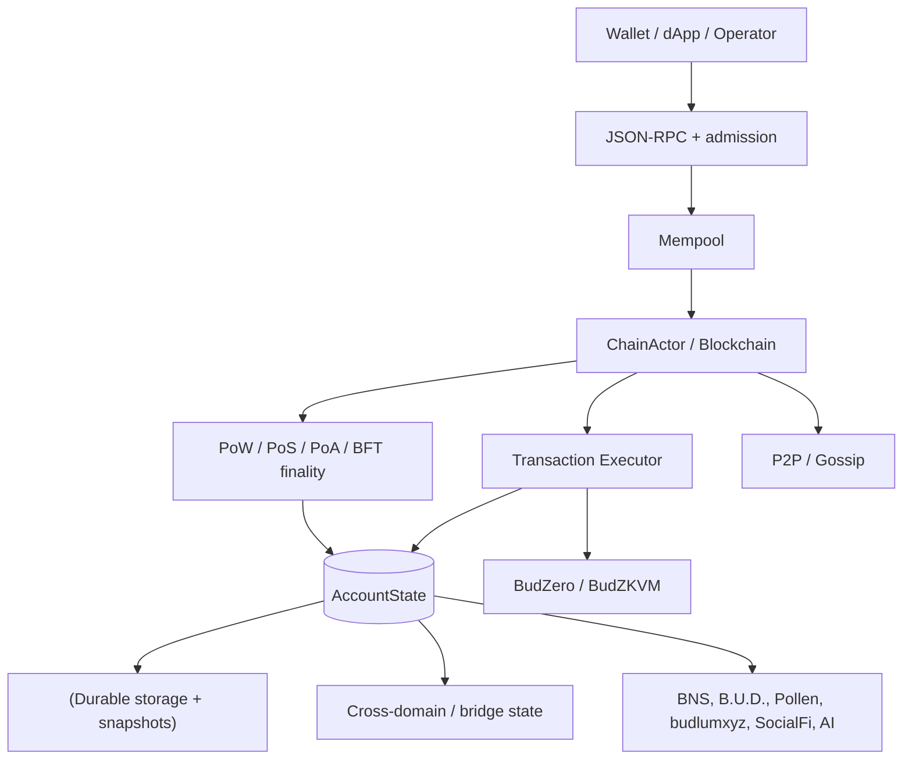

## 2. Consensus-domain isolation

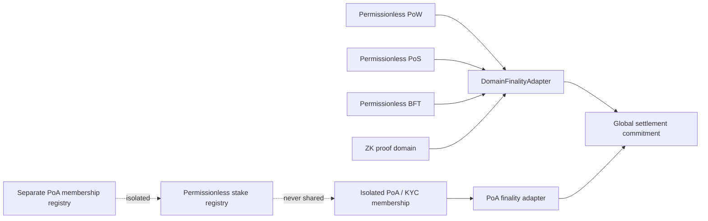

## 3. Transaction admission and V4 signing

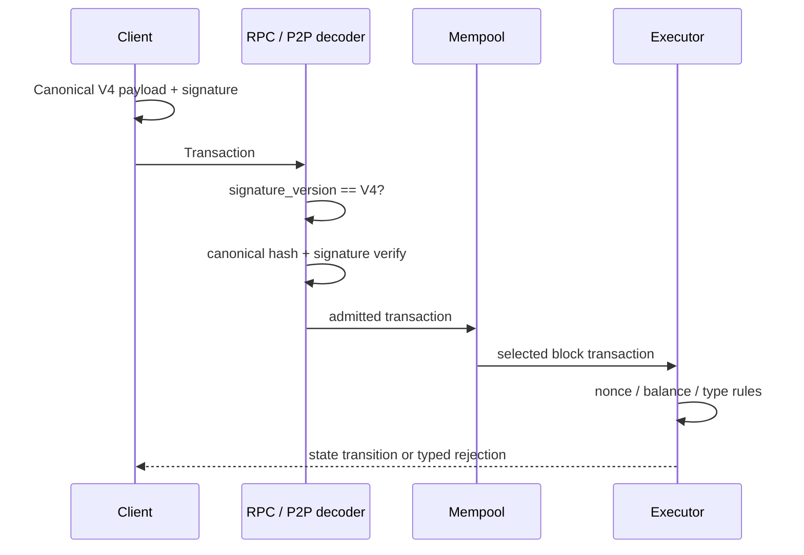

## 4. Cross-domain bridge lifecycle

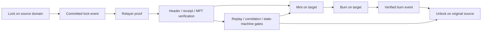

## 5. EVM receipt verification path

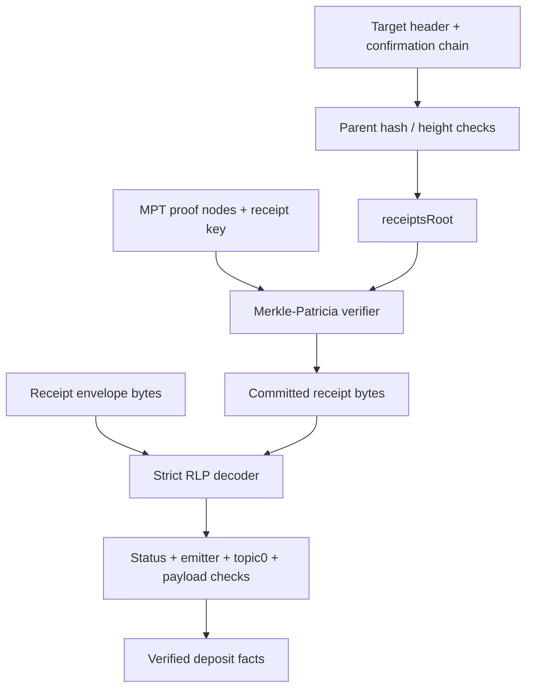

## 6. Snapshot trust and schema migration

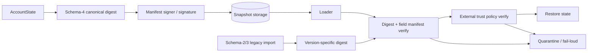

## 7. Critical durability boundary

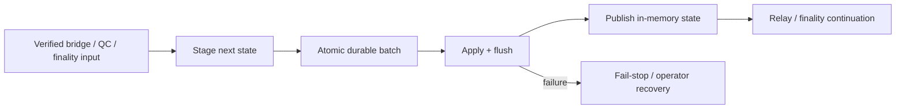

## 8. BudZero execution and proof boundary

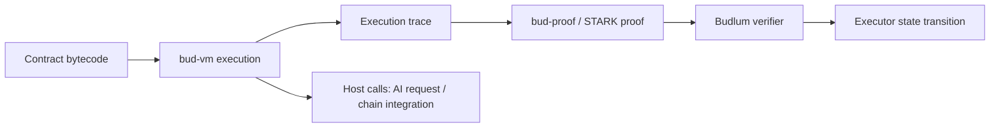

## 9. AI inference lifecycle

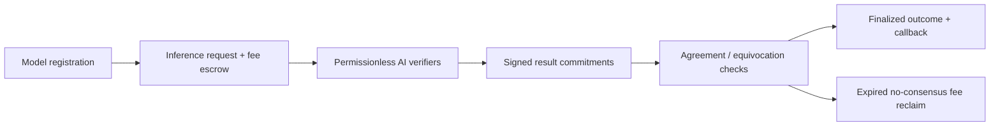

## 10. B.U.D. storage lifecycle

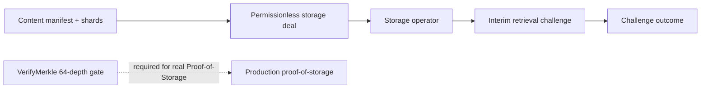

## 11. Mainnet launch gates

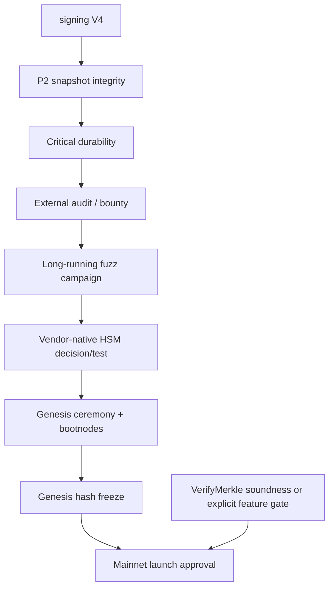

## 12. CI and security gates

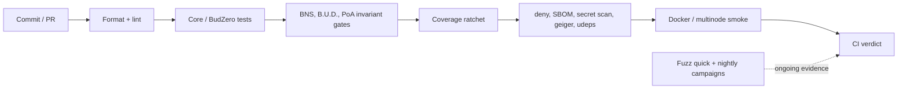


---

# Comprehensive System Diagrams (Detailed Data Flow)

## 13. Executor: full state transition pipeline

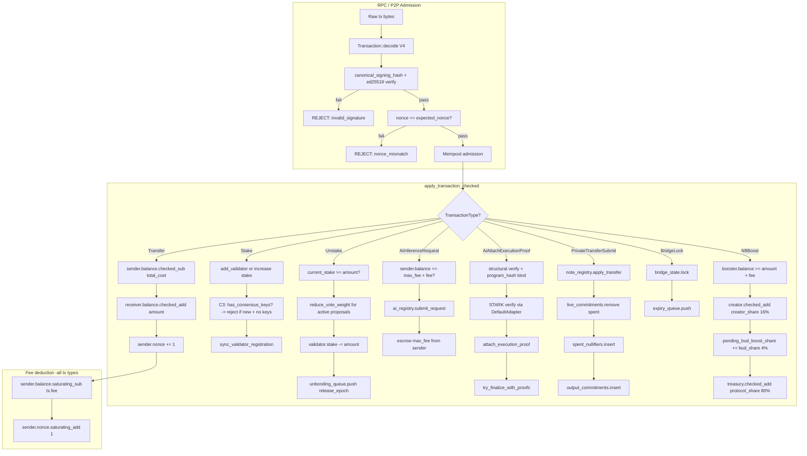

## 14. Privacy layer: Poseidon circuit + note registry state machine

```mermaid
flowchart TD
  subgraph sg4[Wallet-side key derivation]

    Seed[wallet_seed 32 bytes] --> DS[derive_spend_secret SHA3-256 seed // commitment -> u64]
    Seed --> DB[derive_blinding SHA3-256 seed // counter -> u64]
    Seed --> DV[derive_view_key SHA3-256 seed // 0xVIEW -> 32 bytes]
    Addr[address] --> Tag[address_to_recipient_tag SHA3-256 -> u64]
  end

  subgraph sg5[PrivacyCommit opcode -0x20]

    Amount[rs1 = amount u64] --> PC[Poseidon4_hash3 amount blinding recipient_tag]
    Blinding[rs2 = blinding u64 full] --> PC
    RecipTag[imm = recipient_tag i32] --> PC
    PC --> CommitOut[rd = commitment u64]
    CommitOut --> Insert[note_registry.insert_note commitment]
    Insert --> LiveSet[live_commitments BTreeSet]
  end

  subgraph sg6[NullifierCheck opcode -0x21]

    Secret[rs2 = spend_secret] --> NC[Poseidon4_hash secret DOMAIN_NULLIFIER]
    NC --> NullOut[derived_nullifier u64]
    Claimed[rs1 = claimed_nullifier] --> EqCheck{derived == claimed?}
    NullOut --> EqCheck
    EqCheck -->|yes| Rd1[rd = 1 valid]
    EqCheck -->|no| Rd0[rd = 0 invalid]
    Rd1 --> SpentSet[spent_nullifiers BTreeSet insert]
    SpentSet --> DoubleSpend{already in set?}
    DoubleSpend -->|yes| Reject[REJECT: double-spend]
  end

  subgraph sg7[SumConservation opcode -0x22]

    SumIn[rs1 = Sum input amounts] --> SC{sum_in == sum_out AND both < P}
    SumOut[rs2 = Sum output amounts] --> SC
    SC -->|yes| Rd1c[rd = 1 balanced]
    SC -->|no| Rd0c[rd = 0 unbalanced]
  end

  subgraph sg8[AIR constraints -plonky3_air]

    Selector[is_privacy_commit selector -> opcode 0x20]
    PoseidonState[s0=rs1 s1=rs2 blinding s2=imm recipient s3..7=0]
    NullSelector[is_nullifier_check -> opcode 0x21]
    NullState[s0=rs2 secret s1=DOMAIN_NULLIFIER s2..7=0]
    SumSelector[is_sum_conservation -> opcode 0x22]
    SumState[s0=rs1 sum_in s1=rs2 sum_out]
    S2Guard["Goldilocks P bound: both < 0xFFFFFFFF00000001"]
  end
```

## 15. Bridge: full cross-domain message verification pipeline

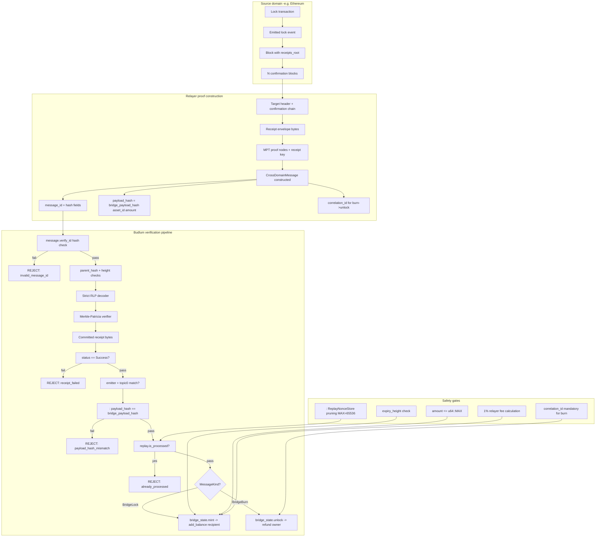

## 16. AI inference + execution proof: full lifecycle with STARK

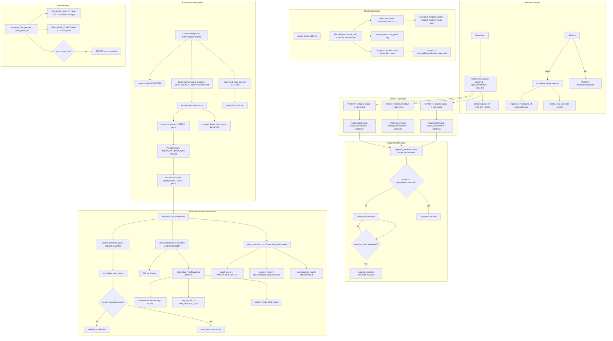

## 17. Consensus finality: all 5 domain adapters

```mermaid
flowchart TD
  subgraph sg20[PoW domain adapter]

    PowCommit["DomainCommitment: domain_block_hash + cumulative_work"]
    PowProof["FinalityProof::PoW: nonce + extra_nonce"]
    PowVerify["verify: declared_head_hash == commitment.domain_block_hash"]
    PowVerify --> WorkCheck[cumulative_work internal consistency]
    WorkCheck --> MinWork[min_work threshold check]
  end

  subgraph sg21[PoS domain adapter]

    PosCommit["DomainCommitment: validators_root + epoch"]
    PosProof["FinalityProof::PoS: BLS certificate"]
    PosVerify[verify: cert.verify BLS aggregate signature]
    PosVerify --> SignerCheck["signers subset of validator_set"]
    SignerCheck --> Threshold["2/3+ stake threshold"]
    PosVRF[VRF: calculate_seed -> validator selection]
    PosVRF --> SeedRisk[C2: poison fallback -> predictable seed]
  end

  subgraph sg22[BFT domain adapter]

    BftCommit["DomainCommitment: round + state_hash"]
    BftProof["FinalityProof::BFT: BLS certificate"]
    BftVerify[verify: BLS cert with signer_count]
    BftVerify --> QuorumCheck[quorum threshold met]
  end

  subgraph sg23[ZK domain adapter]

    ZkCommit["DomainCommitment: proof_hash + program_hash"]
    ZkProof["FinalityProof::ZK: STARK ProofEnvelope"]
    ZkVerify[verify: ProofClaimRegistry first-valid-wins]
    ZkVerify --> StarkCheck["DefaultAdapter::verify envelope"]
    StarkCheck --> PublicInputs[public_inputs_hash match]
  end

  subgraph sg24[PoA domain adapter -isolated]

    PoaCommit["DomainCommitment: authorities_root + round"]
    PoaProof["FinalityProof::PoA: authorities + signatures vec"]
    PoaVerify[verify: ed25519 signature set]
    PoaVerify --> PoaMsg[poa_commit_signing_message commitment-bound]
    PoaMsg --> QuorumPoa[quorum count met no stake]
    PoaIsolation[PoA NO stake in PermissionlessRegistry]
    PoaIsolation --> SeparateReg[PoaMembershipRegistry KYC-only]
  end

  subgraph sg25[Global settlement]

    PowVerify --> Global["GlobalBlockHeader 12+ roots"]
    PosVerify --> Global
    BftVerify --> Global
    ZkVerify --> Global
    PoaVerify --> Global
    Global --> DomainSep[BDLM_GLOBAL_BLOCK_V2 domain separation]
    Global --> Seal[seal_global_header operator-only RPC]
  end
```

## 18. Registry: complete stake + slash + unbond state machine

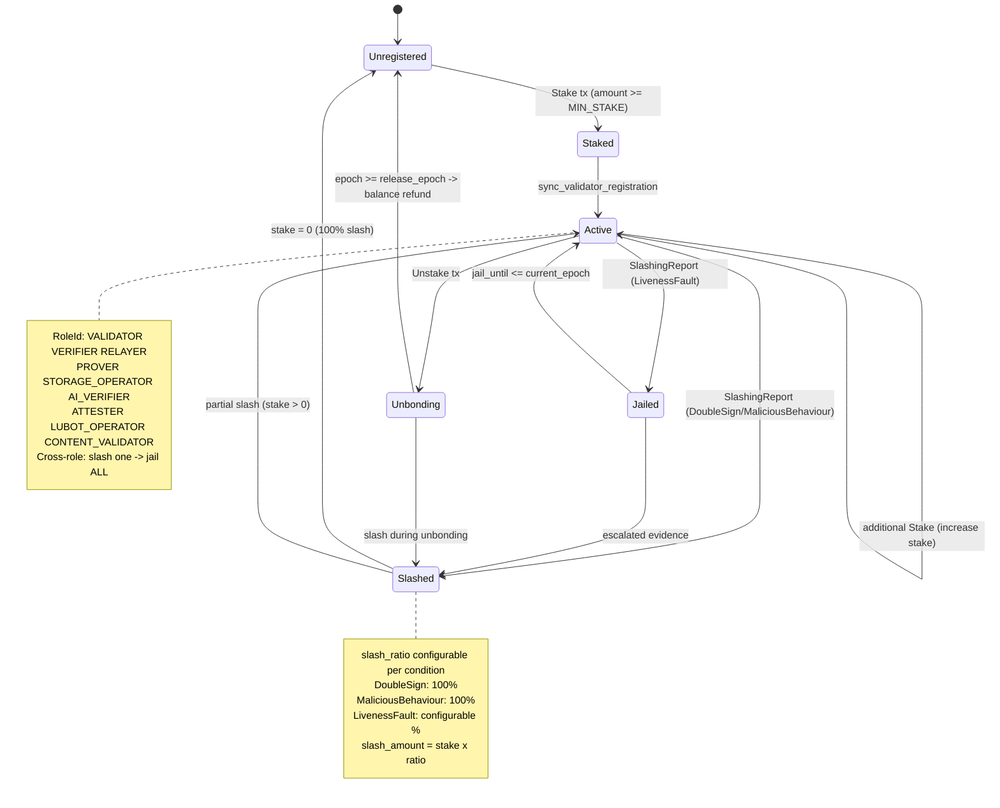

## 19. Wallet: complete signing + privacy + TEE pipeline

```mermaid
flowchart TD
  subgraph sg26[Key derivation]

    Entropy[CSPRNG 16/32 bytes getrandom] --> Mnemonic[BIP39 2048-word English wordlist]
    Mnemonic --> Checksum[checksum verify: SHA256 first N bits]
    Mnemonic --> Seed[PBKDF2-HMAC-SHA512 2048 iterations -> 32 bytes]
    Seed --> SLIP10[SLIP-10 Ed25519 hardened HD m/44'/coin'/account']
    SLIP10 --> SigningKey[ed25519_dalek SigningKey]
    SigningKey --> VerifyingKey[VerifyingKey 32 bytes]
    VerifyingKey --> Address[SHA3-256 -> BudlumAddress]
  end

  subgraph sg27[V4 transaction signing]

    Payload[Transaction payload] --> Canonical[canonical_signing_hash V4]
    Canonical --> Fields["chain_id + nonce + to + amount + fee + data + type"]
    Fields --> Preimage[SHA3-256 domain-separated preimage]
    Preimage --> Ed25519Sign[SigningKey.sign preimage]
    Ed25519Sign --> Signature[ed25519 Signature 64 bytes]
    Signature --> Tx["Transaction: payload + signature + V4 marker"]
  end

  subgraph sg28[Privacy key derivation]

    Seed --> SpendSecret[derive_spend_secret seed // commitment -> u64]
    Seed --> Blinding[derive_blinding seed // counter -> u64]
    Seed --> ViewKey[derive_view_key seed // 0xVIEW -> 32 bytes]
    SpendSecret --> Nullifier[Poseidon2 secret DOMAIN_NULLIFIER]
    Blinding --> Commit[Poseidon3 amount blinding recipient_tag]
  end

  subgraph sg29[TEE execution-time confidentiality]

    TeeConfig[TeeBackendKind: None/ClientSgx/ServerNitro]
    TeeConfig -->|None| NoTee[Plaintext signing path]
    TeeConfig -->|Sgx/Nitro| TeeRuntime[TeeRuntime.seal_private_intent]
    TeeRuntime -->|available| Sealed[Sealed intent -> enclave]
    TeeRuntime -->|unavailable| FailClosed[FAIL-CLOSED: refuse plaintext]
  end

  subgraph sg30[Memory safety]

    Drop["Wallet::drop"] --> ZeroizeMnemonic[mnemonic.zeroize]
    Drop --> ZeroizeSeed[seed.zeroize]
    Drop --> ZeroizeKey[signing_key zeroize internal]
  end

  subgraph sg31[Social recovery]

    Guardians["GuardianApproval: threshold + timelock"] --> Proposal[RecoveryProposal]
    Proposal --> Digest[BDLM_WALLET_RECOVERY_PROPOSAL_V1 domain-separated]
    Proposal --> Timelock["executable_after = created_block + timelock"]
    Proposal --> Rotate[rotate_guardian for compromised]
  end
```

## 20. BudZero STARK: bytecode to verified proof pipeline

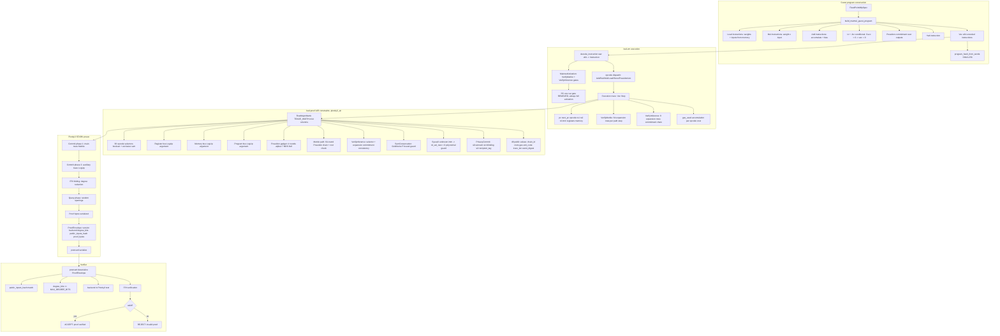

## 21. Governance: proposal to execution pipeline

```mermaid
flowchart TD
  subgraph sg37[Proposal creation]

    Proposer[Proposer address] --> Type{ProposalType?}
    Type -->|ChangeBlockReward| P1[value: new reward amount]
    Type -->|ChangeFeeParams| P2[value: new fee parameters]
    Type -->|SetConstitutionParameter| P3["key + value bounded"]
    Type -->|SetEncryptionPolicy| P4["policy: version + suite + limits"]
    P1 --> Gov[governance.proposals.push]
    P2 --> Gov
    P3 --> Gov
    P4 --> Gov
    Gov --> Epoch["start_epoch + end_epoch"]
    Gov --> Activation[activation_epoch timelock]
  end

  subgraph sg38[Voting period]

    Epoch --> Active[Active status]
    Active --> Vote[Voter: stake-weighted]
    Vote --> For["votes_for += voter.stake"]
    Vote --> Against["votes_against += voter.stake"]
    Vote --> Snapshot[voter_weights snapshot]
    Snapshot --> Unstake[Unstake during voting -> reduce_vote_weight]
    Active --> Cancel[cancel_proposal owner-only]
  end

  subgraph sg39["Epoch advance: finalize"]

    EndEpoch["current_epoch >= end_epoch"] --> Finalize[proposal.finalize]
    Finalize --> TotalStake[total_stake = get_total_stake]
    TotalStake --> Quorum[quorum_pct = 33%]
    Quorum --> Check{votes >= quorum AND for > against?}
    Check -->|yes| Passed[Status: Passed]
    Check -->|no| Rejected[Status: Rejected]
  end

  subgraph sg40["Activation: execute"]

    Passed --> ActCheck["current_epoch >= activation_epoch?"]
    ActCheck -->|yes| Execute[execute_proposal]
    ActCheck -->|no| Wait[Wait for activation]
    Execute -->|ChangeBlockReward| SetReward[block_reward = new_value]
    Execute -->|ChangeFeeParams| SetFee[fee_params = new_value]
    Execute -->|SetConstitutionParameter| SetConst[parameter update with whitelist check]
    Execute -->|SetEncryptionPolicy| SetEnc[encryption_policies.insert DAO-managed]
    Execute --> Whitelist[GOVERNANCE_PARAMETER_WHITELIST validation]
    Whitelist -->|not whitelisted| RejectParam[REJECT: non_whitelisted_parameter]
  end
```

## 22. Tokenomics: burn + vesting + reward state machine

```mermaid
flowchart TD
  subgraph sg41[Genesis allocation -100M BUD, 6 decimals]

    Total[100_000_000 x BUD_UNIT] --> Community[10M -> community accounts]
    Total --> Liquidity[10M -> liquidity accounts]
    Total --> Ecosystem[20M -> ecosystem accounts]
    Total --> Team["20M -> team_vesting cliff+linear"]
    Total --> BurnReserve[40M -> burn_reserve_address]
  end

  subgraph sg42[process_timed_burn -epoch-triggered]

    Epoch[advance_epoch] --> Trigger[process_timed_burn called]
    Trigger --> Rate[annual_burn_rate x BUD_UNIT / epochs_per_year]
    Rate --> BurnFrom[burn_from burn_reserve_address amount]
    BurnFrom --> Supply[circulating_supply decreases]
    BurnFrom --> Exhausted{reserve == 0?}
    Exhausted -->|yes| Stop[Stop burning]
    Exhausted -->|no| Continue[Continue next epoch]
  end

  subgraph sg43[Metabolic tx-fee burn]

    Tx[Transaction applied] --> Fee[tx.fee collected]
    Fee --> Ratio[tx_fee_burn_ratio x fee]
    Ratio --> BurnFee[burn_from sender amount]
    Fee --> Remainder[remainder -> proposer/treasury]
  end

  subgraph sg44[Team vesting -cliff + linear]

    TeamAlloc[20M team allocation] --> Cliff[cliff_epochs: no unlock]
    Cliff --> Linear[linear unlock per epoch after cliff]
    Linear --> Spendable["spendable_balance = balance - locked_at epoch"]
    Spendable --> Transfer{transfer amount <= spendable?}
    Transfer -->|yes| Allow[Transfer allowed]
    Transfer -->|no| RejectVest[REJECT: vesting_locked]
  end

  subgraph sg45[Supply cap enforcement]

    BlockReward[block_reward mint] --> CapCheck["total_bud_committed <= 100M?"]
    CapCheck -->|yes| Mint[Allow mint]
    CapCheck -->|no| CapReject[REJECT: supply_cap_exceeded]
    TotalBud["total_bud_committed = circulating + staked + unbonding"]
    TotalBud --> CapCheck
  end

  subgraph sg46[Fee market -EIP-1559]

    BaseFee[block N-1 base_fee] --> Adjust[±12.5% based on gas usage]
    Adjust --> NewBase[block N base_fee]
    Tx2[Transaction] --> Effective["effective_fee = min max_fee base_fee+priority"]
    Effective --> Burn2[base_fee portion burned]
    Effective --> Tip[priority_fee -> proposer]
  end
```

## 23. P2P protocol stack: libp2p to application

```mermaid
flowchart TD
  subgraph sg47[Transport layer]

    TCP[TCP /ip4/0.0.0.0/tcp/4001]
    QUIC[QUIC /ip4/0.0.0.0/udp/4001/quic-v1]
    Identity[Ed25519 PeerId identity key]
    TCP --> Libp2p[libp2p Swarm]
    QUIC --> Libp2p
    Identity --> Libp2p
  end

  subgraph sg48[Peer discovery]

    Kademlia[Kademlia DHT]
    Bootstrap[Bootstrap nodes from config]
    DNS[Dns seed resolution]
    Kademlia --> Peers[PeerManager known peers]
    Bootstrap --> Kademlia
    DNS --> Bootstrap
  end

  subgraph sg49[Gossipsub messaging]

    Topics[Topic: blocks txs finality snapshots]
    MsgIn[Incoming message] --> Dedup[MessageId dedup SipHash]
    Dedup --> Validate[Message validation]
    Validate --> SizeCheck[MAX_MESSAGE_SIZE 10MB]
    SizeCheck -->|oversized| Score1[report_oversized_message penalty]
    SizeCheck -->|ok| Dispatch[Dispatch to handler]
    Dispatch --> BlockHandler[block received -> validate_and_add_block]
    Dispatch --> TxHandler[tx received -> mempool admission]
    Dispatch --> FinalityHandler[finality cert -> apply_qc_fault_verdict]
  end

  subgraph sg50[Reputation scoring]

    Score[PeerScore: -100 to 100]
    Score --> Good["Valid block/tx relay: +reward"]
    Score --> Bad1[Invalid block: report_invalid_block penalty]
    Score --> Bad2[Invalid tx: report_invalid_tx penalty]
    Score --> Bad3[Oversized msg: report_oversized_message penalty]
    Score --> RateLimit[Rate limit exhaustion: dedicated penalty]
    Score --> Ban{score <= -100?}
    Ban -->|yes| BanPeer["Ban peer + disconnect"]
    Ban -->|no| Continue[Continue connection]
    Eclipse[max_peers_per_subnet /24 = 4] --> Score
    Eclipse --> Idempotent[note_connected/disconnected idempotent]
  end

  subgraph sg51[Snapshot synchronization]

    SnapReq[Snapshot request] --> Chunks[MAX_SNAPSHOT_CHUNKS = 4096]
    Chunks --> Concurrent[MAX_CONCURRENT_SNAPSHOTS = 10]
    Chunks --> Verify["Schema-4 digest + field manifest verify"]
    Verify --> Restore[Restore AccountState]
    Verify --> Quarantine[Quarantine on failure]
  end
```

## 24. Pollen data marketplace: full grant + encryption + AI gate

```mermaid
flowchart TD
  subgraph sg52[DataAsset registration]

    Owner[Data owner address] --> Asset["DataAsset: asset_id + metadata"]
    Asset --> Registry[MarketplaceRegistry.data_assets.insert]
    Asset --> Root1[data_assets_root -> Pollen root -> state_root]
  end

  subgraph sg53[AccessGrant lifecycle]

    Asset --> Grant["AccessGrant: grant_id + grantee + scope + expiry + max_reads"]
    Grant --> GrantReg[MarketplaceRegistry.access_grants.insert]
    Grant --> Root2[access_grants_root -> Pollen root]
    Grant --> Revoke[Revoke: owner-only -> remove from registry]
    Grant --> Expire["Expiry: block > expiry_block -> invalid"]
    Grant --> Exhaust[max_reads reached -> exhausted]
  end

  subgraph sg54[SaleAuthorization + purchase]

    Asset --> Sale["SaleAuthorization: seller + buyer + price + duration"]
    Sale --> SaleReg[MarketplaceRegistry.sale_authorizations.insert]
    Sale --> Purchase["PollenPurchaseReceipt: seller auth + buyer + grant + payment"]
    Purchase --> IssueGrant[issue_grant_from_sale_authorization]
    IssueGrant --> NewGrant[New AccessGrant for buyer]
    Purchase --> ReceiptReg[purchase_receipts.insert -> root]
  end

  subgraph sg55[EncryptionPolicy -DAO-managed]

    DAO[Governance proposal] --> SetPolicy[SetEncryptionPolicy action]
    SetPolicy --> Policy["EncryptionPolicy: version + hpke_suite + min_key + max_duration"]
    Policy --> PolicyReg[MarketplaceRegistry.encryption_policies.insert]
    Policy --> NoDecrypt[NO decrypt/key/read override fields]
    Policy --> AssetPolicy[AssetEncryptionPolicy per-asset]
    AssetPolicy --> Validate["validate_static: algorithm + key_length + rotation"]
    Validate --> RejectNone["EncryptionAlgorithm::None REJECTED"]
  end

  subgraph sg56[AI inference data gate]

    Req[AiInferenceRequest] --> InputRef["input_ref: Pollen data reference?"]
    InputRef -->|no poll| Legacy["Legacy opaque path, no grant needed"]
    InputRef -->|yes poll| GrantCheck{valid AccessGrant exists?}
    GrantCheck -->|no grant| Deny1[REJECT: ai_data_access_denied]
    GrantCheck -->|expired| Deny2[REJECT: grant_expired]
    GrantCheck -->|revoked| Deny3[REJECT: grant_revoked]
    GrantCheck -->|exhausted| Deny4[REJECT: grant_exhausted]
    GrantCheck -->|wrong grantee| Deny5[REJECT: grantee_mismatch]
    GrantCheck -->|valid| Allow[ALLOW: data read permitted]
    Allow --> Consume[Increment read count]
    Consume --> FailCheck[Failed request does NOT consume grant]
  end

  subgraph sg57[D-Web Passport evidence]

    BNSName[BNS name] --> Profile[DwebPassportProfile]
    Profile --> Evidence[EvidenceCard: BNS verified/expired]
    Profile --> PollenSummary[Pollen lineage counts]
    Profile --> Bundle[PassportProofBundle deterministic root]
    Bundle --> Warning["Warning hash only, NO plaintext"]
    Profile --> RPC[bud_passportGetProfile read-only]
    Bundle --> RPC2[bud_passportGetProofBundle read-only]
  end
```

## 25. Cross-domain message verification: EVM MPT deep dive

```mermaid
flowchart TD
  subgraph sg58[Target chain header validation]

    BlockNum[block_number] --> Height["source_height >= deployment_height"]
    ParentHash[parent_hash] --> Chain[chain continuity check]
    Confirm[N confirmations] --> Depth["depth >= min_confirmations"]
    ReceiptsRoot[receipts_root] --> MPT[MPT root for proof verification]
    StateRoot[state_root] --> AccRoot[account state verification]
  end

  subgraph sg59[Strict RLP decoding]

    Bytes[Receipt envelope bytes] --> Prefix[RLP prefix byte]
    Prefix -->|0xf7..0xff| List[RLP list header]
    Prefix -->|0x80..0xb7| String[RLP string]
    List --> Status[Status field: 0x0 = fail 0x1 = success]
    List --> Logs[Logs array]
    Logs --> Topic0[topic0: event signature]
    Logs --> Emitter["Emitter address: known contract?"]
    Logs --> Data[Data: payload bytes]
  end

  subgraph sg60[Merkle-Patricia trie verification]

    Key[RLP encode receipt index] --> Nibble[Convert to nibbles]
    Nibble --> Root[Start at receipts_root]
    Root --> Node{Node type?}
    Node -->|Branch| Branch["16 children + value"]
    Node -->|Extension| Extension["shared nibbles + next"]
    Node -->|Leaf| Leaf["remaining nibbles + value"]
    Branch --> Match[Match next nibble -> child]
    Extension --> Shared[Verify shared prefix matches]
    Leaf --> Remain[Verify remaining nibbles match]
    Match --> Next[Recurse into child node]
    Shared --> Next
    Remain --> Value[Extract leaf value = receipt bytes]
  end

  subgraph sg61[Payload verification]

    Value --> DecodeReceipt[Decode receipt bytes]
    DecodeReceipt --> StatusCheck{status == 0x1 success?}
    StatusCheck -->|no| Reject1[REJECT: transaction_failed]
    StatusCheck -->|yes| EmitterCheck{emitter in allowlist?}
    EmitterCheck -->|no| Reject2[REJECT: unknown_emitter]
    EmitterCheck -->|yes| TopicCheck{topic0 matches expected event?}
    TopicCheck -->|no| Reject3[REJECT: wrong_event_type]
    TopicCheck -->|yes| PayloadHash[": payload_hash == bridge_payload_hash asset_id amount"]
    PayloadHash -->|fail| Reject4[REJECT: payload_hash_mismatch]
    PayloadHash -->|pass| Accept[ACCEPT: verified deposit/lock facts]
  end
```
## 26. Privacy layer: note lifecycle (D2)

```mermaid
flowchart LR
  Seed[Wallet seed] --> Derive["derive_spend_secret + derive_blinding"]
  Derive --> Note[PrivateNoteInput / PrivateNoteOutput]
  Note --> Commit[PrivacyCommit opcode -> Poseidon3]
  Commit --> Reg[L1NoteRegistry live_commitments]
  Note --> Null[NullifierCheck opcode -> Poseidon2]
  Null --> Spent[spent_nullifiers set]
  Reg --> Transfer[PrivateTransferSubmit tx]
  Transfer --> Verify[SumConservation opcode]
  Transfer --> Apply["apply_transfer: remove commitment + insert nullifier"]
  ViewKey[View key disclosure] -. selective .-> Audit[Auditor / authority]
  TEE[TEE opt-in] -. encrypt .-> Note
```

## 27. Wallet-core architecture

```mermaid
flowchart TD
  Entropy[CSPRNG entropy] --> BIP39[BIP39 mnemonic 12/24 words]
  BIP39 --> Seed[PBKDF2 -> 32-byte seed]
  Seed --> SLIP10[SLIP-10 Ed25519 HD derivation]
  SLIP10 --> KeyPair["SigningKey + VerifyingKey"]
  KeyPair --> Address[SHA3-256 -> BudlumAddress]
  KeyPair --> Sign[V4 canonical signing]
  Seed --> Privacy[derive_spend_secret / derive_blinding]
  Seed --> ViewKey[derive_view_key]
  TEE[TeeRuntime opt-in] -. seal .-> Sign
  Zeroize[Zeroize on drop] -. cleanup .-> Seed
  Zeroize -. cleanup .-> BIP39
  Recovery[Social recovery guardians] -. restore .-> Seed
```

## 28. Governance lifecycle

```mermaid
flowchart LR
  Propose[Proposal submitted] --> Active[Active voting period]
  Active --> Vote[Stake-weighted votes for/against]
  Active --> Timelock[activation_epoch timelock]
  Vote --> Finalize[Epoch advance -> finalize]
  Finalize -->|quorum met + majority| Passed[Passed]
  Finalize -->|quorum not met| Rejected[Rejected]
  Passed --> Execute[Execute governance action]
  Timelock --> Execute
  Execute --> Params[Update chain parameters]
  Execute --> BlockReward[Change block reward]
  Execute --> Constitution[Update constitution guardrails]
  Cancel[Proposal cancellation] -. owner only .-> Active
```

## 29. Tokenomics flow

```mermaid
flowchart TD
  Genesis[100M BUD genesis] --> Community[Community 10M]
  Genesis --> Liquidity[Liquidity 10M]
  Genesis --> Ecosystem[Ecosystem 20M]
  Genesis --> Team["Team 20M vesting cliff+linear"]
  Genesis --> BurnReserve[Burn reserve 40M]
  BurnReserve --> TimedBurn[process_timed_burn epoch-triggered]
  TxnFee[Tx fee] --> FeeBurn[tx_fee_burn_ratio metabolic burn]
  TxnFee --> Proposer[Proposer tip]
  TxnFee --> Treasury[Treasury share]
  BlockReward[block_reward mint] --> Proposer2[Block producer]
  TimedBurn --> Sink["Burn sink, supply decreases"]
  FeeBurn --> Sink
```

## 30. P2P network topology

```mermaid
flowchart TB
  Node[Budlum node] --> Gossip[Gossipsub topics]
  Gossip --> Blocks[Block announcements]
  Gossip --> Txs[Transaction relay]
  Gossip --> Finality[Finality certificates]
  Node --> Peers[PeerManager]
  Peers --> MaxPeers[MAX_PEERS = 50]
  Peers --> Subnet[max_peers_per_subnet /24 = 4]
  Peers --> Score[Reputation scoring]
  Score --> Ban["Ban threshold <= -100"]
  Node --> Snap[Snapshot sync]
  Snap --> Chunks[MAX_SNAPSHOT_CHUNKS = 4096]
  Snap --> Concurrent[MAX_CONCURRENT_SNAPSHOTS = 10]
  Node --> Identity[Ed25519 identity key]
  Identity --> Auth[Peer authentication]
```

## 31. Permissionless registry architecture

```mermaid
flowchart LR
  Stake[Stake tx] --> Reg[PermissionlessRegistry]
  Reg --> Roles["RoleId: VALIDATOR, VERIFIER, RELAYER, PROVER, STORAGE_OPERATOR, AI_VERIF..."]
  Reg --> Slash[SlashingReport -> slash]
  Slash --> DoubleSign[DoubleSign -> 100%]
  Slash --> Liveness[LivenessFault -> configurable]
  Slash --> Malicious[MaliciousBehaviour -> 100%]
  Reg --> Unbond[Unbond tx -> unbonding_queue]
  Unbond --> Epoch[Epoch advance -> release]
  CrossRole[Cross-role slashing] -. slash one .-> AllRoles[All roles jailed]
```

## 32. PoA domain lifecycle

```mermaid
flowchart LR
  KYC[KYC / identity verification] --> Membership[PoaMembershipRegistry]
  Membership --> Admin[Admin approval]
  Admin --> Active[Active PoA member]
  Active --> Sign[Ed25519 finality signatures]
  Active --> Compliance[PoaComplianceRegistry]
  Compliance --> Screen[Address screening]
  Compliance --> Freeze[Asset freeze]
  Compliance --> TravelRule[Travel rule metadata hash]
  Compliance --> Audit[Append-only audit log]
  Isolation[PoA isolated from permissionless domains] -. no shared registry .-> Permissionless["Permissionless PoW / PoS / BFT domains"]
```

## 33. Validator lifecycle: multi-role architecture

```mermaid
flowchart TD
  Genesis[Genesis config] --> Val[Validator created with keys]
  Stake[Stake tx] --> Active[Active validator]

  subgraph sg1["Role 1: Consensus Validation"]
    Active --> Propose[Block proposal via VRF]
    Active --> Finality[BLS finality signing]
    Active --> Witness[Epoch witness + vote]
    Propose --> ConsensusReward[Block reward + fee tip]
    Finality --> FinalityReward[Finality signing reward]
  end

  subgraph sg2["Role 2: Lubot CPU/System Provider"]
    Active --> LubotBond[LUBOT_OPERATOR role bond]
    LubotBond --> LubotCompute[CPU/GPU compute for AI inference]
    LubotCompute --> LubotServe[Serve Lubot inference requests]
    LubotServe --> LubotReward[Inference service reward]
    LubotServe --> LubotSlash[Compute fault -> slash]
  end

  subgraph sg3["Role 3: B.U.D. Storage Verification"]
    Active --> StorageBond[STORAGE_OPERATOR role bond]
    StorageBond --> StorageStore[Store content shards]
    StorageStore --> StorageChallenge[Respond to retrieval challenges]
    StorageChallenge --> StorageProof[VerifyMerkle 64-depth proof]
    StorageProof --> StorageReward[Storage operator reward]
    StorageChallenge --> StorageSlash[Challenge failure -> slash]
  end

  subgraph sg4[Cross-Role Slashing]
    Slash[Slashing evidence] --> Jailed[Jailed until epoch N]
    LubotSlash --> Jailed
    StorageSlash --> Jailed
    Jailed --> Release[Jail release]
    Release --> Active
    Liveness["Missed epochs > threshold"] --> LivenessSlash[Liveness report -> slash all roles]
    CrossRole[Slash one role -> jail ALL roles]
  end

  Unstake[Unstake tx] --> Unbonding[Unbonding queue]
  Unbonding --> Epoch[Epoch advance -> release stake]
```

## 34. Pollen data rights lifecycle

```mermaid
flowchart LR
  Asset[DataAsset registered] --> Grant[AccessGrant issued]
  Grant --> Grantee["Grantee address + scope + expiry"]
  Asset --> Sale[SaleAuthorization]
  Sale --> Buyer[Buyer purchases access]
  Buyer --> Purchase[PollenPurchaseReceipt]
  Grant --> AI[AI inference request]
  AI --> Gate[Pollen data gate: valid grant required]
  Gate -->|grant valid| Allow[Allow data read]
  Gate -->|no grant| Deny["Deny, strict default-deny"]
  Encrypt[EncryptionPolicy DAO-managed] -. parameters .-> Asset
  Revoke[Revoke grant/asset] -. owner only .-> Grant
```

## 35. Relayer policy layer

```mermaid
flowchart LR
  User[User intent] --> Intent[UserIntent signed]
  Intent --> Pool[Intent pool]
  Pool --> Solver[Solver bids]
  Solver --> Best[Best bid selection]
  Best --> Settle[IntentSettlement]
  Settle --> Execute[Execute settlement]
  Policy[PolicyEnvelope] --> FeeCap[Fee cap enforcement]
  Policy --> Deadline[Deadline validation]
  Policy --> Domain[Domain allowlist]
  Policy --> Replay[Replay nonce check]
  Slashing[Relayer slashing] --> Griefing[Griefing -> 100%]
  Slashing --> FrontRunning[Front-running -> 100%]
  Slashing --> WrongRelay[Wrong-relay -> 100%]
```

## 36. Fee market (EIP-1559)

```mermaid
flowchart LR
  Block[Block N-1 base_fee] --> Calc[next_base_fee calculation]
  Calc --> Adjustment[±12.5% adjustment based on gas usage]
  Adjustment --> BaseFee[Block N base_fee]
  Tx[Transaction] --> Bid["FeeBid: max_fee + max_priority_fee"]
  Bid --> Effective["effective_fee = min(max_fee, base_fee + priority)"]
  Effective --> Check["effective_fee >= base_fee?"]
  Check -->|yes| Accept[Accepted]
  Check -->|no| Reject["Rejected, underpriced"]
  Accept --> Burn[base_fee burned]
  Accept --> Tip[priority_fee -> proposer]
```

## 37. AI execution proof pipeline

```mermaid
flowchart TD
  Model[FixedPointMlpSpec] --> Host[Host eval_fixed_point_mlp i32 MAC]
  Host --> Output[Output limbs]
  Model --> Guest[build_matmul_guest_program BudZKVM instructions]
  Guest --> ProgramHash[program_hash_from_words]
  Model --> Weights[weights_digest SHA3-256]
  Weights --> Bytecode["Guest bytecode: Load + Mul + Add + ReLU + Poseidon + Halt"]
  Bytecode --> Prove[prove_bytecode -> STARK proof]
  Prove --> Envelope[ProofEnvelope postcard]
  Envelope --> Attach[AiAttachExecutionProof tx]
  Attach --> Verify["Structural verify + program_hash bind"]
  Verify --> STARK[STARK verify via DefaultAdapter]
  STARK --> Finalize[try_finalize_with_proofs]
```

## 38. DeEd content manifest architecture

```mermaid
flowchart LR
  Content[Raw content bytes] --> Hash[ContentId = SHA3-256 domain-tagged]
  Content --> Shards[Off-chain sharding]
  Shards --> ShardRef["ShardRef: shard_id + size"]
  Hash --> Manifest["ContentManifest: shards + metadata + owner"]
  Manifest --> ManifestId["Manifest::id() = deterministic hash"]
  ManifestId --> Chain[On-chain registration]
  Chain --> Deal[Storage deal per shard]
  Deal --> Operator[Storage operator bonds]
  Deal --> Challenge[Retrieval challenge]
  Challenge --> Proof[VerifyMerkle 64-depth proof]
  Roles["Permissionless roles: STORAGE_OPERATOR, ATTESTER"] -. no whitelist .-> Deal
```

## 39. BNS (Budlum Name Service) lifecycle

```mermaid
flowchart LR
  Register[Register name 3-32 chars] --> Cost[Cost = base x multiplier x duration]
  Cost --> Owner[Owner address bound]
  Owner --> Resolve[resolve_content -> address]
  Owner --> SetContent[set_content -> CID/hash]
  Owner --> Transfer[Transfer to new owner]
  Owner --> Renew[Renew before expiry]
  Expiry[Expiry epoch reached] --> Grace[Grace period 3000 epochs]
  Grace -->|original owner| Renew2[Renew only by original owner]
  Grace -->|expired| Available[Name available for re-registration]
  Squat[Front-running squatting protection] -. grace period .-> Grace
```

## 40. SocialFi NFT lifecycle

```mermaid
flowchart LR
  Mint[Mint NFT owner-only] --> Metadata["CID + luminance=0"]
  Metadata --> Luminance[update_luminance delta i128]
  Luminance --> Positive[Positive: amplify reach]
  Luminance --> Negative[Negative: reduce reach]
  Mint --> Transfer[Transfer to new owner]
  Mint --> Burn[Burn -> CID returned]
  Registry[NftRegistry next_id auto-increment] --> Mint
  Guard[Luminance clamp i128 -> safe range] --> Luminance
```

## 41. budlumxyz app registry

```mermaid
flowchart LR
  Developer[Developer address] --> Register[register_app auto-increment ID]
  Register --> Record["AppRecord: website_url + manifest_id"]
  Record --> Update[update_app URL/manifest]
  Register --> SelfVerify[verify_app developer self-verify]
  SelfVerify --> Attested[developer_attested = true]
  Attested --> Verified[verified = true DAO override reserved]
  Root[Registry root hash] --> StateRoot[AccountState state_root]
  Audit[Attestation audit trail] --> SelfVerify
```

## 42. Mempool internals

```mermaid
flowchart TD
  Tx[Incoming transaction] --> Decode["V4 decode + signature verify"]
  Decode --> Admit["Admission: nonce + balance + type rules"]
  Admit --> Pool[Mempool pool max_size=20000]
  Pool --> PerSender[max_per_sender=100]
  Pool --> Evict[evict_lowest_fee when full]
  Pool --> RBF[Replace-By-Fee: higher fee replaces]
  Pool --> Dedup[Duplicate tx rejection]
  Pool --> Select[Block producer selects by fee priority]
  Select --> Block[Included in next block]
  Select --> Expire[Stale tx removed after N blocks]
```

## 43. Developer OS / SDK architecture

```mermaid
flowchart LR
  Manifest[DeveloperOsManifest deterministic] --> Project["Project ID + labels"]
  Project --> DevNet[Local devnet topology]
  Project --> BudL[BudL package fixtures]
  Project --> Proof[Proof fixtures]
  Project --> Pollen[Pollen fixtures]
  Project --> Relayer[Relayer policy fixtures]
  Manifest --> Flags[SDK feature flags]
  Flags --> Offline[Offline default: no external network]
  Flags --> Safety[Safety fixtures: verified proof required]
  Safety --> NoMock[Pollen fixture cannot bypass AI grant]
  Project --> Traversal[Path traversal rejection]
```

## 44. Gateway: Atlas + Passport evidence

```mermaid
flowchart LR
  Address[BudlumAddress] --> Atlas[AtlasWalletContext]
  Atlas --> Account[Account state evidence]
  Atlas --> Pollen[Pollen lineage summary]
  Atlas --> Domain["Domain trace + wallet graph"]
  Name[BNS name] --> Passport[DwebPassportProfile]
  Passport --> Evidence[EvidenceCard: verified/expired/pending]
  Passport --> Bundle[PassportProofBundle deterministic root]
  Bundle --> Warning["Warning hash only, no plaintext"]
  Atlas --> RPC[bud_atlasGetWalletContext read-only]
  Passport --> RPC2[bud_passportGetProofBundle read-only]
  NoPlaintext[Endpoint never returns raw data] -. enforced .-> RPC
  NoPlaintext -. enforced .-> RPC2
```

## 45. Settlement commitment tree

```mermaid
flowchart TD
  Block[Block commitment] --> Roots["12+ root fields"]
  Roots --> DomainReg[domain_registry_root]
  Roots --> Commitment[commitment_root]
  Roots --> Message[message_root]
  Roots --> Bridge[bridge_root]
  Roots --> Replay[replay_root]
  Roots --> Settlement[settlement_root]
  Roots --> Storage[storage_root]
  Roots --> AI[ai_root]
  Roots --> Pollen[pollen_root]
  DomainSep[BDLM_GLOBAL_BLOCK_V2 domain separation] --> Hash[GlobalBlockHeader hash]
  Proof[SettlementProofVerifier] --> Merkle["Merkle proof + domain/height/index check"]
  Merkle --> Forge[expected_block_hash forgery gate]
```

## 46. Prover market: proof verification

```mermaid
flowchart LR
  Task[ProofTask created] --> Assign[Assigned to prover]
  Assign --> Prove[Prover generates STARK proof]
  Prove --> Receipt["ProofReceipt: task_id + prover + hash + reward"]
  Receipt --> Verify["Verification: task_id + prover + epoch + hash + reward cap"]
  Verify -->|valid| Complete[complete_task -> reward committed]
  Verify -->|invalid| Reject["Reject, task stays active"]
  Policy[First valid receipt wins] --> Complete
  Policy --> Duplicate[Identical duplicate -> idempotent]
  Limits["Active tasks + pending receipts bounded"] --> Task
```

## 47. Sovereign domain kit

```mermaid
flowchart LR
  Template[SovereignDomainTemplate] --> Class[SovereignDomainClass enum]
  Class --> PoA[EnterprisePoa -> requires PoA consensus]
  Class --> Custom[Custom class label validated]
  Template --> Compliance[ComplianceEvidence hash/root only]
  Compliance --> NoPII[No private KYC/passport on-chain]
  Template --> Lifecycle[Lifecycle: draft -> active -> retired]
  Lifecycle --> NoReactivate[Retired cannot re-activate]
  Template --> Audit["AuditExportBundle template + compliance root"]
  Audit --> Bounded[Bounded height span]
```

## 48. Constitution engine

```mermaid
flowchart TD
  Guardrails[Hard guardrails immutable] --> NoWhitelist[No permissionless whitelist]
  Guardrails --> NoDecrypt[No AI read/decrypt override]
  Guardrails --> PoAIsolation[PoA domain isolation]
  Guardrails --> NoCustody[No private key custody]
  Guardrails --> EvidenceOnly[Evidence-only API]
  Params[Mutable bounded params] --> HaltMax[emergency_halt_max_epochs]
  Params --> PropMin[constitution_proposal_min_epochs]
  Governance[SetConstitutionParameter proposal] --> Params
  Governance -->|hard guardrail update| Reject[Fail-closed rejected]
  Root[Constitution root hash] --> StateRoot[AccountState state_root]
```

## 49. Mobile self-hosting profile

```mermaid
flowchart LR
  Profile[MobileNodeProfile] --> Power[PowerMode: battery/saver/performance]
  Power --> Battery[BatteryStatus validated]
  Profile --> Network["NetworkStatus: bandwidth + latency + NAT"]
  Profile --> Storage["StorageStatus: capacity + availability"]
  Network --> Relay[Relay address for NAT traversal]
  Storage --> Critical[Critical content requires paid replica]
  Profile --> Opportunistic["Opportunistic hosting, not always-on"]
  Profile --> Scheduled[Scheduled replication windows]
  BatteryCheck[Impossible battery state rejected] --> Battery
  BandwidthCheck[Zero bandwidth rejected] --> Network
```

## 50. Encryption DAO policy lifecycle

```mermaid
flowchart LR
  DAO[Governance proposal] --> SetPolicy[SetEncryptionPolicy action]
  SetPolicy --> Policy["EncryptionPolicy: version + suite + limits"]
  Policy --> Active[active = true]
  Policy --> Deprecated[deprecated_after_block set]
  Policy --> MinKey[min_public_key_bytes enforced]
  Policy --> MaxGrant[max_grant_duration_blocks enforced]
  Policy --> NoDecrypt[No decrypt/key/read override fields]
  Asset[AssetEncryptionPolicy per-asset] --> Validate["validate_static: algorithm + key length + rotation"]
  Validate --> Reject["EncryptionAlgorithm::None rejected"]
  Root[Pollen root hash] --> StateRoot[AccountState state_root]
```

## 51. Security audit: attack graph

```mermaid
flowchart TD
  CIPat[CI PAT leak] --> MainBranch[main branch compromise]
  MainBranch --> CodeManip[Code manipulation]
  PKCS11[PKCS11 data object] --> BLSExtract[BLS key extraction]
  BLSExtract --> FinalityForge[Finality forge]
  BLSExtract --> FixH1["Closed: CKA_EXTRACTABLE false, key never leaves the token"]
  BLSBias["BLS hash_to_g1 bias"] --> FinalityManip[Finality manipulation]
  FinalityManip --> FixC1["Closed: dual SHA3-256 LO/HI, bias below the field modulus"]
  RPCNoAuth[RPC no auth] --> BridgeMint[Unauth bridge mint]
  BridgeMint --> FixR2["Closed: require_operator on every mint path"]
  BridgeNoPayload[Bridge mint no payload check] --> FundInflation[Fund inflation]
  FundInflation --> FixB2["Closed: payload_hash verified against the deposit"]
  SaturatingArith[saturating arithmetic] --> SilentLoss[Silent BUD loss]
  SilentLoss --> FixE1["Closed: checked arithmetic, a refusal instead of a rounded balance"]
  BlindingTrunc[Blinding truncation] --> PrivacyBreak[Privacy break]
  PrivacyBreak --> FixS1["Closed: register-based blinding, full-width factor"]
  NullifierCollision[Nullifier collision] --> DoubleSpend[Double-spend]
  PoseidonDesync[Poseidon constants desync] --> AllProofsFail[All proofs rejected]
  SeedMemory[Seed in memory] --> TotalLoss[Total fund loss]
```

## 52. Panic boundaries: verifier and node liveness

The release profile uses `panic = "abort"`. The consequence in one sentence:
every `unwrap`/`expect` in production code is a liveness hole if it can be
triggered. If a peer can stop the node with a single malformed message, an
attacker slows the network without breaking a single cryptographic assumption.

`unwrap_used` and `expect_used` are therefore `deny` workspace-wide (root
`Cargo.toml`, `[lints.clippy]`). The count was measured before the gate went up:
150 violations on the production path, all closed. The gate itself was tested  -
adding a temporary `unwrap` to production code makes `clippy --lib -D warnings`
fail with 101, removing it returns 0.

Exemptions are narrow and justified:

| Where | Why exempt |
|---|---|
| `#[cfg(test)]` modules, `#[test]` functions | In a test a panic is the correct behaviour: it is how a broken invariant reports itself. |
| `build.rs` | Runs at build time, not on a running node; if protobuf generation fails the build must stop loudly. |
| `benches/` | Measurement harness; if a setup step fails the measurement must stop. |
| `Blockchain::last_block` | Returns `&Block`, so there is no owned value to fall back to; the chain is seeded with genesis at construction. Marked individually. |

How the violations were closed falls into three patterns:

1. **Parsing attacker input.** If the guard exists but is *distant*, localise it.
   Inside `verify_bls_sig` there was an expression of distance between the
   `is_none()` check and the `unwrap()`; `CtOption::into_option()` fuses the two
   into one step, so a malformed key can only be an `Err`. The same holds for the
   STARK verifier: the shape check lived in `valid_shape` while the read was
   hundreds of lines away; the read site now carries its own check.
2. **State root computations.** These run identically on every node. A panic here
   does not drop one node, it drops the whole cluster at once. A serialisation
   failure (impossible for a derived `Serialize`) now falls back to a fixed
   marker byte: `BDLM_*_SERIALIZE_FAILED`. An empty byte is not used - two
   distinct states hashing to the same value is a fork with no error visible
   anywhere.
3. **Fixed-bound arithmetic.** Expressions like `digest[..8].try_into().expect(...)`
   were converted to fixed-size array reads (`copy_from_slice`), since the slice
   length is already constant. No panic is left to reason about.

The transaction admission path matters especially: inside `Mempool` a
replacement (RBF) candidate's target was read from the same map, so the `unwrap`
was safe - but any peer can trigger that path by sending a transaction. It is
now reported as a rejected transaction.

```mermaid
flowchart TD
  Peer["Peer: byte string"] --> Parse["Parsing"]
  Parse -->|"before: unwrap"| Abort["panic = abort: the node dies"]
  Parse -->|"now: into_option / ok_or"| Reject["Err: message refused, node lives"]
  Root["State root computation"] -->|"before: expect"| AllDown["Whole cluster falls at once"]
  Root -->|"now: fixed marker"| Deterministic["Root stays deterministic"]
  Gate["clippy: unwrap_used / expect_used = deny"] --> Parse
  Gate --> Root
  Gate --> Proof["A new violation is red in CI"]
```

## 53. Account abstraction: the registry and V6 multisig authorization

The account abstraction layer carried a two-part gap for a long time. The code
was written, it bound to real ML-DSA-87 and its tests passed; but no production
path could reach it. There were two separate causes and both were measured, not
guessed.

**The first was the state layer.** `QuantumAccount::validate_all` enforced rules
like "the threshold cannot exceed the guardian count" and "a zero threshold is
not allowed". But searching production code for `QuantumAccount` returned zero
results: the account was stored nowhere. An account type without a record that
holds it is only a type; its protection is only an intention.

`QuantumAccountRegistry` was written as a gate over that gap. Registration
happens under two conditions: the declared address must equal the address
derived from the account's public key, **and** `validate_all` must pass. Without
the second the rules are not enforced; without the first an account could be
registered under an address carrying someone else's key. Updates use the
clone-validate-write pattern: a change that invalidates the record is not
applied and the record stays as it was. The validity of a record must not be
left to the individual care of every path that writes to it.

**The second was the authorization layer.** `MultisigPolicy` performed a real
`t-of-n` check: every signature verified individually, a repeat of the same
owner not counted, anything below threshold refused. But the transaction schema
carried a single signature, so no transaction could bring it an authorization.
The rule existed in code; the path to apply it did not.

`SIGNATURE_VERSION_V6` opens that path. In a V6 transaction the single-signature
field stays empty and `authorization` takes its place: the owner set, the
threshold and `(owner, signature)` pairs. Two design decisions carry this.

**The address is derived from the set.** `from` is the hash of the owner set and
the threshold (`BDLM_TX_V6_MULTISIG_ADDRESS`). Without this, an attacker
collecting valid signatures could associate their own set with someone else's
address: signatures verify, the address is not checked, the account is spent.
The threshold must enter the derivation too, because the same three owners under
`2-of-3` and `3-of-3` are two different security statements; if they share an
address the lower threshold spends the higher one's funds.

**The set is in the signature's scope, the signatures are not.** The owner set
and threshold enter the preimage; the signatures themselves do not. Had the set
been left out, an intermediary could change the set and carry the signatures
across unchanged. Had the signatures been inside, a signature would be signing
itself.

Versions do not mix: a V4/V5 transaction carrying `authorization` is refused, a
V6 transaction carrying a single signature is refused. When two sources of
authority sit side by side, which one binds is left to the reader - and that is
exactly the shape of silent drift.

Verification is stateless: because the set arrives with the transaction,
`verify()` need not read account state. This is a deliberate choice - the set
could have been stored on chain, but then a signature's validity would depend on
a state read.

```mermaid
flowchart TD
  Owners["Owner set + threshold"] --> Addr["from = H(set, threshold)"]
  Owners --> Preimage["Signature preimage"]
  Tx["Transaction fields"] --> Preimage
  Preimage --> Sigs["t ML-DSA-87 signatures"]
  Sigs --> V["verify_v6"]
  Addr --> Bind{"Is from derived from the set?"}
  V --> Bind
  Bind -->|"no"| Reject["Refused: binding broken"]
  Bind -->|"yes"| Policy{"MultisigPolicy: threshold met?"}
  Policy -->|"repeat / foreign / short"| Reject
  Policy -->|"yes"| Accept["Accepted"]
  Registry["QuantumAccountRegistry"] -->|"validate_all gate"| Shape["Account shape valid"]
```

**Boundary.** The registry validates the **shape** of an account; V6 validates
the **authority** of a spend. These are separate decisions and they live in
separate places. An account being registered does not mean it authorized every
transaction, and a signature set meeting the threshold does not mean the account
is registered.

## 54. Sovereign domains: being the same thing the template names

The Sovereign Domain Kit defines how we describe a domain to an auditor: its
class (CBDC, public sector, enterprise PoA, consortium), its consensus type, its
operator, its KYC requirement and the roots of its compliance evidence. The kit
was written correctly - a PoA template could not pass without requiring KYC, the
identity was recomputed from the fields, lifecycle transitions were checked.
None of these were what was missing.

**What was missing was a check on what the template described.** A template
could say "PoA, KYC required" for `domain_id = 7`. No code looked at whether
domain 7 was actually registered as `PoS`. Both records were valid in
themselves; together they were lying. The document handed to the auditor would
say "this domain is permissioned and KYC'd" while the chain kept running
permissionlessly, and no log would say so.

The same defect existed for the operator: the operator a template pointed at did
not have to be the domain's actual operator, so an audit document could be
written on behalf of someone else's domain.

`register_template_for_domain` establishes that link. Three gates in order: the
domain must be registered, the consensus type must match, the operator must
match. The template's own validation runs **after** these - you first need to
know that the thing it names exists and is that thing.

The same class of defect was present in the audit bundle. `AuditExportBundle`
carries a `template_id` and validates itself against that identity; but the
identity comes from inside the bundle. A bundle produced with a fabricated
`template_id` would pass its own consistency check. `validate_audit_export` now
looks the identity up in the registry first: if it does not correspond to a
registered template the bundle is refused. Something validating itself is not
validation.

Both entries open outside the node (`bud_registerSovereignTemplate`,
`bud_validateSovereignAuditExport`). Template registration requires operator
authority; audit validation does not, because asking whether a document is valid
is not a privileged operation.

```mermaid
flowchart TD
  Tmpl["Sovereign template: id, type, operator, KYC"] --> G1{"Domain registered?"}
  Reg["ConsensusDomainRegistry"] --> G1
  G1 -->|"no"| Rej["Refused"]
  G1 -->|"yes"| G2{"Consensus type equal?"}
  G2 -->|"claims PoA, registered PoS"| Rej
  G2 -->|"yes"| G3{"Operator equal?"}
  G3 -->|"no"| Rej
  G3 -->|"yes"| G4{"Template's own validation"}
  G4 -->|"PoA but no KYC"| Rej
  G4 -->|"passed"| Acc["Registered, root changes"]
  Bundle["Audit bundle: template_id"] --> L{"Identity present in registry?"}
  Acc --> L
  L -->|"no"| Rej
  L -->|"yes"| B2["Bundle validated against the template"]
```

**Boundary.** This link guarantees the template **describes the right domain**;
it does not guarantee that the compliance evidence inside the template is
actually correct. Compliance roots are produced off chain and the chain only
carries them. We do not claim otherwise: roots are stored as hashes and their
contents never enter the chain.

## 55. Proof validity is not an authorization decision

A STARK verifier says exactly one thing: "this program ran this way with these
public inputs." What it does not say is that those public inputs are the
**right** ones. Which chain, which domain and which height the inputs belong to
is not something the proof system constrains; it is something the verifier must
check in its own code.

Everywhere this distinction is skipped, the same class of defect appears. Three
were found in Budlum and all three had the same shape: **the proof was valid,
the claim was a lie.**

**1. Chain binding.** `submit_zk_proof` compared the sender-supplied
`public_inputs.chain_id` against nothing. A proof produced for another chain, and
entirely valid on that chain, would verify here too and advance a domain. The
check was placed before fee collection: a refused proof burns no fee, because no
work was done to burn it for.

**2. The same defect, second site.** On the AI execution path `program_hash` was
compared against the registry but `chain_id` was not. It is now bound to
`tx.chain_id`; because that field is in the transaction's signature preimage the
sender cannot choose it freely. When you find a defect, looking for where else
the same shape lives is as important as fixing the defect itself.

**3. Claim replay.** This was the most serious. The hash binding the transport
message to the proof was over `(proof, public inputs, program)`. The key of an
accepted claim, however, was `(target domain, height)`. So **which claim** the
proof was submitted for lay outside the preimage, and one valid proof could be
submitted for every not-yet-claimed (domain, height) pair. The attacker never
touches the proof; they only rebuild the message. A "first valid wins" policy
does not catch this, because every new pair looks like a new claim to it.

Target domain and height were taken into the preimage and the domain separator
moved to `V2`; old hashes are deliberately invalid.

```mermaid
flowchart TD
  Sub["Proof submission: proof + public inputs + program"] --> B{"Binding hash holds?"}
  B -->|"no"| Rej["Refused"]
  B -->|"yes"| C{"Is chain_id this chain?"}
  C -->|"another chain"| Rej
  C -->|"yes"| P{"Program on the domain allowlist?"}
  P -->|"no / list empty"| Rej
  P -->|"yes"| Fee["Fee collected"]
  Fee --> V{"STARK verification"}
  V -->|"invalid"| Burn["Fee burns"]
  V -->|"valid"| Claim{"Claim policy: first valid wins"}
  Claim --> Acc["Accepted"]
  Note["Target domain + height in the binding hash"] --> B
```

**Boundary.** These three gates guarantee the proof belongs to the **right
claim**; they do not guarantee that the state transition inside the claim
matches the chain's real state. `final_state_root` is recorded and used for
conflict detection, but it is not compared against the domain's real root. We do
not claim it is.

## 56. Only the code we put there runs: the zk program allowlist

The previous section covers the three gates that guarantee a proof belongs to
the **right claim**. Even after all of them pass, one question stayed open: what
**code** was proved?

### The gap

`Plonky3Adapter::verify` computes the Keccak-256 hash of the program and
compares it against `public_inputs.program_hash`. That check is real, but what it
says is narrower than it appears: because the sender supplies both the program
and the expected hash, the two validate each other and **always agree**. The
check says "the program you sent matches the hash you sent." It does not say
"this program is entitled to advance this domain."

The consequence: an attacker takes a program they wrote themselves - say a
three-line program that moves the state root to a value of their choosing - runs
it **honestly**, and produces a genuine STARK. The proof is flawless. No
cryptographic check can catch it, because the lie is not in the proof. A proof
system is designed to say "this program ran this way"; "should this program have
run" is not its question.

This is the widest example of the class where the verifier must check, in its own
code, the space the proof system **does not constrain**. The three previous gates
bind the proof's identity; this gate binds the proof's **authority**.

### The gate

`ConsensusDomain` now carries a `zk_program_allowlist`: the hashes of the
programs permitted to advance that domain. `submit_zk_proof` computes the hash of
the submitted program and looks it up; absent, it refuses.

The allowlist identity is the **same** value the verifier binds against the AIR
(untagged Keccak-256, words little-endian). Deliberately the same: using a
separate tagged hash would leave room for drift between "the program on the list"
and "the program that was proved."

The gate stands **before the fee**. An unauthorized program is refused without
producing a monetary side effect; the cost of refusal is not charged to an
account that does not own it.

### Empty list = closed door

The direction of the default is the most important part of this design. The list
is born empty and an empty list accepts **no** proof. A domain cannot be advanced
by zk until its operator explicitly supplies a program list.

The inverse default - "empty list means open to everyone" - looks convenient and
is catastrophic: every newly created domain, and every legacy record migrating
through bincode, would be born silent. The storage migration path
(`LegacyConsensusDomainV1` → `ConsensusDomain`) therefore writes `Vec::new()`
explicitly: the old record had no such field, so which programs it permitted is
**unknown**, and unknown permission is not permission.

```mermaid
flowchart TD
  A["Attacker writes their own program"] --> B["Runs it honestly"]
  B --> C["Produces a genuine, valid STARK"]
  C --> D{"program_hash check"}
  D -->|"passes: they supplied both"| E{"Domain allowlist"}
  E -->|"program not on list"| F["Refused - before any fee"]
  E -->|"list empty"| F
  E -->|"program on list"| G["STARK verified"]
  G --> H["Claim evaluated"]
```

### The AI path: same class, different shape

At first glance the AI inference path carries the same hole, but it **does not**,
and where the difference lies is instructive.

`submit_zk_proof` took the program **from the sender**. The AI path does not:
`guest_program_for_model` **rebuilds it from the model's registered dimensions**
and the proof is verified against that program. Authority already comes from the
registry, not from the sender. The second instance of the same class was already
**closed** here.

But the registration itself carried a separate defect. `execution_program_hash`
and `execution_dims` were supplied separately and nothing checked that the two
described the **same program**. If they diverge, no valid proof can pass for that
model: the model stays in a state where its registration was accepted but it can
never be verified.

This is not a forgery hole - it is fail-closed. It is a silent trap: it surfaces
the error not at the record, but much later at verification time. Registration
now rebuilds the program from the dimensions and compares the hash; the
inconsistency is refused at its source.

**The two surfaces in one sentence:** if authority comes from the sender you need
an allowlist; if it comes from the registry you need the registry's own internal
consistency.

### What this gate does not prevent

If a program **on** the allowlist is itself defective, this gate does not help; it
binds authority, not correctness. What goes on the list is a governance question
and is deliberately left outside the code: a domain declares its own set. The
soundness of the AIR itself (under-constrained defects) is also out of scope here
 -  that is a separate surface left to external audit.

## 57. Regeneration: the gate that refuses unauthorized code and regenerates canonical code

The previous two sections bind the proof's **identity** and its **authority**.
Both rest on a single value: the program's canonical hash. This section describes
the mechanism that protects that value itself.

### Problem: four sources for the same value

Which program a zk proof was produced for is stated by a single value. That value
is currently computed in **four separate places**, across **three crates**, using
**two different hash libraries**:

| Where | For what | Library |
|---|---|---|
| `src/prover/mod.rs` | domain allowlist identity | `sha3` |
| `src/ai/execution/guest.rs` | AI model registration | `sha3` |
| `src/domain/storage_deal.rs` | storage challenge | `sha3` |
| `budzero/bud-proof/src/plonky3_prover.rs` | **verifier**, bound to the AIR | `tiny_keccak` |

That all four return the same result is an **assumption**, and assumptions go
stale. If they diverge, what happens is silent: the hash written to the allowlist
and the hash the verifier computes from the proof differ. At that moment either
every honest proof is refused (the domain locks up), or - if the ordering goes
the other way - a program that is not on the list counts as being on it.

The compiler cannot see this: all four functions are individually correct, what
is wrong is the **relationship** between them. A type check does not express a
relationship.

### Solution: regenerate the value, do not trust the code

`xtask/gates/src/gates/regeneration.rs` implements Keccak-256 **inside itself**,
using none of the hash libraries in the tree. Then:

1. It validates its own implementation against known vectors (empty input,
   `"abc"`). If the gate itself is wrong, nothing it says is worth anything.
2. It **regenerates** the canonical value.
3. It verifies from source that every implementation in the tree uses the
   canonical feed (words little-endian, no tag).

The gate does not believe what the code says; it computes the value itself. The
idea of producing a value by a second independent route and comparing comes from
the compiler-trust literature: instead of trusting one source, compare two
independent productions.

```mermaid
flowchart TD
  G["regeneration gate"] --> S{"Is its own Keccak correct?"}
  S -->|"vectors do not hold"| X["FAIL: the gate is untrustworthy"]
  S -->|"yes"| R["Regenerate the canonical value"]
  R --> C{"Does every implementation use the canonical feed?"}
  C -->|"a tag was added"| F["FAIL: divergence"]
  C -->|"the feed changed"| F
  C -->|"a surface disappeared"| F
  C -->|"all identical"| P["PASS"]
```

### Why not at runtime

The idea "let the code renew itself when an attack is detected" is appealing and
correct in the **wrong place**. If a node changes its own code at runtime it is no
longer running the same program as the others - that is not a defence, it is a
**consensus split**. The attacker's cheapest victory would be to trigger the
defence and cut the network in two.

Regeneration is therefore a **pre-release** gate: drift never reaches production.
Renewal happens at build time, not at runtime; determinism is preserved.

### Convergence: it unites, it does not divide

This is the core property of the gate and where it earns its name. A "renewal"
mechanism set up wrongly splits the network. The condition for setting it up
correctly is **convergence**: every node starting from a different point must
arrive at the same canonical result.

The gate does not claim this, it measures it:

* **Idempotence** - the second production equals the first. Otherwise two nodes
  would arrive at different places from the same source; precisely the split we
  are avoiding.
* **Repair** - a corrupted input is **brought back** to canonical form, not just
  refused and abandoned. "Let it be regenerated" means exactly this.

Together these give: in the face of an unauthorized code entry, the answer is not
"let every node find its own solution" but "let everyone return to the same
canonical state." The network is protected, not divided.

### The gate's own weak spot: a hand-maintained list

The first version **counted the three production sites by hand**. This was the
self-amputation point inside the invention: if a fourth site produced the same
hash tomorrow, the list would stay silent - and that silence is exactly what the
gate exists to prevent.

Measurement confirmed it. The tree contained **more** than the three counted by
hand:

| New site found | What it does |
|---|---|
| `src/execution/zkvm.rs` | `hash_u64_words`, the zkVM's own program hash |
| `src/lubot/verify.rs` | `build_public_inputs` on the Lubot STARK path |
| `src/domain/storage_deal.rs` | storage challenge program hash |

All three are production code, all three were where the gate could not see.

The gate no longer says **"check what I know", it says "find whatever is there and
check it"**. It walks the source tree and discovers every site that feeds a
Keccak/SHA3 hasher with program words; it currently finds **7 sites**.

## 58. Permission at the browser boundary: CORS is not a refusal, it is a delivery decision

For a client running inside a browser, such as Budscan, the node's RPC surface is
determined not only by what the server returns but by whether the browser
delivers that response to JavaScript. These are two separate decisions and each
must have its own counterpart in the code.

The `RpcSecurityConfig.cors_origins` field promised the second by its name but
only did the first: it looked the incoming request's `Origin` header up against
the list and refused, and when it allowed, it added no `Access-Control-*` header
to the response. The result was the opposite of what the name promised:

- **Even an allowed origin was blocked.** The server returned 200 and the right
  body; the browser, finding no `Access-Control-Allow-Origin`, did not hand the
  response to the caller. Listing an origin in the configuration changed nothing.
- **Preflight died at authentication.** Before a `POST` with custom headers a
  browser sends an `OPTIONS` preflight, and it does not put `x-api-key` on that
  request. With `auth_required=true` the preflight got 401 and the real request
  was never sent. In other words, with authentication enabled a browser client was
  structurally impossible.

Written as a rule: **a permission decision is only a permission if it appears in
the response.** A configuration field that implements only the refusal side does
not carry the authority its name implies.

```mermaid
flowchart TD
  B["Browser: fetch from Budscan"] --> Pre{"Custom header? preflight needed"}
  Pre -->|"yes"| OPT["OPTIONS preflight, no x-api-key"]
  OPT --> Auth1{"before: authentication runs first"}
  Auth1 -->|"401"| Dead["Real request never sent"]
  OPT --> Order["now: IP allowlist + origin check, then answer preflight"]
  Order --> Outcome{"cors_outcome"}
  Pre -->|"no"| Outcome
  Outcome -->|"not configured / not a browser"| NA["NotApplicable: no header"]
  Outcome -->|"origin not on list"| Deny["Deny"]
  Outcome -->|"origin allowed"| Allow["Allow(origin)"]
  Allow --> H["Allow-Origin reflected + Vary: Origin + methods + headers"]
  H --> Codes["Also added to 401 and 429"]
  Allow --> NoCred["Allow-Credentials: never sent"]
```

The counterpart in the code (`src/rpc/server.rs`):

- `cors_outcome` is the single decision point and produces one of three results:
  `NotApplicable` (CORS not configured, or the request is not from a browser),
  `Allow(origin)`, `Deny`. The previous `is_origin_allowed` was deleted; two
  separate origin decisions could drift apart.
- **Closed by default:** if `cors_origins` is empty no header is emitted. Browser
  access requires an explicit configuration.
- For an allowed origin the response gains `Access-Control-Allow-Origin` (the
  reflected origin), `Vary: Origin`, the permitted methods and the permitted
  headers. `Vary` is required: the response varies by origin, and an intermediate
  cache must not serve a response produced for one origin to another.
- The headers are added not only to successful responses but **also to 401 and
  429**. Otherwise the client cannot see the real error and treats everything as
  an indistinguishable network failure.
- Preflight is answered **before** authentication. This is safe because preflight
  changes no state: it only answers "may this origin try", and the IP allowlist
  and origin check run before it.
- `Access-Control-Allow-Credentials` is **never** sent. Identity is carried by the
  `x-api-key` / `Authorization` header, not by a cookie, so a `*` configuration
  cannot turn into a session-stealing path.

What it does not prevent: CORS is a browser contract, not access control. A
non-browser client writes the `Origin` header however it likes. Authority comes
from authentication, the IP allowlist and rate limiting; this section only makes
it possible for the browser to do the right thing.

## 59. Durability comes from the recipe, not the copy: source regime and replication target

The storage layer wanted `STORAGE_REPLICATION_TARGET` = 3 copies for every piece
of content. That number was fixed and **did not ask what it was holding**. Keeping
three copies of content born from a recipe means storing the same deterministic
generator three times: the copies ADD no durability, because the content can
already be regenerated from the recipe on chain.

The question to ask is not "how many copies are there" but **"do these bytes have
another source"**. If they do, a copy is not a backup, it is a repetition of the
same answer.

```mermaid
flowchart TD
  M["ContentManifest.source"] --> S1{"Which regime?"}
  S1 -->|"Stored"| A["Bytes themselves persist -> full target (3)"]
  S1 -->|"Generated(spec)"| B["Only the recipe persists -> 1 copy"]
  S1 -->|"Hybrid(prefix, spec)"| C["Prefix is not regenerable -> full target (3)"]
  B --> Claim["'Generated' is a discount claim"]
  Claim --> Run["register_manifest_with_source RUNS the recipe"]
  Run --> Cmp{"Do the output bytes match the manifest shard?"}
  Cmp -->|"no"| Rej["Registration refused - no discount"]
  Cmp -->|"yes"| Ok["Registered, 1 copy"]
  C --> NoVerify["Prefix is not on chain -> unverifiable -> no discount"]
  M --> Id["source enters manifest_id"]
```

### The source regime is the manifest's declaration

`ContentManifest.source` states one of three regimes:

| regime | what persists | copies required |
|---|---|---|
| `Stored` | the bytes themselves | full target (3) |
| `Generated(spec)` | the recipe only | **1** |
| `Hybrid { prefix, spec }` | prefix + recipe | full target (3) |

For `Generated`, one copy is enough: that copy is a live example showing the
recipe produces output, and what provides durability is the recipe itself. A lost
copy is regenerated from the recipe on chain.

**Why `Hybrid` gets NO discount:** the discount comes from the existence of a
generator that compensates for loss. A prefix is not born from such a generator  -
it is real, non-regenerable bytes. Granting a partial discount would mean treating
unprotected bytes as if they were protected.

### "Generated" is a claim for a discount, so it is proved

A manifest saying "this content is born from a recipe" is demanding full
durability payment for a third of the copies. If that claim were not verified,
anyone labelling ordinary organic content as `Generated` would take the discount
and the content **would actually be lost**.

`StorageRegistry::register_manifest_with_source` **runs the recipe** before
accepting the claim, computes the content identity of the resulting bytes and
compares it against the manifest's shard. If it does not hold, registration is
refused; a refused manifest is not stored, so it does not get the discount either.
Unregistered content falls to the full target (fail-closed).

You cannot fake it: the recipe space is smaller than the content space. A recipe
only holds if the content genuinely came from it - a design claiming "we can find
a recipe for every organic file" collides with the pigeonhole principle.

`Hybrid` is not accepted on this path: the prefix bytes are not on chain, so they
cannot be verified. **An unverifiable claim gets no discount.**

### The regime enters the identity

`source` is part of `manifest_id`. Without that, two manifests for the same bytes
 -  one saying "stored", the other "generated" - would share an id, and because
`register_manifest` is first-writer-wins one could silently change the other's
durability requirement.

`Stored` adds **no bytes** to the commitment. This is deliberate: the field was
added later and `Stored` was the meaning of every manifest before it existed.
Adding a field must not change old identities.

### What it does not provide

- **It does not zero storage for organic content.** For content not born from a
  recipe, someone holding the bytes is information-theoretically required. This
  section only makes copy counts honest in the recipe-bearing class; a design
  claiming "storage 0 for all content" is lying.
- **It does not guarantee access continuity.** If the single copy of
  recipe-bearing content drops, no data is lost (the recipe is on chain) but
  service stops until it is regenerated. Durability and availability are separate
  axes.
- **It does not prove the generator is deterministic.** `GeneratorId` is a closed
  set and each entry's determinism is defended from its own source; arbitrary
  bytecode does not carry that guarantee.

## 60. Derived representation: the frame describes itself, no intermediate is stored

Content changes form to pass through a channel: it is packed into frames, turned
into a representation the channel can carry. The question to ask is: **what does
this transformation add to storage?**

The answer: nothing. `RenderFormat::QrStream` is not a storage format, it is a
**transport representation**. Frames are produced on demand and no intermediate
product is stored. The persistent form of the content is still what the manifest
says - the recipe for recipe-bearing content (§59), the bytes for organic content.
A derived representation ADDS storage in no regime; the test measures that
property directly.

### Why the frame must describe itself

An optical or broadcast channel has **no back channel**. The receiver cannot
re-request a lost frame, cannot handshake, and joins the stream mid-flow. A frame
carrying context is garbage to a receiver that missed that context. Every frame
must therefore be parseable on its own.

```mermaid
flowchart LR
  R["Recipe"] --> Gen["Frame produced on demand"]
  Gen --> F["Frame"]
  F --> H1["2 magic bytes: is this ours?"]
  H1 --> H2["version: unknown version is NAMED, not misparsed"]
  H2 --> H3["flags: 0x0F must-understand / 0xF0 ignorable"]
  H3 --> H4["seq: which frame; same seq, same bytes"]
  H4 --> H5["total_len: receiver knows how much it has"]
  H5 --> H6["payload digest: corrupt frame is not used"]
  F --> NotOurs{"Magic bytes do not match?"}
  NotOurs -->|"stay SILENT - every code in the camera passes here"| Quiet["No verdict"]
  F --> Ours{"Ours but undecodable?"}
  Ours -->|"say so LOUDLY"| Loud["Named failure"]
  Gen -.->|"nothing stored"| S["Storage unchanged"]
```

Header fields and the error each one prevents:

| field | error it prevents |
|---|---|
| two magic bytes | "is this ours" must be answered before any version is named. A receiver that looks at one byte accuses a source that never spoke this protocol of having "an old version" - every code in the camera passes this way |
| version | binds parsing wholly to the gate; an unknown version is not silently misparsed, it is **named** |
| flags | `0x0F` must be understood, `0xF0` is the ignorable half |
| `seq` | which frame; the same `seq` always means the same bytes |
| `total_len` | the receiver knows how much it has collected |
| payload digest | if the frame is corrupt the payload is not used |

**The flag split comes first, because it cannot be added later.** A receiver told
"every unknown bit is fatal" can only be fixed by another format break. Declaring
the ignorable half today, even if no bit uses it, is the design itself.

**Silent failure is worse than loud failure.** A receiver meeting a frame it
cannot decode must say what state it is in; but for a frame that is NOT ours it
must **stay silent** - narrating every code in the camera image is noise, and a
wrong guess stays on the screen.

### What it does not do

- **It is not a channel coder.** Erasure coding, the real module matrix and the
  video container are separate, versioned steps. This only builds the
  self-describing frame the channel will carry.
- **It does not guarantee the channel is deterministic.** Frame production is
  deterministic; the channel is not. Round-trip under a lossy re-encode cannot be
  assumed without measuring it on the target channel.
- **It does not zero storage for organic content.** Changing representation does
  not change information theory (§59).

## 61. Identity limits who, transport limits what it costs: two questions before listening

Authentication decides **who** may call. Transport limits decide **how much an
accepted caller may cost**. These are two different questions and answering one
does not answer the other: an authorized client can also exhaust the node's memory
with a single request.

`validate_rpc_security_config` asked only the first question for a long time: with
`auth_required=true`, is the API key empty. Because the second question was never
asked, a configuration leaving `max_request_body_size` and `max_connections` as
`None` **could pass validation and start listening**; the limit at that point was
not ours, it was the transport library's default.

The divergence came from the structure itself: these two fields were `Option` and
three of the four constructors (`default`, `operator_default`, direct struct
construction) set a value while `from_env` **left both `None`**. So the release's
security posture depended on which constructor the config came from. In production
`main.rs` filled the fields in by hand after the constructor; every call path that
did not do so silently stayed unlimited.

```mermaid
flowchart TD
  C1["default"] --> Set["value set"]
  C2["operator_default"] --> Set
  C3["direct struct construction"] --> Set
  C4["from_env"] -->|"before: both None"| None1["Limit belongs to the transport library"]
  C4 -->|"now: RPC_DEFAULT_BODY_LIMIT / CONNECTION_LIMIT"| Set
  Set --> V{"validate_rpc_security_config"}
  None1 --> V
  V -->|"field absent"| Rej["Startup error - fail-closed"]
  V -->|"value 0: a lock, not a limit"| Rej
  V -->|"above BODY_LIMIT_CEILING"| Rej
  V -->|"above CONNECTION_LIMIT_CEILING"| Rej
  V -->|"present and actually limiting"| Listen["Listener opens"]
```

**What the code does:**

- `from_env` now fills both fields (`RPC_DEFAULT_BODY_LIMIT`,
  `RPC_DEFAULT_CONNECTION_LIMIT`). A caller wanting its own value overwrites after
  construction; a caller that says nothing stays **limited**.
- `validate_rpc_security_config` checks that both fields **exist** and **actually
  limit**. Four refused cases: field absent; value `0` (a lock, not a limit); value
  above `RPC_BODY_LIMIT_CEILING`; value above `RPC_CONNECTION_LIMIT_CEILING`. A
  number large enough to exhaust memory is not a limit, it is a misconfiguration.
- The check runs inside `run`, before the listener opens. A refused configuration
  is a startup error, not a warning (fail-closed).

**Boundary:** these limits are one node's admission gate. Distributed rate
limiting, per-client quotas and the upstream reverse proxy's own limits are
separate layers; the check here does not replace them.

## 62. Two roots: the one consensus reads and the one that can prove

The chain now has **two** roots over account state. This is not an inconsistency
but a deliberate separation: the two roots bind the same account set but **under
different structures**, because they answer two different questions.

**The consensus root** (`core::account::calculate_state_root`) asks: *what is the
state?* Leaves are ordered by the account map's iteration order, the tree is
cached and updated incrementally over dirty accounts. Block production and
validation read this. This root does not change; changing it forks the chain.

**The proving root** (`storage::merkle_trie`) asks: *how do you prove it?* The
consensus root cannot answer that question, and the reason is not an omission but
its structure:

- **There is no cryptographic link between leaf position and address.** Position
  comes from the account map's traversal order. A path out of this tree says
  "there is such a leaf somewhere"; it does **not** say whose leaf it is. A
  verifier could relabel the path as the proof of another address.
- **Absence proofs cannot be given in bounded size.** The only way to show an
  address is *not* in the tree is to send all leaves and let the verifier search:
  the witness grows with account count, O(n).

In the trie, position **is the address bits**. This yields two consequences:
inclusion and exclusion are the same fixed-depth (256) proof, and a proof cannot
be relabelled to another address - `MerkleProof::verify` checks at every step that
the direction bit matches the corresponding bit of the address, and if it does not
the proof **fails**.

```mermaid
flowchart TD
  A["Account state"] --> C["Consensus root: calculate_state_root"]
  A --> T["Proving root: merkle_trie"]
  C --> Q1["Question: what is the state?"]
  T --> Q2["Question: how do you prove it?"]
  C --> P1["Leaf position = map traversal order"]
  P1 --> W1["No address binding: a path can be relabelled"]
  P1 --> W2["Absence proof O(n)"]
  T --> P2["Leaf position = address bits"]
  P2 --> S1["Inclusion and exclusion: same 256-depth proof"]
  P2 --> S2["Direction bit must match the address bit"]
  T --> Cache["ProofTrieCache: keyed by height, lazy"]
  Cache --> RPC["bud_getAccountProof -> field named proofRoot"]
  RPC --> FC["Node verifies its own bundle first; failure = -32603"]
```

**Surface:** `prove_account` produces an `AccountProofBundle`; the chain actor
serves it via the `GetAccountProof` command; RPC exposes it as
`bud_getAccountProof`. The field is deliberately named **`proofRoot`**, not
`stateRoot`: a client conflating the two roots would verify against the wrong
value.

**Fail-closed:** the node does not put a bundle on the wire without verifying it
against its own root. A bundle that fails to verify is a node error, not a client
error, and is refused with `-32603`; distinguishing a corrupt proof from a forged
one is not the caller's job.

**What it does not do:** the root a bundle carries is not trustworthy merely
because it carries it. A verifier must either obtain that root from an independent
source, or learn only that the bundle is internally consistent. A proof guarantees
only what it states.

### 62.1 The cost was measured, and the measurement changed the design

Measurement (reference machine, release):

| Accounts | Root build | 1 proof | 10 proofs | Verification | Proof size |
|---|---|---|---|---|---|
| 100 | 4.6 ms | 4.6 ms | - | 32 µs | 8288 B |
| 1000 | 44.7 ms | 45.4 ms | 459 ms | 32 µs | 8288 B |
| 5000 | 221 ms | 229 ms | **2.23 s** | 32 µs | 8288 B |

Three things read out of this:

1. **Verification is constant** (32 µs) and **proof size is constant** (8288 B),
   whatever the account count. That is why we wanted the trie; the measurement
   confirms it.
2. **Producing a proof costs the same as building the root.** So the expensive part
   is not the traversal, it is **building the tree itself**.
3. And here is the real finding: **10 proofs cost 10× one proof.** The tenth call
   was paying to rebuild the tree the first had already built.

The third item is a design error, not a performance note. `bud_getAccountProof` is
remotely triggered; every request rebuilding the tree from scratch gives the caller
a **work multiplier**.

**The first fix was wrong.** A ceiling was put in first (`MAX_PROOF_ACCOUNTS`):
refuse the request if the account count is exceeded. But instead of solving the
cost this **turned the feature off** - in a growing network the proof service would
one day quietly stop, and the reason would not be a design choice but a forgotten
constant. The ceiling looked like a limit; it was actually a surrender.

**The right fix is to keep the tree.** `ProofTrieCache` builds the trie **at most
once per height**:

- **Lazy:** if no proof is requested the tree is never built. Running the node does
  not pay for a feature nobody uses.
- **Keyed by height:** state changes only with a block, so a tree carrying the
  height it was built at is either current or discarded. Not a flag or a timestamp
  but the **height** - because a flag can be forgotten, a height cannot.
- Result: the first request at a height builds the tree, every later one is a tree
  walk (32 µs on the verification side, 256 levels on the production side).

**Why a stale tree is dangerous:** a proof belonging to the state at build time
**verifies against its own root**. So a stale proof does not look broken - it looks
correct and answers the wrong question. Two tests hold this: `prove_from_trie` and
`prove_account` must produce the **same** bundle for every address (the cache may
not give a different answer), and the root **must change** when state changes
(otherwise staleness could not be detected).

### 62.2 Why now, while the network is unused

This work was deliberately done **before usage began**. As long as the two roots
sit together there is no fork question; but adding a second root while the chain is
live means adding a new field that has to be agreed upon. Adding it now costs only
CPU; adding it later would cost a version migration.

The measurement itself also changed the design: the cache requirement was born from
a **number**, not from a document. That could only be measured once the code
existed. The order is: **code first, then measurement, then design** - the reverse
is optimising by guesswork.

## 63. A guarantee given by adjacency is not a guarantee

In the `bud_stark` verifier, `recompose_quotient_from_chunks` produces Lagrange
coefficients from the **domain list** but walks the sum by the index of the **chunk
list**. The two lists must be equal in length. Code checking that equality did
exist - but in **another function**: `valid_shape` inside
`verify_with_preprocessed`.

That is not a guarantee, it is an **adjacency**. It has three problems:

1. **The function is `pub`.** A second caller added tomorrow does not inherit that
   check; nothing reminds it.
2. **The chunk count comes from the far side.** A proof is data someone else
   produced; a length mismatch is not a software bug, it is **attacker input**.
3. **The failure mode is a panic, not a refusal.** On the verifier path a panic is a
   remotely triggerable node stop. Refusing a bad proof is our job; **stopping**
   because of a bad proof is not.

The old code defended itself in a comment: *"We checked in valid_shape ... hence the
unwrap will never panic."* What a comment guarantees is not what the compiler
guarantees. The comment was true - **today** and **for that one caller**.

```mermaid
flowchart TD
  P["Proof from the far side"] --> VW["verify_with_preprocessed"]
  VW --> VS["valid_shape: length equality checked HERE"]
  VS --> RQ["recompose_quotient_from_chunks"]
  RQ -->|"before: unwrap, defended by a comment"| Panic["Panic = remote node stop"]
  New["A second caller added tomorrow"] -.->|"pub fn: inherits no check"| RQ
  RQ -->|"now: returns Option, get(...)"| Opt{"Lengths equal?"}
  Opt -->|"no"| NoneR["None -> InvalidProofShape"]
  Opt -->|"yes"| Val["Challenge value"]
  NoneR --> Ref["Refused, node lives"]
```

**What was done:** the precondition was moved **next to** the code that would be
wrong if it were violated. The function now returns `Option<SC::Challenge>` and
gives `None` if the lengths disagree; the caller turns that into
`VerificationError::InvalidProofShape`. Indexing is written with `get(...)`: what
excludes the panic is no longer a comment but the type itself.

**Why `Option`, why not repair:** a proof whose shape does not match the pattern is
not a proof that needs fixing - it **is not a proof**. Padding the shortfall with
zeros would make the verifier accept something it must not accept.

**General rule:** *if it is clear whom a check serves, that check lives next to
them.* Code relying on a distant check silently becomes vulnerable when that check
moves or a new path opens; and nobody notices, because everything compiles and all
tests pass.

## 64. In a permissioned domain, the absence of admission is not permission

Two admission models sat side by side in PoA and **the compliant one was switched
off**.

`registry/poa_onboarding` carries a full admission lifecycle: a per-domain admin,
approve/reject/revoke, an immutable audit trail, and a **KYC validity horizon**.
Consensus never saw any of it; what it looked at was a flat `Vec<Address>` on
`PoAEngine`. That vector is only filled by `with_authorities` and no production
path called it. All three setup sites left the list empty.

And an empty list meant **"no filter"**.

The result must be read like this: a domain that was supposed to be permissioned
was **running permissionlessly** because its admission list was never filled - and
it looked healthy. The compliance layer that had been written (KYC horizon, revoke
path, audit trail) was deciding nothing.

```mermaid
flowchart TD
  Admin["Domain admin"] --> Rec["Admission record: (domain, account) + KYC horizon"]
  Rec --> State["AccountState.poa_onboarding - consensus state"]
  State --> Close["End of block: refresh_poa_admissions"]
  Close --> Derived["AccountState.poa_admitted - derived set"]
  Derived --> F1{"Active in the permissionless set?"}
  F1 -->|"no"| Out["Cannot produce blocks"]
  F1 -->|"yes"| F2{"Live admission record? KYC not expired?"}
  F2 -->|"stale approval"| Out
  F2 -->|"yes"| F3{"Operator's local authorities list"}
  F3 -->|"non-empty: narrows further"| Allow["May produce blocks"]
  F3 -->|"empty: no widening"| Allow
  Empty["Empty admission set"] -->|"before: no filter"| Danger["Domain runs permissionlessly"]
  Empty -->|"now: nobody is authorized"| Safe["Domain produces no blocks"]
  Derived -.->|"NOT written to the snapshot; recomputed from records"| Close
```

### What changed

**1. The admission record is in chain state.** `AccountState.poa_onboarding`. A
whitelist that consensus agrees on cannot be a field in one node's engine; it has
to be something every node answers identically. It is carried through snapshots
with `#[serde(default)]`, so old snapshots still load.

**2. The derived set is computed at block close.** `refresh_poa_admissions` rebuilds
`AccountState.poa_admitted` at the end of every block.

Why there: `whitelist()` needs `&mut`, because it writes the **first observation**
of an expiring KYC horizon into the audit trail. Consensus reads state immutably and
on the hot path. But that is not the real reason - the real reason is that **when
the observation happens must be independent of who asked**. At block close every
node makes the observation at the same index with the same state, so the compliance
record is identical on all of them. A record whose content depends on query traffic
is not a record.

The derived set is **not written to the snapshot**, it is recomputed from the
records. Had it been written, a hand-edited snapshot could carry an admission set its
own records do not support.

**3. The filter is fail-closed.** Two gates, both mandatory: a validator must be
active in the permissionless set **and** carry a live admission record. A live record
means an unexpired KYC horizon - that is, a stale approval stops authorizing blocks
**with nobody doing anything**.

An empty admission set now means "nobody is authorized" and the domain produces no
blocks until someone is admitted. **A silent stop is reversible; a silent opening is
not.**

**4. The operator list narrows, it does not widen.** If the engine's own
`authorities` vector is non-empty it constrains the set further. An operator's local
list **cannot admit** an account the chain has not admitted.

**5. The domain comes from configuration.** `PoAConfig.domain`. Developers set up
their own permissioned domains; each domain has its own admin and its own admission
set. An engine looking at the wrong domain would read **someone else's admission
decisions**, so the domain is stated once where the engine is configured.

**6. Full isolation between domains.** An admission record is keyed by
`(domain, account)`. A domain's admin admits only into their own domain; an attempt
to write into another domain **returns an error**. One domain collapsing does not
affect another.

### Boundary

This is a decision about **who** may produce blocks in a PoA domain. It does not say
the produced block is **correct**: signature verification, state transition and
finality rules say that. Admission is authorization; correctness is a separate
question.

## 65. A check standing on one path is not a rule

`BridgeRelayerPipeline` was never constructed in production. It looked like a "dead
module"; measurement said something else.

The work it did **was already being done, inline and in order, on two production
paths**: `Blockchain::submit_relay_proof` and the executor's foreign-outcome handler.
Both walk the same six steps: open the lock, fetch the transfer, take the fee, two
overflow refusals, write the recipient's and the relayer's balances.

The second was written by copying the first - and **says so in its own comment**:
*"Now uses the same logic as submit_relay_proof."*

### What the copy failed to carry

When a lock is opened, two domains must agree: the domain the lock is **opened in**,
and the domain the burn message **targets**. If they differ, the message is talking
about **a different transfer** than the one about to be opened.

That check existed on the first path and not on the second.

The result: which check applied depended on **which door the message came in
through**. And the attacker picks the door.

```mermaid
flowchart TD
  M["Burn message"] --> D1["Door 1: submit_relay_proof"]
  M --> D2["Door 2: executor foreign-outcome handler"]
  D1 --> S1["Open lock / fetch transfer / take fee / 2 overflow refusals / write balances"]
  D2 --> S2["Same six steps - written by copying"]
  S1 -->|"had it"| Chk["burn target domain == lock domain?"]
  S2 -->|"MISSING"| Gap["Check skipped: attacker picks the door"]
  Chk --> Now["now: check_burn_matches_lock_domain - one definition, two calls"]
  Gap --> Now
  Now --> T1["Test 1: behaviour"]
  Now --> T2["Test 2: reads CALL SITES via include_str!"]
  T2 --> Why["The defect was structural: the bug was where the logic was ABSENT"]
```

### The fix

`check_burn_matches_lock_domain`: one definition, two calls. The rule now stands
**above** the callers, not inside one of them.

The principle: **a check living inside one caller is not a rule, it is a habit.**
Callers get added; a rule with only one home is open to the next caller forgetting it.

This is the same shape seen in the DAO grant ceiling (§53) and in the two roots: a
check present on one path, absent on the other. When the same shape appears three
times, the shape is not a coincidence.

### What the test reads

The second test reads **call sites, not behaviour** (`include_str!` over two files).
The reason is that the defect is **structural**: the logic was correct everywhere it
existed, the problem was where it did **not** exist. Testing behaviour proves only the
tested path - the missing path was not being tested at all.

It also verifies the old inline comparison has **not come back**: one rule, one home.

### What happened to the pipeline

It was not deleted. What it promised - listing the bridge steps in one place - was
right; it was simply **at the wrong layer**. As shared checks move under
`cross_domain/bridge`, what the pipeline says finds its counterpart in the code.

## 66. Derived content: a dependent recipe gets no discount

The source regime (§59) could say three things: the bytes are stored (`Stored`),
they are born from a recipe (`Generated`), or a prefix is stored and the rest is
generated (`Hybrid`). A fourth class existed and could not be expressed:
**content that is a region of an object the chain already holds.**

`storage/derived` carried the mathematics of that class - which crop can be
recomputed byte for byte and which cannot, measured. But it was not bound to the
source regime, so the rest of the system was unaware such a thing existed.

### Why calling it `Generated` would be a lie

The nearest variant looks like `Generated`. It is not, and the difference is
exactly this section's subject:

- **A `Generated` recipe is self-sufficient.** The seed is on chain, the bytes are
  born from it. If the copy is lost it is regenerated. Hence **one copy** suffices
  (`required_replica_count` → 1).
- **A derivation's recipe points at a master.** If the master goes, the derivation
  cannot be produced - even with the recipe in hand.

So calling a crop `Generated` would mean **granting a durability discount to a
recipe that cannot stand on its own**. One copy is kept instead of three, the
master is released one day, and the content cannot be brought back. The discount
comes from the existence of a generator that compensates for loss; here there is no
such generator.

The distinction is not cosmetic: it is the difference between *"we can always
recompute this"* and *"we can recompute this as long as something else survives."*

```mermaid
flowchart TD
  G["Generated: seed on chain"] --> GS["Self-sufficient recipe"]
  GS --> G1["1 copy - loss is recoverable"]
  D["Derived: crop of a master"] --> DM["Recipe points at a master"]
  DM --> DQ{"Is the master alive?"}
  DQ -->|"released"| Lost["Cannot be produced - recipe in hand is not enough"]
  DQ -->|"held"| Ok["Producible"]
  DM --> R1["Rule 1: commits to the master (tag 3u8 + all bounds)"]
  DM --> R2["Rule 2: NO replica discount - full target"]
  DM --> R3["Rule 3: holds no bytes of its own - paid under the master"]
  R1 --> MR["MasterRegistry blocks release while derivations name it"]
  R2 --> MR
  Chain["register_manifest_with_source"] -->|"master bytes are not on chain"| RejD["Refuses derived - same reason as Hybrid"]
```

### Three rules

1. **A derivation commits to its master.** The source commitment carries a `3u8` tag
   and `derivation_commitment_tag` (master identity + all bounds). Turning the same
   crop against another master produces **a different object**; it cannot be moved
   silently.
2. **No replica discount.** Full target. The master carries its own full target, and
   `MasterRegistry` prevents its release while derivations name it.
3. **It holds no bytes of its own.** The bytes it is a region of are held under the
   master's manifest and paid for there; counting them twice would be billing one
   object as two.

### On-chain registration is still refused

`register_manifest_with_source` does **not** accept a derived manifest - for the
reason it refuses `Hybrid`: verifying the claim requires the master's bytes and they
are not on chain.

This is not a shortfall but the continuation of the same principle: **an unverifiable
claim is not accepted merely because it is well formed.** A derivation goes through
its own registration path; there the master's being held is verified and referenced.

### The gate found a stale marker again

When the module was wired, the `WIRING: unwired` marker became invalid and
`capability-wiring` caught it in the same round. For the second time: finishing a
hardening job ends not with changing the code, but **with correcting what is said
about the code** as well.

## 67. Proven demand: the discount is revoked by popularity

Up to section 66, how many copies an object required looked only at its **source**:
recipe-born content one copy, stored content three. The justification for that
discount is durability. As long as the recipe is on chain the object can always be
regenerated, so a third copy adds no durability.

The justification was incomplete. A recipe saves an object from being *lost* but not
from being *unreadable*. When the operator holding the single copy goes down the
object is not lost; it simply cannot be read right then, and someone must regenerate
it. For an object read once a month that is a cost. For an object read every second
it is an outage. The discount was granted for durability; **popularity revokes it**.

```mermaid
flowchart TD
  Ch["Retrieval challenge"] --> A{"Answered correctly?"}
  A -->|"missed / wrong"| No["Proves the opposite - not recorded"]
  A -->|"yes"| Rec["Ledger entry: (epoch, count)"]
  Rec --> Fold["Reads in the same epoch fold into ONE entry"]
  Fold --> Est["Estimate recomputed from the list on every query"]
  Est --> Dec["Integer halving per half-life (720 epochs), ACCESS_SCALE"]
  Dec --> Ladder{"Every 8 proven reads per half-life"}
  Ladder --> Up["+1 copy - upward only"]
  Up --> Cap["Cannot exceed the full target"]
  Base["Base comes from the regime"] --> Up
  Down["Demand never lowers the count"] -.->|"absence of measured demand is not a durability decision"| Base
```

### What demand is measured with

A read counter is the first solution that comes to mind and the wrong one. A counter
means writing a number the network must agree on at every read; yet avoiding exactly
that cost is why storage arms exist.

Instead the estimate is **derived from settled events**. The ledger is a per-object
list of events (`epoch`, `count`), and the estimate is recomputed from that list every
time it is asked. Two nodes with the same blocks find the same number, because the
decay is not a floating-point exponential but integer halving: an accumulation scaled
by `ACCESS_SCALE`, shifted right once per half-life (720 epochs).

Only **answered retrieval challenges** enter the ledger. A challenge answered
correctly means the chain *proves* that read happened; one missed or answered wrongly
proves the opposite. If unproven reads counted, an operator could inflate demand for
their own content and hold copies the network pays for.

Reads in the same epoch collect into one record. The ledger grows not with the number
of reads but with the number of epochs the object was read in: a thousand reads, one
row. A late-arriving event also folds into the newest record rather than being
appended after it; an unordered ledger would give two nodes two estimates.

### How demand changes the target

The base comes from the regime, and demand only pushes **upward**. Every eight proven
reads per half-life adds one copy, up to the full target; it cannot exceed the ceiling.

Demand does not push downward, and this is a decision, not an omission. Trimming the
copies of a rarely read object would turn the *absence* of measured demand into a
durability decision. A backup nobody has ever read is precisely the thing that must
not be lost.

The threshold is a fixed ladder, not tied to the operator's hardware ratios. The
break-even computation in `storage::living_threshold` uses the operator's own disk and
CPU costs and is correctly node-local: two operators may honestly reach different
answers for the same object, because they bought different hardware. The copy target is
not like that. It is a number the chain must agree on, so its input must also be
something the chain agrees on.

### One version

`under_replicated_shards` now takes an `epoch`. Two versions - one seeing demand, one
not - were not left side by side. The same shape was seen as a defect in section 65: if
a check has two copies, the attacker picks which one applies.

## 68. A verifier returns what it proved

`EvmChainAdapter::verify_deposit` was verifying an Ethereum deposit proof and two
things were wrong.

The first: it did the verification twice. `verify_evm_receipt` was called, its result
discarded as `_verified`, and then the header chain and MPT were resolved again in the
same function body. The shape from section 65: if a check has two copies, when one is
fixed and the other forgotten the attacker picks which one applies.

The second and more important: **the type it returned did not carry what it proved.**
`verify_evm_receipt` verifies five things - is the header chain confirmed, does the MPT
bind the receipt to receiptsRoot, is the receipt decodable, is `status` successful, and
does the expected deposit log from the bridge contract actually exist. The result of
those five checks is a `VerifiedDeposit`: tx hash, deposit payload, block number.

The function returned an `EthReceipt` instead. `EthReceipt` is a raw receipt; it carries
neither the fact that `status` was checked nor that the log was found. So a function
named `verify_deposit` handed its caller a value that **looks unverified**. The caller
either repeats the checks needlessly, or does not repeat them and assumes the function
did them. In the second case the code works but nobody can read why; in the first, a
third copy of the check is born.

```mermaid
flowchart TD
  P["Deposit proof"] --> VR["verify_evm_receipt: 5 checks"]
  VR --> C1["header chain confirmed"]
  VR --> C2["MPT binds receipt to receiptsRoot"]
  VR --> C3["receipt decodable"]
  VR --> C4["status successful"]
  VR --> C5["expected deposit log present"]
  C5 --> VD["VerifiedDeposit: tx hash, payload, block number"]
  Old["before: result discarded as _verified"] --> Dup["header chain + MPT resolved AGAIN in the same body"]
  Dup --> Ret["Returned EthReceipt: carries neither status nor the log"]
  Ret --> Caller{"What does the caller do?"}
  Caller -->|"repeats the checks"| Third["A third copy of the check is born"]
  Caller -->|"does not repeat"| Blind["Works, but nobody can read why"]
  VD --> New["now: one line - the type says what was proved"]
```

The fix reduced the function to a single line: `verify_evm_receipt(proof)`. The type
signature now states what was proved. Deleting the duplicated code left `verify_chain`,
`mpt`, `decode_receipt` and the local `decode_header_or_err` unused, and they were
removed - measurable evidence of the duplicated verification.

The principle is the same as the stale tree in section 62: **a value that correctly
answers the wrong question is more dangerous than a wrong answer**, because it looks
right.

## 69. A single-leaf tree: the self-certifying proof

Before signing, the relayer checks a receipt proof produced by an adapter with
`verify_receipt_proof`. The file's own header justified the step like this: *"an adapter
is assumed only to be a source, not to be correct; its own verifier runs against its own
output."*

The check existed and **measured nothing.**

`MerkleProof::verify` starts at the leaf, takes one hash step per sibling in the
`siblings` list, and compares the result with the expected root. If the list is empty no
step is taken and the comparison becomes `leaf == expected_root`.

`EvmChainAdapter::generate_receipt_proof` produced exactly that: an empty sibling list,
and the **same value** for `leaf` and `root`. Every proof the adapter produced was bound
to pass the adapter's own check. The test pinned that equality too
(`assert_eq!(proof.leaf, root)`), so the defect was being preserved.

A leaf is not verified against its own root. Such a proof shows only that the prover can
repeat itself.

```mermaid
flowchart TD
  GP["generate_receipt_proof"] -->|"before"| E["Empty sibling list, leaf == root"]
  E --> VP["verify_receipt_proof -> MerkleProof::verify"]
  VP --> Zero["No sibling: no hash step taken"]
  Zero --> Cmp["Comparison collapses to leaf == expected_root"]
  Cmp --> Always["ALWAYS passes - measures nothing"]
  Always --> T["The test pinned the equality: the defect was preserved"]
  GP -->|"now"| Err["Returns an error: this adapter does not read Ethereum"]
  VP -->|"now"| Guard["Empty sibling list refused BEFORE verify is called"]
  Guard --> Rel["Relayer signs nothing"]
  Err --> Rel
  Rel --> Late["A silent relayer delays a transfer"]
  Sign["Signing an unverified success makes the lie true"] -.->|"worse"| Late
```

Two changes were made.

`verify_receipt_proof` now refuses an empty sibling list **before** `verify` is called.
Refusing afterwards would be meaningless; the call would already have passed.

`generate_receipt_proof` stopped producing valid-looking output and returns an error:
this adapter does not read Ethereum, therefore it cannot produce a receipt proof. The
most dangerous form of a stub is one that produces valid-looking output; a refusing stub
says it is incomplete, a valid-looking stub hides the incompleteness.

The relayer, seeing this, signs nothing. A silent relayer delays a transfer; a relayer
signing an unverified success makes the lie true, because the signature makes it genuine.

The principle is in the same family as sections 62 and 68: **a check that always passes is
worse than a check that does not exist**, because the reader believes there is a check
there.

## 70. The gateway reads the recipe: bytes that are not stored

Sections 66 and 67 dealt with the **record** of recipe-born content: how it is accepted,
how many copies it requires, when its discount is revoked. Reading it was missing.

`BudGateway::fetch_name_content` turns a BNS name into content and tries four paths: the
local sled store, the node's own B.U.D. store, remote peers, then an error. All four look
for **stored bytes**.

A `Generated` manifest's bytes are stored nowhere. What is stored is the recipe. That is
the whole idea of the format: a generated object is a generator and a seed, and the bytes
are born with the CPU as they are read. So the gateway returned "not found" for every
generated object whose record had been accepted, whose fee had been computed and whose
copy target had been set. The object existed on the chain and could not be read.

A branch was added to the gateway, and it comes **first**: there is nothing for the others
to look for.

```mermaid
flowchart TD
  N["BNS name"] --> M["Manifest"]
  M --> B{"Is the source a recipe?"}
  B -->|"Hybrid / Derived"| NoneR["Ok(None): not a recipe on its own"]
  NoneR --> Fall["Caller falls through to stored-byte paths"]
  B -->|"Generated"| Gen["generate_content"]
  Gen --> Re["ContentManifest::from_bytes_sliced - rehash"]
  Re --> Cmp{"Does the identity hold?"}
  Cmp -->|"no"| ErrR["Err: recipe exists but generation is untrustworthy"]
  ErrR --> Stop["Do NOT fall through to later paths"]
  Cmp -->|"yes"| OkR["Ok(Some(bytes))"]
  Fall --> P1["local sled store"]
  P1 --> P2["node's own B.U.D. store"]
  P2 --> P3["remote peers"]
  P3 --> P4["error"]
```

### Generation is verified

The recipe is on chain. But the only thing saying the generator code read that recipe
correctly is that the produced bytes hold the manifest identity. The branch produces the
bytes with `generate_content`, rehashes them with `ContentManifest::from_bytes_sliced` and
compares the identity. If it does not hold, the request is refused.

This is not an internal consistency check but the proof that what the gateway serves is the
**requested thing**. The same question as Budscan's fifth step: are the fetched bytes the
requested bytes.

### Three outcomes, three meanings

`Ok(None)` means "this manifest is not a recipe" and leaves the caller to the stored-byte
paths. `Hybrid` and `Derived` fall here: the first carries a non-regenerable prefix, the
second depends on the master's bytes. Trying to produce either from the recipe alone would
be pretending bytes we do not have are present.

`Err` means the recipe exists but generation is untrustworthy, and in that case later paths
are **not** tried. Falling through would mean serving bytes from another source under the
same name after an unverifiable generation: exactly the error in section 68, a value
appearing to be proven.

`Ok(Some(bytes))` is returned only for bytes whose identity holds.

## 71. A placement recommendation: measurement, not rule

`storage/assignment.rs` uses rendezvous hashing to deterministically choose who should
hold a shard: the same shard, entropy and candidate set give the same answer on every node,
and a candidate with zero stake is eliminated. Its arithmetic was tested and no production
path called it.

The repair ticket today works in an **open market**: when a shard's copy drops, a ticket
opens and the first operator to accept takes it. Putting the placement computation in front
of acceptance as a condition would close that market. That is a separate policy decision and
not one a module makes on its own.

The placement was therefore wired **as a recommendation**. The maintenance sweep writes
`expected_holder` on pending tickets each epoch; the acceptance rules did not change,
whoever takes the ticket takes it.

```mermaid
flowchart TD
  Sweep["Maintenance sweep, each epoch"] --> Pend{"Ticket Pending AND expected_holder empty?"}
  Pend -->|"no"| Skip["Nothing written - never after the outcome"]
  Pend -->|"yes"| Cand{"Candidate set empty?"}
  Cand -->|"yes"| Skip2["Nothing written: an empty recommendation beats a wrong one"]
  Cand -->|"no"| Ent["Entropy from the last block hash - same answer on every node"]
  Ent --> RV["Rendezvous hashing: zero stake eliminated"]
  RV --> Write["expected_holder = recommended"]
  Market["Open market: first acceptor takes the ticket"] --> Accept["Actual holder"]
  Write --> Div["placements_that_diverged: (ticket, recommended, actual)"]
  Accept --> Div
  Div --> Two["Distinguishes two failures: computation vs. operators skipping duty"]
```

### Why it is worth writing

Today there is no comparison between who took a ticket and who the placement chose. That
makes two different failures indistinguishable from outside: the placement computation not
reflecting real capacity, and assigned operators skipping their obligation. Both are worth
knowing.

`placements_that_diverged` reports that difference: `(ticket, recommended, actual acceptor)`.
An empty result means the computation agrees with the acceptances that happened.

### The recommendation is written once

Only on `Pending` tickets and only if `expected_holder` is empty. Writing a recommendation
onto an already accepted ticket would be inventing the recommendation after the outcome, and
there would be no measurement left. The entropy is derived from the last block's hash: every
node finds the same answer and the choice cannot be predicted an epoch ahead.

If the candidate set is empty nothing is written. **An empty recommendation is better than a
wrong one.**

### Still unwired: `displaced_shards`

Turning a divergence into a repair requires the placement recorded when the object was
written. `ContentManifest` does not carry a holder list. Comparing against a placement nobody
stored would be comparing today's answer with today's answer again; the same error as the
stale tree in section 62, from the other direction.

## 72. Format is part of the commitment

Section 70 made the gateway read the recipe: when a generated object is requested, the bytes
are born from the recipe. What is returned is the generator's raw output.

Readers do not want the same bytes. A browser wants SVG, a wallet a small PNG, a gallery
another size, a player a single frame. For a generated object all of these are born from the
**same recipe** and none of them are stored. This is the most concrete counterpart of the
recipe idea: instead of storing as many files as an object has views, one recipe and a CPU at
request time.

`storage/render.rs` produced these formats deterministically and no production path called it.
`bud_gatewayRenderContent` now does.

```mermaid
flowchart TD
  Req["bud_gatewayRenderContent(name, format)"] --> Fmt{"Format recognised?"}
  Fmt -->|"svg"| Ok1["Accepted"]
  Fmt -->|"png:<edge>"| Ok2["Accepted"]
  Fmt -->|"frame:<index>"| Ok3["Accepted"]
  Fmt -->|"pngg / anything else"| Rej["Error - NO fallback to a default"]
  Fmt -->|"png:70000 does not fit u16"| Rej
  Fmt -->|"QrStream"| RejQ["Refused: a transport representation, not a read format"]
  Ok1 --> Acl{"Pollen access check - same as fetch"}
  Ok2 --> Acl
  Ok3 --> Acl
  Acl -->|"denied"| Rej2["Refused: a format is not a way around access rules"]
  Acl -->|"allowed"| Rnd["Render from the recipe"]
  Rnd --> Id["render_id: format enters the hash"]
  Id --> Ret["Both identities returned together"]
```

### Why a render identity, not the manifest identity

Format is part of the object's identity. A recipe produced as PNG is **a different object**
from the same recipe's SVG: different bytes, different length, different use. `render_id` mixes
the format into the hash, so two views get two identities.

The response returns both together. Returning the manifest identity would name two different
byte strings with one name; the caller could not read which bytes they received from the
identity.

### An unknown format is refused

`svg`, `png:<edge>`, `frame:<index>`. Anything else returns an error and does **not** fall back
to a default.

Falling back looks like flexibility and is not: giving SVG to someone who meant to type `png`
and typed `pngg` delivers an unwanted object under an unpredictable identity. The same for an
unparsable numeric parameter: `png:70000` does not fit a `u16`, and silently clamping would
produce a different object.

`QrStream` cannot be requested over RPC. It is a transport representation, not a read format.

### Access control is independent of format

Pollen-protected content is protected in whatever format it is requested. The new endpoint runs
the same check as `bud_gatewayFetchContent`. Requesting a format cannot be a way around access
rules; if it were, it would not be a check but a delay.

## 73. Two independent compilers: who says the source reached the binary

Every check in this document rests on one assumption: the running binary was born from the
source we read. Reading the source, running the tests, building the gates - all of it says
something only if that assumption holds.

What proves the assumption is the compiler, and the compiler is also a program. A compiler that
adds something not in the source can be written so as to leave no trace in its own source
either: it reproduces the same addition when compiling the new compiler. No check that reads the
source can see this, because the problem is not in the source.

### Determinism is not enough

`determinism.yml` verifies that compiling the same source twice yields the same genesis hash, and
that is valuable: the build is not picking up something process-dependent. But the **same**
compiler runs twice. If a backdoor exists both runs produce the same surplus and the comparison
passes. A check that always passes is worse than a check that does not exist (see section 69).

### The solution is not trust but a second witness

The same source is compiled with **two different compilers**. If both produce the same result,
the two must have independently added the same surplus. Two different versions, two different
binaries, two different build histories - their having been compromised identically is a far
weaker assumption than trusting a single compiler.

This does not declare a compiler "clean". What it does is raise the condition a backdoor needs in
order to stay invisible.

```mermaid
flowchart TD
  Src["Same source"] --> C1["Compiler A"]
  Src --> C2["Compiler B"]
  C1 --> B1["Binary A"]
  C2 --> B2["Binary B"]
  B1 --> X1{"Compare binaries bit for bit?"}
  X1 -->|"path prefixes, incremental metadata, absolute paths in panic messages"| Red["Red on every run -> the gate gets switched off -> nothing is measured"]
  B1 --> D1["Genesis hash + canonical program hash"]
  B2 --> D2["Genesis hash + canonical program hash"]
  D1 --> Eq{"Equal?"}
  D2 --> Eq
  Eq -->|"no"| Fail["FAIL: divergence"]
  Eq -->|"a value could not be produced"| Fail2["FAIL - not skipped: the unmeasurable is not green"]
  Eq -->|"yes"| Pass["PASS: two independent witnesses"]
  Det["determinism.yml: same compiler twice"] -.->|"a backdoor reproduces itself in both runs"| Weak["Always passes"]
```

### What is compared, and why not the binary

Rust binaries are not bit-for-bit reproducible today: path prefixes, incremental compilation
metadata and absolute paths in panic messages leave different bytes across two runs. These
differences do not change behaviour. Comparing binaries would make the job red on every run, and a
gate that stays red gets switched off - meaning nothing is measured in the end.

What is compared is the **canonical summary of behaviour**: the genesis hash and the canonical
program hash. Both are values the chain agrees on, and exactly where a backdoor would need to hide.
A compiler that changes generated code cannot operate without shifting these values.

If a value cannot be produced the job returns **red**, it is not skipped. Something unmeasurable
cannot be counted green; an empty comparison looks like a comparison that passed.

### Why weekly

Two full release builds are expensive and the class this check catches does not change on every
commit. Checks that catch source changes run on every push; this one checks the ground beneath them.

## 74. The dictionary is part of the identity

A shared dictionary is how you pay once for the common structure of a set of objects: the
common part is stored once, each object keeps only its difference and still decodes on its own.
The code stood there with its measured gains (49% over 200 social posts, 92% over 40 game
variants) and no manifest could name a dictionary.

The marker explained this with a promise: the field would land **together** with the other V4
fields, so registered manifests would migrate once. V4 landed - the source commitment entered
the preimage - and this field was not part of it. The justification had outlived its condition;
what it was waiting for had happened and the code was still waiting.

```mermaid
flowchart TD
  M["Manifest names a dictionary"] --> A["acquire_dictionary - the check is INSIDE this call"]
  A --> R1{"Unknown dictionary?"}
  R1 -->|"nobody holds the bytes"| Rej["Refused - before registration"]
  A --> R2{"Retired dictionary?"}
  R2 -->|"adding a dependent would void the deletion date"| Rej
  A --> R3{"Dictionary depending on a dictionary?"}
  R3 -->|"chains form: fetches per open become unbounded"| Rej
  A -->|"all three pass"| Reg["Registration - first-writer-wins, idempotent"]
  Rej -.->|"a refused registration is irreversible: the checks MUST come first"| Reg
  Reg --> Ref{"New registration?"}
  Ref -->|"yes"| Inc["Reference count +1"]
  Ref -->|"same manifest again"| NoInc["Count unchanged - otherwise the dictionary is never deletable"]
  M --> Id["Dictionary enters manifest_id"]
  Id --> None["None adds NO bytes: pre-existing ids are byte-identical, no migration"]
```

### Why it enters the identity

The dictionary is part of the object's **decodability**. Bytes opened with the wrong dictionary
are different bytes. Had it not entered the identity, a manifest could be redirected to another
dictionary without breaking its record, and different content would decode under the same id.

The commitment follows section 66's rule: **only what is claimed is committed.** `None` adds no
bytes to the preimage, so the id of every manifest registered before this field stays byte for
byte the same. No migration, because nothing changed.

### Three refusals, all before registration

The reference is taken with `acquire_dictionary` and the check is inside that call - writing a
separate pre-check would keep the same rule in two places (section 68).

Unknown dictionary: if nobody holds the bytes the object cannot be opened, and accepting the
record means paying durability for something undecodable. Retired dictionary: adding a new
dependent to something scheduled for deletion would silently void the deletion date. A dictionary
depending on a dictionary: chains form and the number of fetches needed to open one object becomes
unbounded.

All three must come **before** registration, because registration is first-writer-wins and
idempotent: a refused registration cannot be undone.

### The reference is taken only on a new registration

Submitting the same manifest a second time does not increment the count. If it did, a reference
would remain that never drops and the dictionary could never be deleted even after its last
dependent left. If the side effect of an idempotent operation is not idempotent, the operation is
not idempotent either.

## 75. The declared budget: the list says which code, the gate says how much

The program allowlist (section 2, tier 2) says **which code** may advance a domain, and while the
list is empty the door is closed. That was how proof validity was kept from being confused with an
authorization decision.

The question it did not ask: how much may that code, once past the list, spend.

`gas_limit` and `gas_used` are carried inside the public inputs and enter the binding hash, so the
sender cannot change either after the fact. But the two were never checked against each other. A
proof with `gas_used > gas_limit` was accepted because the values were signed consistently: the
declared ceiling was recorded and nothing read it.

```mermaid
flowchart TD
  PI["Public inputs: gas_limit + gas_used"] --> BH["Both enter the binding hash - sender cannot alter them"]
  BH --> Sign["Signed consistently"]
  Sign --> Old["before: never compared against each other"]
  Old --> Acc["gas_used > gas_limit was ACCEPTED"]
  Acc --> Why["The STARK does not constrain this relation - the ceiling is just one of two numbers"]
  Sign --> Order["Check order, all before the fee"]
  Order --> S1["1b chain binding"]
  S1 --> S2["1c allowlist"]
  S2 --> S3["1d freshness"]
  S3 --> S4["1e continuity"]
  S4 --> S5["1f budget: gas_used > gas_limit?"]
  S5 -->|"yes"| Rej["Refused - sender's balance untouched"]
  S5 -->|"no - spending exactly the ceiling is fine"| Fee["Fee collected"]
```

### The proof system does not constrain this relation

A STARK says "this program ran this way with these public inputs." It does not say the declared
ceiling was not exceeded, because the ceiling is not something it constrains - it is one of two
numbers inside the public inputs.

The same class as section 69: **the verifier must check, in its own code, the space the proof
system does not constrain.** There it was an empty sibling list; here it is an unchecked ceiling.

### Why the allowlist does not cover this

They are different questions. The list determines who may enter, the budget what they may do
inside. A program on the list spending more than it declared could grow the verification work
without bound - and being on the list, it would pass every check.

The check runs **before** the fee, in the same order as the others: chain binding (1b), allowlist
(1c), freshness (1d), continuity (1e), budget (1f). A refused proof does not touch the sender's
balance.

### The difference between `>` and `>=`

Spending exactly the ceiling is accepted. Writing `>=` would refuse an honest program that spends
what it declared; a declared limit is a ceiling, not a threshold forbidden to reach.

## 76. Is the limiter itself limited

This section follows a single question, and in this round that question gave the same answer in
nine separate places: **writing a limit does not mean the limit binds.**

### The class itself

There are three things in a codebase that look like limits, and all three make the reader feel the
same way:

1. **A computed but never consulted limit.** `supply_capacity_remaining` correctly computed the 100
   million supply ceiling. No production path called it - only tests. The ceiling was a document;
   every asset arriving over the bridge was minted directly with `try_add_balance`.
2. **A limit that measures but is not itself measured.** `step_budget` bound how many steps a
   generation recipe could spend. The budget itself was free across the `u32` range: a recipe
   declaring close to four billion steps could make **every validator that recorded it** do that work.
3. **A limit refused in one step and free in two.** The plugin registry refused re-registration. Next
   to it sat `remove`, and `remove` + `register` did exactly what was refused - without a trace.

What the three share: someone reading the code sees a limit. In all three there is no limit. And that
is worse than having no limit at all, because a missing limit waits to be written; a limit that
appears to exist counts as written.

```mermaid
flowchart TD
  L1["Computed but not consulted: supply_capacity_remaining"] --> Look["All three LOOK like a limit"]
  L2["Measures but is not measured: step_budget free across u32"] --> Look
  L3["Refused in one step, free in two: remove + register"] --> Look
  Look --> None["In all three there is NO limit"]
  None --> Worse["Worse than no limit: a missing limit waits to be written; an apparent one counts as written"]
  Tests["Why the tests did not catch it"] --> Beh["They verified EXISTING behaviour, and it was self-consistent"]
  Beh --> Link["What was missing was not a bug but a LINK"]
  Link --> Red["So each new test was seen RED first"]
  Red --> Shape["And the shape of red mattered: it must fall when the gate is WEAKENED, not only when removed"]
  Shape --> Ex1["Supply ceiling test falls when stake is taken out of the denominator"]
  Shape --> Ex2["Frame binding test falls when the session anchor is removed - but only when two streams carry the SAME bytes"]
```

### Why the tests had not caught it

They were not expected to. In all three cases the tests were verifying **existing behaviour** and that
behaviour was self-consistent. `remove` really removed, `step_budget` really measured,
`supply_capacity_remaining` really computed correctly. What was missing was not a bug but a **link**:
the computed thing being consulted, the measuring thing being measured, the refused thing being refused
on every path.

That is why every test written in this round was shown **red** first, and the shape of the red mattered:
it had to fall not when the gate was removed but when the gate was **weakened**. The supply ceiling test
falls when stake is taken out of the denominator. The frame binding test falls when the session anchor is
removed - but only when two streams carry the **same bytes**, because that is the measure of collision.

### Source-reading gates: what they catch and what they do not

Three new gates read source text. This is a conscious trade-off:

- `transcript-mirrors` compares the prover's and verifier's absorption sequence by order and type.
  Measuring it at runtime would require producing and verifying a full proof; the question here is
  narrower and answerable in source. **It does not catch:** both sides absorbing the same wrong thing in
  the same order.
- `proof-deps-are-exactly-pinned` looks for `p3-*` dependencies written with `=x.y.z`. This gate's first
  run found a concrete divergence: the root `Cargo.lock` held 0.6.2, `budzero/Cargo.lock` held 0.6.3  -
  the same caret manifest, two different versions, in one repository.
- `minting-paths-are-counted` counts every production line that adds balance and compares the count
  against a justified list. The gate **cannot infer** which call is a transfer and which is a mint  -
  that is an accounting question. So the justification for each call site is written inside the gate and
  adding a new call turns it red. The friction is deliberate: silently adding a supply-creating path is
  the most expensive mistake this chain can make, and the gate costs one line of justification.

### A refundable bond is not a limit

Domain registration is not permissioned; anyone who deposits enough bond can open a domain. A bond reads
like a cost but it is not a **spent** fee, it is a **refundable** deposit. Every registered domain adds a
leaf to the registration root and that root is regenerated every block - so the whole network bears the
cost while the domain owner gets their money back after a while.

`MAX_REGISTERED_DOMAINS` breaks that composition. When the ceiling fills, new registrations are refused,
and that forces a governance decision: raise the ceiling or retire the unused. From a silently growing
cost to a discussed decision.

### Entropy: the measurable and the unmeasurable

`seed_from_entropy` accepted input of any length and **always** returned 32 bytes. The output always looks
high-entropy; SHA3-256's output reads like a random bit string even from a single-byte input. What breaks a
seed is not the shape of the output but the search space of the input.

The lower bound was set on length, not on Shannon entropy. The reason is honesty: 32 zero bytes and 32 bytes
from a CSPRNG are **indistinguishable** at this layer. Length is the part that is on the right side and
measurable; the quality of the source is the caller's responsibility and the error message says so.

### Revocability

The same principle in two places: if there is a way to accept something, there must be a way to withdraw it.

`zk_program_allowlist` was being read (`submit_zk_proof`, fail-closed) but **could not be filled**: the field
was written as `Vec::new()` at construction and no other code touched it. There could never be anything behind
the door. Now there is `allow_zk_program` and `revoke_zk_program`. Revocation is not retroactive: proofs
accepted before the withdrawal stay valid, the chain's history is not rewritten.

For plugins the same principle inverted: replacement was **not** prevented, because a faulty plugin must be
replaceable. What is prevented is replacement happening unseen. `replace` writes the old and new adapter names
into a trail and the trail accumulates - a deleted trail makes the trail itself meaningless.

## 77. A cache is not a storage claim

The gateway produces content requested by name from a recipe. When the same name was requested many times in
quick succession, the same generation was redone from scratch. A cache went in between; the cache itself opened
a question about limits.

```mermaid
flowchart TD
  C["Cache entry"] --> P1["Ephemeral: gone when the process restarts"]
  C --> P2["Node-local: not shared, not in consensus, nobody is responsible for it"]
  C --> P3["Rebuildable: deleted, the recipe gives the same output"]
  P1 --> All{"All three together?"}
  P2 --> All
  P3 --> All
  All -->|"yes"| Cache["It is a cache - the zero-byte storage claim stands"]
  All -->|"no"| Store["It is STORAGE - and then the claim is false"]
  Cache --> Lim["Limit is the ENTRY COUNT, not bytes"]
  Lim --> Why["Each entry is already bounded by MAX_GATEWAY_CONTENT_BYTES: 64 x ceiling worst case"]
  Cache --> Un["An unbounded cache is an unbounded queue: an attacker requesting distinct names grows node memory at will"]
  Cache --> Dup["Same identity appears once - duplicate check"]
  Dup --> T["The first test measured SIZE and missed the mutation removing the duplicate check"]
  T --> T2["Size stays fixed at 64; what changes is the COPY COUNT"]
  Cache --> FIFO["FIFO eviction, not true LRU: LRU needs a write lock on the read path"]
```

**A cache does not touch the zero-byte storage claim.** The declaration is: the network does not store the
content itself, it stores its recipe. A byte in the cache is not an exception to that declaration, because it
carries three properties at once: **ephemeral** (gone when the process restarts), **node-local** (not shared, not
part of consensus, nobody is responsible for it) and **rebuildable** (deleted, the recipe gives the same output).
Something not carrying all three is not a cache but storage, and then the declaration is false. The distinction is
not a naming subtlety: if losing the stored thing is a data loss, that place is no longer a cache.

**The limit is the entry count, not bytes.** Each entry is already bounded by the gateway's content ceiling
(`MAX_GATEWAY_CONTENT_BYTES`), so 64 entries means at worst 64 × the ceiling of memory. Counting bytes would give
the same result with more complicated accounting.

**An unbounded cache is an unbounded queue.** A cache without a ceiling is no different from a queue the client can
fill: an attacker requesting distinct names grows the node's memory as much as they like. The ceiling is therefore
not an optional setting but the gate itself.

**The same identity appears once in the cache.** Eviction is FIFO; the oldest entry leaves. Without the duplicate
check the cache could hold two copies of the same content while saying "64 entries" - and then the declared capacity
becomes meaningless, because a 64-entry cache might hold 32 distinct items. That is what the test measures: the copy
count, not the total size. The first test written measured size and did not catch the mutation that removed the
duplicate check - the size stays fixed at 64, what changes is the copy count.

A true LRU was not chosen: it needs a write lock on the read path, meaning read requests wait for one another.
FIFO's hit rate is lower, its cost is predictable.

## 78. Where the computed thing arrives

BudZero's `VerifyMerkle` operation performs a path verification: over 64 rounds the leaf is passed through Poseidon
with one sibling value per round, and the result is expected to equal the claimed root. The proof circuit constrained
each of those rounds row by row - that the sibling value really was read from memory, that the direction bit matched
the key, that Poseidon was computed correctly, that the round counter did not skip. All of it was in place.

The only thing missing was **binding where the chain arrived to the root**.

The root comparison looked at a cell in the operation's **own** row, not in the expansion rows. The proving side wrote
the output of round 64 into that cell - but no constraint forced it. So a malicious producer could, without touching
the 64 expansion rows at all (the chain stays perfectly self-consistent), write into that one cell the very root they
claimed. Equality is obtained for free, the operation says "verified". 64 rounds are computed and their result is
skipped.

This was measured: before the constraint was added, such a proof was produced and it **verified**.

```mermaid
flowchart TD
  Op["Operation row"] --> Exp["64 expansion rows"]
  Exp --> R1["Round 1: Poseidon(leaf, sibling)"]
  R1 --> Rn["... round 64"]
  Rn --> Out["Output of round 64"]
  Op --> Cell["Root comparison looked at a cell in the OPERATION row"]
  Cell --> Free["Nothing forced round 64's output into that cell"]
  Free --> Attack["Write the claimed root there, touch no expansion row"]
  Attack --> Verified["Chain stays self-consistent - the proof VERIFIED (measured)"]
  Fix["Fix: the operation row comes BEFORE the expansions"]
  Fix --> Window["The circuit's two-row window cannot look back from the last expansion"]
  Window --> Carry["So the expected value is carried FORWARD"]
  Carry --> Col["A column already defined but read by no constraint took the job"]
  Col --> Chk["Operation row -> first expansion -> unchanged through -> equality with round 64's output"]
```

The gap was closed by carrying a column. Because the operation's row comes **before** the expansions, the circuit's
two-row window cannot look back from the last expansion; instead the expected value is carried forward. A column that
was already defined but read by no constraint took on that job: it is passed from the operation row into the first
expansion, travels unchanged through the expansions, and is checked for equality with the output produced in the last
round.

**A column that is defined but never consulted is worse than a column that does not exist** - to the reader it looks
like it is being checked.

The operation is still disabled in production. But its justification has changed: not a missing constraint, but
**external audit**. The distinction matters, because the previous state of the code declared path verification
"complete" and that declaration was true within its own frame - what was missing was a link nobody had written down as
a separate item. A soundness claim convincing the person who wrote it is not enough.

## 79. Recipe-addressed identity: binding the frame to its position

With `ContentSource::Generated` the network stores not the content's bytes but its recipe. The identity layer did not
say so: `ContentId::of` is a digest of the produced bytes, meaning you must produce it first in order to learn the
identity. The claim "what we store is the recipe" had not reached the addressing layer.

`qr_stream_content_id` derives the identity directly from the recipe: every frame already carries its own digest and
that digest is bound to the recipe; the value emerging when frames are folded in order is the identity of the stream
that recipe produces. With the recipe in hand the identity can be recomputed; with the identity in hand a produced
stream can be verified to be the right stream. No need to hold bytes.

This is **not** a storage proof. The identity being correct says not that the other side holds the bytes but that
running the recipe will produce the same stream - which is what is wanted. Organic content cannot enter this scheme:
`Stored` bytes have no recipe, and addressing a recipe that does not exist would be a class lie.

### Binding the frame to its position

While this was being written, a gap was measured in the frame digest. The digest bound only the recipe digest and the
slice bytes. Under a uniform payload - empty space, padding and flat colour regions make this ordinary - consecutive
slices carry the same bytes, so frames carried **byte-identical** digests: all four of four frames were
`[72, 41, 61, 244]`.

In that case one frame can substitute for a frame at another position in the same stream. The receiver sees a correct
digest, accepts the frame and writes the slice to the wrong position. It reads the order from the header's `seq` field,
and while that field is outside the digest it is a mutable hint - not a verified claim. Integrity is preserved, order is
not. On an optical channel frames arrive out of order anyway, so this is not a theoretical ordering but the normal mode
of operation.

The digest now binds `seq` as well.

```mermaid
flowchart TD
  Rec["Recipe"] --> Fr["Frames"]
  Fr --> Dg["Each frame carries its own digest"]
  Dg --> Fold["Folded in order -> stream identity"]
  Fold --> Idy["qr_stream_content_id - computable WITHOUT holding bytes"]
  Idy --> NotProof["NOT a storage proof: says the recipe reproduces the stream"]
  Uni["Uniform payload: consecutive slices carry the same bytes"] --> Same["Frames had byte-identical digests: all four [72, 41, 61, 244]"]
  Same --> Sub["One frame substitutes for another position"]
  Sub --> Wrong["Receiver sees a correct digest, writes the slice to the WRONG position"]
  Wrong --> Seq["Order was read from header seq - outside the digest, a mutable hint"]
  Seq --> Now["Digest now binds seq: integrity AND order"]
```

### Shrinking the scheme

The first version of the identity scheme carried three more fields: recipe digest, frame count, slice length. All three
were removed.

The justification is measurement. Each field was removed from the scheme one at a time and **no test broke** - because
what all three distinguished was already inside the frame digests. A different slice length produces different frames; a
different frame count folds over a different length; a different recipe gives a different frame digest.

What defends a scheme is that removing it breaks something. If it does not break, it is not there - it is merely sitting
there, and a sitting field tells the reader "this is bound too", producing a false assurance. The remaining scheme catches
all three mutations: the zero-frame gate, the folding of frame digests, and the frame's positional binding.

## 80. Which arithmetic the division sign describes

In BudL, `/` executes as `Opcode::Div` in the VM and this is **field division**: `rs1 * rs2^-1 mod p` over the Goldilocks
prime field. The AIR constraint pins exactly that - `rd * rs2 = rs1` - and in the division-by-zero case it explicitly pins
`rd` to 0, because that equation holds vacuously for `rs2 = 0` and without the pin a malicious prover could put any value
in place of the quotient.

This choice is right for a ZK circuit. Integer division requires range-checking the quotient and the remainder separately
in the circuit; the field inverse is expressed with a single multiplication constraint.

The problem was not in the semantics but in **what the sign told whom**. A developer writing `let x = 7 / 2;` on a `u64`
expects 3. The measured result is `9223372034707292164` - 7 multiplied by the field inverse of 2. Likewise `7 / 0` does not
error, it returns 0. Both behaviours are consistent in field arithmetic and silently wrong under an integer expectation: a
contract branching on such a value takes the wrong branch and no error appears anywhere.

```mermaid
flowchart TD
  Src["BudL source: a / b"] --> Ty{"Operand type"}
  Ty -->|"u64"| Rej["sema.rs refuses BinOp::Div"]
  Ty -->|"field"| Ok["Allowed - the writer chose field arithmetic knowingly"]
  Rej --> Reason["7 / 2 measured 9223372034707292164; 7 / 0 returns 0 silently"]
  Reason --> Risk["A contract branching on that value takes the wrong branch, no error anywhere"]
  Ok --> VM["VM: Opcode::Div = rs1 * rs2^-1 mod p"]
  VM --> AIR["AIR: rd * rs2 = rs1, and rd pinned to 0 when rs2 = 0"]
  AIR --> Vac["Without the pin the equation is vacuous at zero: a prover could put any value there"]
  Gate["Gate sits in the SEMANTIC layer, not the execution layer"] --> Rej
  Gate --> Unchanged["VM and AIR unchanged - what had to change was which intent can reach the opcode"]
  M1["Mutation: remove the gate"] --> R1["Refusal test goes red"]
  M2["Mutation: extend the ban to every type"] --> R2["field control group goes red"]
  R2 --> Ctl["Without the control group an over-broad ban would pass unnoticed"]
```

The gate was therefore placed in the semantic layer, not the execution layer: `sema.rs` refuses `BinOp::Div` on `Type::U64`
operands and leaves it free over `field`. Whoever writes `field` chose field arithmetic knowingly; whoever writes `u64` did
not. The VM and the AIR did not change - what had to change was which intent could reach that opcode.

All three were measured: removing the gate turns the refusal test red, extending the gate to every type turns the `field`
control group red. Without the control group an over-broad ban would have passed unnoticed.
