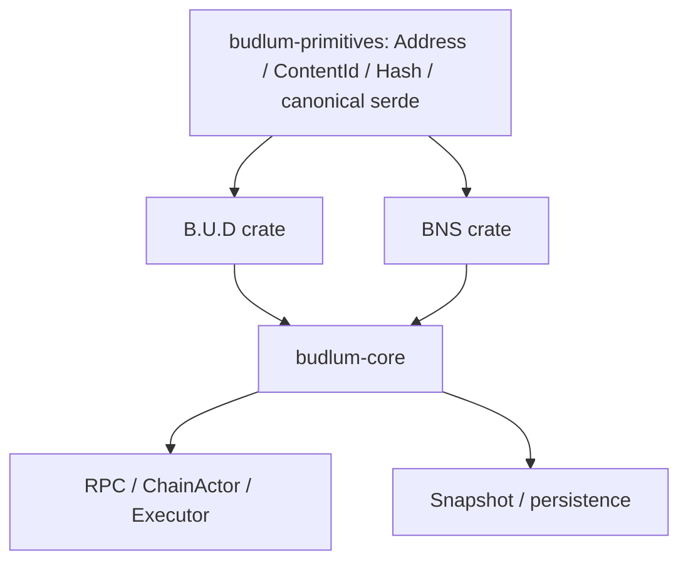

# Phase 10 — B.U.D. ve BNS Bağımsız Workspace Migration Planı

**Branch:** `arena3/phase10-bud-bns-workspaces`  
**Hedef klasörler:** `B.U.D/` ve `BNS/`  
**Durum:** Kaynak bağımlılık haritası tamamlandı; fake facade yasaktır.

## Hedef mimari

B.U.D. veya BNS'in `budlum-core`a bağımlı facade crate olması kabul edilmez;
Core'un bu crate'lere bağımlı olduğu gerçek modül sınırı kurulmalıdır.

## Mevcut bağımlılık bulguları

- B.U.D. `src/storage/` ile sınırlı değildir: `src/domain/storage_deal.rs`,
  `AccountState`, snapshot, RPC, executor, chain actor, pollen/hub/socialfi ve
  çoklu integration test yüzeyi kullanır.
- BNS `src/bns/` altında olsa da `Address`, `ContentId`, `AccountState`,
  snapshot ve chain actor ile Core içinde bağlıdır.
- Bu yüzden doğrudan `git mv src/storage B.U.D/src` veya `git mv src/bns BNS/src`
  işlemi crate dependency cycle üretir.

## Atomik migration dizisi

1. **C1 — primitives extraction:** Döngüsüz türler ve canonical serde sınırı.
2. **C2 — BNS crate:** registry/types + bağımsız BNS unit tests.
3. **C3 — B.U.D crate:** ContentId/manifest/params/deal registry + unit tests.
4. **C4 — Core integration:** AccountState, executor, chain actor, RPC path migration.
5. **C5 — Snapshot/root migration:** schema/root/legacy roundtrip ve persistence pinleri.
6. **C6 — CI/dashboard:** crate-specific test jobs, README dashboard, B.U.D/BNS docs.

Her commit ayrı CI kanıtı gerektirir. C4/C5 arasında partial merge yoktur.

## Kabul kriterleri

- `B.U.D/Cargo.toml` ve `BNS/Cargo.toml` gerçek library crate'lerdir.
- Core, B.U.D/BNS'i path dependency ile kullanır; ters dependency yoktur.
- Eski `src/storage`/`src/bns` public source sahipliği kaldırılır veya yalnız
  geçici, deprecation-etiketli re-export katmanı olarak kalır.
- B.U.D ve BNS testleri kendi crate komutlarıyla koşar.
- Snapshot/root migrationı eski state'i sessizce kaybetmez.
- Main merge öncesi güncel `origin/main` diff ve CI yeniden denetlenir.
